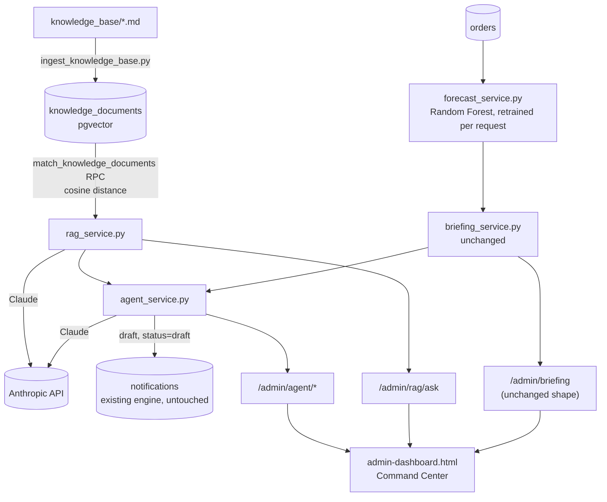

# Business Intelligence Layer — ML + RAG + AI Operations Agent

**Status:** Implemented, migrations applied, verified live end-to-end. Per the STOP CONDITION, this is where this phase stops — no further automatic enhancement.

---

## Architecture

Nothing existing was modified: `notification_service.py`, `admin/orders.py`, `admin/notifications.py`, auth, CRM, and the original schema are all untouched. `briefing_service.py` is untouched too — it still calls `forecast_service.compute_tomorrow_forecast()`, which now internally trains a Random Forest instead of running the old heuristic, but returns the exact same shape, so nothing downstream needed to change.

---

## ML Evaluation

Random Forest, XGBoost, LightGBM, and CatBoost were trained on the same engineered daily feature table (calendar signals, lag/rolling-window history, the confirmed-orders-for-date signal) built from the seeded order history, with a time-based train/test split (`tools/evaluate_forecast_models.py`). Results (MAE, lower is better):

| Model | Volume MAE | Revenue MAE | Notes |
|---|---|---|---|
| **Random Forest** | **1.26** | **199.86** | Best on volume, competitive on revenue. Lightest weight (only `scikit-learn`, already needed for TF-IDF). Natural uncertainty quantification via per-tree prediction spread — directly powers the confidence score. |
| LightGBM | 1.29 | **196.98** | Marginally best on revenue only. New dependency. |
| XGBoost | 1.33 | 221.39 | Consistently worst here. |
| CatBoost | 1.31 | 216.63 | Pulls in matplotlib/plotly/graphviz (~100MB+) as transitive deps — real deployment weight for no accuracy gain. |

**Selected: Random Forest.** It wins or ties on the primary target (volume), stays within 1.5% of the best revenue result, needs no new production dependency beyond what RAG's TF-IDF step already requires, and its ensemble variance gives a principled confidence score for free — exactly the "maintainability, explainability, reliability" priority this phase asked for over squeezing out marginal accuracy. Only Random Forest ships in `requirements.txt`; the other three are evaluation-only, documented here, not deployed.

The model retrains fresh on every `/admin/briefing` request (~350ms for ~340 days of history, measured) rather than being persisted/versioned — the dataset is small enough that this is faster to reason about and immune to staleness than a training pipeline would be.

---

## RAG Design

13 knowledge base documents (`knowledge_base/*.md`) — Operations Manual, Recipe Guide, Allergen Policy, Delivery/Pickup Policy, Wedding/Corporate guides, Customer Service Handbook, Pricing Policy, Production Workflow, Decoration Standards, Food Safety Procedures, FAQ — chunked by `## ` section (75 chunks), embedded with a single TF-IDF vectorizer (`scikit-learn`, 1024-dim, zero-padded to a fixed width) fit once at ingestion time and persisted (`backend/app/rag_models/tfidf_vectorizer.joblib`), stored in `knowledge_documents` (pgvector). Retrieval calls a Postgres RPC (`match_knowledge_documents`) that orders by pgvector's native cosine-distance operator (`<=>`) — the actual point of using pgvector, not just storing vectors in a column. Claude answers strictly from the retrieved chunks, with an explicit "say so if the documents don't cover it" instruction — the real difference between RAG and an ungrounded chatbot.

**Why TF-IDF, not a neural embedding model or API:** no new dependency beyond `scikit-learn` (already needed for the ML model), no API key/cost, fully offline and reproducible, and for a ~75-chunk internal policy knowledge base, query/document vocabulary genuinely overlaps enough for bag-of-words retrieval to work well — verified directly (see Verification below).

---

## AI Agent Design

`agent_service.py`, three capabilities, all combining `briefing_service` (live data + forecast) with `rag_service` (grounding) and Claude (synthesis):

- **Morning briefing** — a structured JSON narrative (production/staffing/inventory notes) layered on top of the unchanged AI Daily Briefing.
- **Ask** — the general "what should I prepare tomorrow?" entry point: live orders + forecast + retrieved knowledge, synthesized into one grounded, concrete recommendation.
- **Draft customer communication** — drafts a subject/body for a specific order and inserts it directly into `notifications` at `status="draft"`, reusing the *existing* Notification Engine's exact table/lifecycle. `notification_service.py` is not touched — the insert happens in `agent_service.py` itself, the same "new module, same schema, zero changes to the shared engine" pattern the Communication Adapters established.

**Human-in-the-loop is structural, not a convention**: nothing in `agent_service.py` ever calls `notification_service.send()` or a Communication Adapter. Every draft lands in the existing Notification Queue at `draft` status and goes through the unchanged submit → approve → send workflow before anything reaches a customer.

---

## Explainable AI

- **Forecast**: value + confidence % (from Random Forest tree-prediction variance) + a reason citing the model's own top feature importances and the confirmed-orders count.
- **RAG answers**: every answer ships with its source document titles; the prompt instructs Claude to say when the documents don't cover a question rather than guess.
- **Agent recommendations**: grounded and cited the same way as RAG, plus the underlying forecast's own confidence/reason are passed through in the prompt context, so the Agent's narrative inherits that explainability rather than inventing its own.

---

## Verification

- **Offline**: 82 checks across 9 test files (`python -m tests.<name>` from `backend/`), including new `test_forecast_service.py` (12), `test_rag_service.py` (5), `test_agent_service.py` (6) — all passing.
- **Live, real data, real Claude calls**:
  - `/admin/briefing` — unchanged shape, now Random-Forest-backed, verified against the seeded database.
  - `/admin/rag/ask` — "wedding cake deposits", "nut-free cake", "late pickup", "sponge flavors" all retrieved the exact right knowledge base section as the top match; full Claude-generated answers verified accurate against the source policy.
  - `/admin/agent/morning-briefing` and `/admin/agent/ask` — verified against real live data, correctly citing real order names, the real forecast, and grounding staffing advice in the actual Bakery Operations Manual threshold rule.
  - `/admin/agent/draft-communication` — verified the created draft appears in the existing `/admin/notifications` queue, and that an `notification.ai_drafted` audit event is recorded.
- **Visual**: CDP screenshots confirm the Dashboard's new "AI Agent Insights" section and "Ask the AI Operations Agent" box, and the Orders drawer's new "AI Agent" draft section, all render correctly alongside every pre-existing panel, unaffected.
- **Bugs caught and fixed during this phase** (all live, not hypothetical): a 384-dim TF-IDF cap silently dropped the specific term "deposit" from the vocabulary, breaking retrieval for a real deposit question — widened to 1024 via a new migration; ingestion-time and query-time embedding padding were two separate code paths that silently diverged in width — unified into one shared `embed_texts()` function; a title-only leading chunk was scoring unpredictably high in TF-IDF similarity — dropped from indexing; Claude's extended thinking (on by default for `claude-sonnet-5`) was consuming the entire token budget, leaving zero-or-truncated text responses — disabled via `thinking={"type": "disabled"}` for these synthesis tasks; a 400-token cap truncated a JSON-wrapped email draft mid-object, causing a parse failure — raised to 800 and made JSON extraction more robust (outermost `{...}` span rather than naive fence-stripping).

---

## Known Limitations

- **TF-IDF retrieval is keyword-based, not semantic.** It retrieves the exact right section for direct policy questions (verified above) but can surface topically-loose sources for more conversational phrasing (observed: "What should I prepare tomorrow?" pulled Allergen Policy chunks) — Claude's answer quality held up regardless because the live operational data carried the query, but the *sources* shown for such queries can be weak. A neural embedding model (or a hosted embedding API) would improve this at the cost of a new dependency/API.
- **No caching on any AI call.** Every briefing/ask/draft request makes a fresh Claude call. Fine for a single-bakery admin dashboard used by one or two staff; a short-TTL cache would matter at higher traffic.
- **"Inventory observations" are qualitative, not real stock data** — there is no inventory/ingredient-tracking table in this schema (out of scope to add — "do not modify existing database design"), so the Agent infers inventory-relevant notes from order categories/forecast rather than tracking actual stock levels.
- **The draft-communication feature has no per-order duplicate guard** — asking twice for the same order creates two separate drafts. Acceptable given every draft requires human review before it goes anywhere.

## Suggested Future Improvements

- A neural/hosted embedding model for RAG if retrieval quality on conversational queries becomes a real issue.
- A short-TTL cache on `/admin/briefing` and `/admin/agent/*` if usage grows beyond occasional dashboard refreshes.
- A real inventory/ingredient-tracking table, if the bakery wants the Agent's inventory notes grounded in actual stock rather than inferred from order volume.
- Delivery-status webhooks (already a reserved, unused `notifications.status` value from Sprint 1) to close the loop on whether an Agent-drafted, staff-approved message actually delivered.
