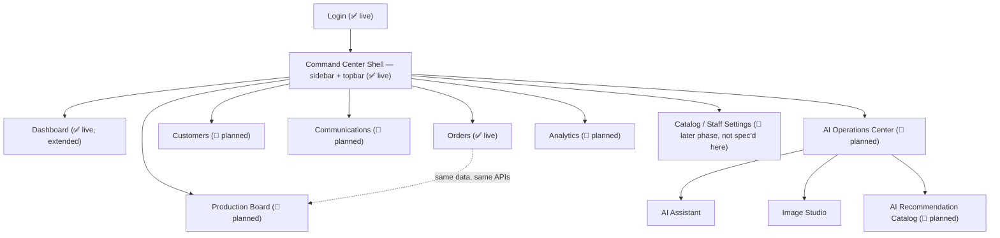
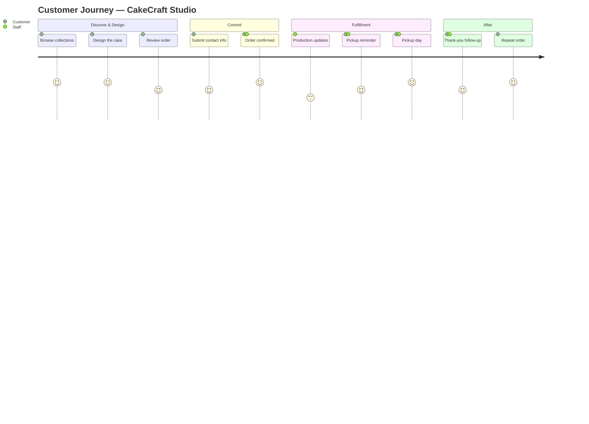

# CakeCraft Studio — Bakery Command Center: UX & Product Blueprint v1

**Status:** Definitive product specification for Version 2
**Date:** 2026-08-06
**Source of truth:** [`Project_Audit_Report_v1.md`](Project_Audit_Report_v1.md) (current-state audit), [`Master_Blueprint_v1.md`](Master_Blueprint_v1.md) (target technical architecture), and the current implementation ([`PHASE1_IDENTITY_SECURITY.md`](PHASE1_IDENTITY_SECURITY.md), [`EPIC1_BACKOFFICE.md`](EPIC1_BACKOFFICE.md)).
**Nature of this document:** Product and UX specification only. **No production code is included or implied to have been written.** Endpoint tables describe target shapes for planning, the same way `EPIC1_BACKOFFICE.md` documents endpoints that already exist — they are not implementation.

## How to read this document

Every screen below carries a status tag:

- **✅ Live** — built and working today (Phase 1 + Epic 1).
- **🚧 Planned** — designed here, mapped to a phase in `Master_Blueprint_v1.md` §17, not yet built.

Everything planned **extends** the current architecture: the same layered FastAPI backend (routes → services → Supabase), the same vanilla-JS multi-page frontend (`frontend/js/admin/` shared modules + one page-orchestrator per screen), the same design tokens in `styles.css`. No new framework, no new database technology, no rewrite of anything that already works. Where a planned screen needs a new table, it reuses the exact shape already agreed in `Master_Blueprint_v1.md` §7 — this document does not invent new schema beyond what's already on record there.

"Bakery Command Center" is this document's product name for what Epic 1 shipped as "Backoffice." They are the same system — renaming the sidebar label is a one-line cosmetic change, noted in the Future Roadmap, not a rebuild.

---

## 1. Product Vision

Maison de Gâteau Paris — and every bakery like it — runs on two things today: a phone that rings constantly, and a whiteboard (or a memory) of who ordered what and when it's due. CakeCraft Studio's customer-facing site already solves half the problem — customers design and submit orders themselves. The **Bakery Command Center** solves the other half: it's the single place the owner and staff work from to know, at any moment, *what's due, who's asking, and what's working* — without a spreadsheet, a second app, or a phone call to a colleague.

Three commitments shape every screen in this document:

1. **One order, one truth.** Whether an order is viewed on the Dashboard, the Orders list, or the Production Board, it's the same row in the same `orders` table, updated through the same one status-change action. Nothing in the Command Center maintains its own copy of order state.
2. **AI helps, it doesn't gatekeep.** Every AI-touched screen (Dashboard's AI Insights, the AI Operations Center, Analytics' narrative summaries) degrades to "AI features are not enabled" with zero loss of core function when the AI layer is off — the same principle already enforced by `docs/ARCHITECTURE.md` Principle 9 and `Master_Blueprint_v1.md` §9.
3. **Built for a small team, not an enterprise.** Two roles, not twelve. One dashboard, not a report-builder. Every screen answers a question a real bakery owner actually asks ("what's due today," "who hasn't ordered in a while," "did that email actually send") rather than a generic admin-panel feature checklist.

---

## 2. User Roles

Only two roles are technically enforced today (`staff_profiles.role`, constrained to `admin` / `staff` — see `PHASE1_IDENTITY_SECURITY.md`). This section maps the bakery's real job functions onto that model as it exists now, and flags where the model would need to grow.

| Product role (owner's mental model) | Technical role today | Typical person | Access level |
|---|---|---|---|
| **Owner / Manager** | `admin` | The bakery owner, or a manager they trust with the whole business | Every screen in this document, including Analytics, AI Operations Center, and (future) staff/catalog management |
| **Kitchen & Front-of-House Staff** | `staff` | Bakers, decorators, the person who answers the phone | Dashboard (operational widgets), Orders, Production Board, Customers (read + quick lookup), Communications (send only) |
| Customer | *(none — no account exists)* | Anyone ordering a cake | No Command Center access at all; interacts only with the public storefront. This is unchanged and deliberate — see `Project_Audit_Report_v1.md` §9. |

**Future growth (not built, flagged honestly):** a bakery that hires a dedicated marketing or events person may eventually want a third role (e.g., `marketing`) with access to Analytics and Communications but not Orders' status-changing actions. That requires widening the `staff_profiles.role` check constraint and adding a new `require_role(...)` gate on the relevant routes — a small, additive change in the same pattern already established, not a redesign. Listed in the Future Roadmap (§13), not assumed here.

---

## 3. Complete Navigation

**Sidebar** (persistent, same `.admin-sidebar` component Epic 1 already built): Dashboard, Orders, Production Board, Customers, Communications, AI Operations Center (with three sub-items once built), Analytics. Adding each new item is the same three-step pattern already used for every page today: a new `<a class="admin-nav-link">` in the shared shell markup, a new `admin-<screen>.html`, and a new `admin-<screen>.js` orchestrator — no navigation framework, no router.

**Topbar** (unchanged from Epic 1): page title, current admin identity (`GET /admin/me`), logout.

**Not spec'd in this document:** Catalog management and Staff management are real, expected nav items in the eventual full product (both named in `Master_Blueprint_v1.md` §5/§17 Phase 5) but are outside the ten sections this document was asked to cover — they get their own spec when their phase comes up.

---

## 4. Dashboard

**Status:** ✅ Live (Epic 1) for the core widgets; 🚧 Planned for the four marked additions below.

- **Purpose:** Answer "is my bakery on track today?" in one glance, with a path to act on anything that isn't.
- **Target user:** Owner/Manager (full view); Staff (same screen, same data — nothing hidden, since day-to-day operational awareness matters for everyone).
- **Main components:**
  - Total Orders, Today's Orders, Orders by Status, Recent Orders, Recent Audit Events, Quick Actions, System Health — ✅ all live today, unchanged.
  - AI Insights card — ✅ live as a placeholder ("Coming in a future phase"); 🚧 planned to surface 1–3 short, plain-language insights (e.g. "Wedding orders are up 20% this month").
  - 🚧 **Revenue Today / This Week** card — sum of `total_price` for today's and this week's orders.
  - 🚧 **Upcoming Pickups** card — orders with a `pickup_date` in the next 48 hours (depends on pickup scheduling existing at all — see §13).
  - 🚧 **Communications Snapshot** — count of messages sent today + any failed sends needing attention (depends on Communications, §8).
- **User actions:** refresh; click through any widget to its full screen (Recent Orders → Orders, Recent Audit Events → nothing deeper yet, System Health → informational only).
- **AI interactions:** AI Insights card only — heuristic-first (order-count trend comparisons), narrative generation is a later upgrade layered on the same card, never a prerequisite for the dashboard to be useful.
- **Data sources:** `orders`, `audit_log`, `staff_profiles` (✅ live); environment variables for System Health (✅ live); future: `notifications_log` (Communications Snapshot).
- **APIs involved:** `GET /admin/dashboard` (✅ live — response shape documented in `EPIC1_BACKOFFICE.md`); new widgets are additive fields on the same response, not new endpoints — a dashboard should be one request, not five.
- **Success criteria:** owner can assess "is today under control" in under 30 seconds; p95 load time under 2 seconds; every number on the page is traceable to a real query, never a hardcoded placeholder (the one deliberate exception being the AI Insights card until its phase lands, and it says so).

---

## 5. Orders

**Status:** ✅ Live (Epic 1) for list/search/filter/pagination/detail/status-update; 🚧 Planned for pickup-schedule editing and the order timeline.

- **Purpose:** The operational system of record for every order — find any order, see everything about it, move it forward.
- **Target user:** Owner and all staff equally — this is the most-used screen in the product.
- **Main components:** search bar (customer name/email/phone), status filter, paginated table, click-through detail drawer (customer, template, configuration, pricing, notes), status-update control — ✅ all live. 🚧 Planned: pickup date/time fields become editable once pickup scheduling exists; an **order timeline** tab in the detail drawer.
- **User actions:** search, filter, paginate, open detail, change status (✅ live); 🚧 planned: edit pickup date/time, jump to "message this customer" (Communications).
- **AI interactions:** 🚧 planned, advisory only — an "aging" flag on an order sitting in one status noticeably longer than the historical average for that status (heuristic, part of the Recommendation Catalog, §11). Never changes a status itself.
- **Data sources:** `orders`, `customers`, `cake_templates` (✅ live, PostgREST embedding — see `EPIC1_BACKOFFICE.md`); the order timeline reuses `audit_log` filtered to `entity_type='orders', entity_id=<id>` rather than a new table — Epic 1's `order.status_changed` audit events already capture every before/after status transition, so a dedicated `order_status_history` table (originally sketched in `Master_Blueprint_v1.md` §7) turns out not to be needed. This document supersedes that one detail of the Blueprint.
- **APIs involved:** `GET /admin/orders`, `GET /admin/orders/{id}`, `PATCH /admin/orders/{id}/status` (✅ live); 🚧 planned: `PATCH /admin/orders/{id}` for pickup fields (a second, narrower update endpoint, not an expansion of the status one — keeps each endpoint's audit-log semantics unambiguous).
- **Success criteria:** any order locatable by search in under 10 seconds; a status change is one click plus one confirm; no order is ever only visible via direct database access — if it exists, it's on this screen.

---

## 6. Customers

**Status:** 🚧 Planned (first version needs no new schema — see below).

- **Purpose:** Turn "who ordered a cake from us" into "who are our customers" — contact lookup during a phone call, and a lightweight relationship view for the owner.
- **Target user:** Owner (retention/marketing decisions); Staff (fast lookup mid-call — "what did Mrs. Dubois order last time?").
- **Main components:** searchable, paginated customer list (name, email, phone, order count, lifetime value, last-order date); customer detail (contact info, full order history, journey timeline — see §12).
- **User actions:** search, open detail, click through to any of that customer's orders; 🚧 later: add an internal note or tag, message the customer directly (Communications).
- **AI interactions:** 🚧 planned — a "no order in 90+ days" flag (churn heuristic, Recommendation Catalog §11); a short, plain-language summary of a customer's order pattern ("usually orders birthday cakes, chocolate flavor") generated from their own order history only — an aggregate summary, not a chat feature, and explicitly not built on customer PII beyond what orders already store.
- **Data sources:** `customers`, `orders` (aggregated per customer) — **both existing tables, no new schema required** for the first version of this screen.
- **APIs involved (new, same pattern as Orders):** `GET /admin/customers` (search + paginate, mirrors `list_orders`'s `_page_to_range` pagination and `.or_()` search pattern already proven in `order_service.py`), `GET /admin/customers/{id}` (detail with `orders(*)` embedded the same way order detail embeds `customers`/`cake_templates` today).
- **Success criteria:** any customer's full order history retrievable in under 10 seconds during a live phone call; owner can name their top 10 customers by lifetime value without exporting anything.

---

## 7. Production Board

**Status:** 🚧 Planned — **zero new backend work**, a new frontend view over data Epic 1 already fully serves.

- **Purpose:** The kitchen-floor view — "what do I need to work on today," organized as a workflow instead of a data table. This is the screen a baker glances at between tasks, not the screen they search from.
- **Target user:** Kitchen and decorating staff primarily; useful to anyone during a busy pickup day.
- **Main components:** columns matching `orders.status`'s six values (Pending → Confirmed → In Progress → Ready → Completed, with Cancelled collapsed out of the way by default), each order as a compact card (cake name, customer, pickup date, size), click-to-advance (or drag) between columns.
- **User actions:** advance an order to its next status; click a card to open the *exact same* detail drawer Orders uses (`admin-orders.js`'s drawer logic, reused, not rebuilt).
- **AI interactions:** 🚧 planned — a capacity warning when a day's pending+confirmed order count is well above the recent daily average ("6 cakes due tomorrow, your average is 3/day") — heuristic, informational, never blocks accepting an order.
- **Data sources:** identical to Orders — `orders`, `customers`, `cake_templates`. No new table.
- **APIs involved:** identical to Orders — `GET /admin/orders` (client-side grouped by `status` instead of shown as a flat table) and `PATCH /admin/orders/{id}/status`. This is the clearest example in the whole product of "extend, don't redesign": the entire screen is `admin-api.js`'s existing functions plus a new layout.
- **Success criteria:** a status change made here is visible on the Orders screen (and vice versa) with no refresh delay beyond a normal page load, because both read the same live table — there is no synchronization to get wrong.

---

## 8. Communications (Gmail & WhatsApp)

**Status:** 🚧 Planned — `Master_Blueprint_v1.md` §10, Phase 4. **Explicitly not implemented** in this or any prior phase; this section specifies the target design only.

- **Purpose:** One place to see every message that went to a customer, and to send one manually when something needs a human touch a template can't cover.
- **Target user:** Staff (day-to-day sending, e.g. "let them know it's ready"), Owner (oversight — did the confirmation email actually go out?).
- **Main components:** message log (channel, recipient, related order, delivery status, timestamp), a compose panel (pick a customer/order, pick a template — order confirmed, ready for pickup, thank-you follow-up — or write freehand), a small template library.
- **User actions:** filter the log by channel/status, open a related order from a log entry, compose and send a message tied to an order.
- **AI interactions:** 🚧 planned — an AI-drafted message suggestion pre-fills the compose panel (e.g., a friendly, order-specific pickup reminder); **a human always reviews and clicks send** — this is the concrete, working example of `Master_Blueprint_v1.md` §12's rule that an AI-proposed action never becomes a real one without explicit confirmation. Nothing is ever auto-sent by AI.
- **Data sources:** `notifications_log` (proposed in `Master_Blueprint_v1.md` §7 — `order_id`, `channel`, `recipient`, `status`, `provider_message_id`, `sent_at`), `orders`, `customers`.
- **APIs involved:** `GET /admin/communications` (log, filterable), `POST /admin/communications/send`; backed by a new `notification_service.py` (already named in `Master_Blueprint_v1.md` §5) wrapping Gmail SMTP and the WhatsApp Business Cloud API behind one interface, exactly as previously specified — this document doesn't change that design, only places it on a screen.
- **Success criteria:** every automated status-change message is visible in the log within 5 seconds of sending; a staff member can manually message a customer about their specific order in 3 clicks or fewer; a failed send is visibly flagged, never silently lost.

---

## 9. AI Operations Center

**Status:** 🚧 Planned — `Master_Blueprint_v1.md` §9, Phases 6–7. **Explicitly not implemented**; this section specifies the target design only.

- **Purpose:** The one screen where every AI capability lives — deliberately walled off from the rest of the Command Center so it can be fully disabled with zero effect anywhere else, exactly mirroring `app/ai/`'s structural isolation from `app/services/` in the backend.
- **Target user:** Owner (assistant Q&A, image generation, reviewing suggestions); Staff (assistant Q&A for quick answers, e.g. "what's our standard allergy disclaimer wording").
- **Main components:**
  - **AI Assistant** — chat interface over a RAG knowledge base (bakery policies/FAQs) plus read-only order/catalog Q&A via the scoped Agent (`Master_Blueprint_v1.md` §9 — tool-restricted to existing, already-validated service functions, no direct writes, ever).
  - **Image Studio** — prompt in, generated template preview art out; a "save to catalog" action visible to `admin` role only (`require_role("admin")`).
  - **Recommendation Review Queue** — every AI-surfaced suggestion from anywhere in the product (Dashboard, Orders, Customers, Production Board, Analytics) lands here as one unified inbox for approve/dismiss decisions.
  - **Feature Flag Status** (read-only) — which AI capabilities are currently switched on, so "why isn't X working" is self-service, not a support ticket.
- **User actions:** ask the assistant a question, generate an image, approve or dismiss a queued recommendation.
- **AI interactions:** this screen *is* the AI interaction surface — RAG retrieval, Agent tool-calls, image generation.
- **Data sources:** `ai_knowledge_documents`, `ai_embeddings`, `ai_conversations`, `ai_messages`, `ai_generated_images`, `recommendation_feedback` (all proposed in `Master_Blueprint_v1.md` §7); read-only access to `orders`/`cake_templates` via the existing services the Agent is scoped to — never a bypass.
- **APIs involved:** `/ai/assistant`, `/ai/image`, `/ai/recommendations`, each individually feature-flagged (`AI_FEATURES_ENABLED` + a per-capability flag) and each behind `Depends(get_current_admin)` exactly like every other admin route — no separate auth mechanism for "AI routes."
- **Success criteria:** with every AI flag off, this screen shows one clear message ("AI features are not enabled") and every other screen in the product is provably unaffected — the same regression discipline already proven in Epic 1 (customer funnel + admin CRUD both pass with zero AI configuration present) extended to cover this screen's absence too.

---

## 10. Analytics

**Status:** 🚧 Planned — `Master_Blueprint_v1.md` §17 Phase 7 territory, first version needs no new schema.

- **Purpose:** Trends instead of snapshots — what's working, what to feature next, when the bakery gets busy — to support decisions the Dashboard's "right now" view can't.
- **Target user:** Owner.
- **Main components:** revenue-over-time chart, orders by collection/template breakdown, average order value, repeat-customer rate, busiest days/times, a date-range picker, CSV export.
- **User actions:** change the date range, drill into a specific collection or template, export the underlying data.
- **AI interactions:** 🚧 planned — an auto-generated narrative summary of the selected period ("Wedding cakes were your top revenue driver this month, up 18%") — the fully-realized version of the Dashboard's AI Insights teaser, generated over already-computed aggregates rather than raw order data (keeps the model's input small, cheap, and free of anything that looks like a prompt-injection surface — see `Master_Blueprint_v1.md` §12).
- **Data sources:** `orders`, `customers`, `cake_templates`, `collections` — all existing tables; purely aggregate, read-only queries.
- **APIs involved:** `GET /admin/analytics/revenue`, `GET /admin/analytics/templates`, `GET /admin/analytics/customers` — same route → service → Supabase pattern as everything else, backed by a new `analytics_service.py` that composes read-only aggregates exactly the way `dashboard_service.py` already does.
- **Success criteria:** the owner can decide what to feature on the homepage next month using only this screen — no spreadsheet export required for a routine decision.

---

## 11. AI Recommendation Catalog

**Status:** 🚧 Planned. This is both a **reference** (what AI actually does in this product, and how "AI" each piece really is) and a **screen** (where an owner can see and control it) — kept honest on purpose, directly answering the Audit Report's original finding that the README claimed "AI-Native" with zero AI code behind it. Nothing in this catalog is allowed to be vaporware once built: every row maps to a real, scoped feature elsewhere in this document.

| Recommendation | Audience | Surfaced in | Trigger / data | Technique | Human-in-the-loop |
|---|---|---|---|---|---|
| Template/flavor suggestions | Customer | Templates, Designer | Browsing + past order patterns | Heuristic (popularity/category) → embedding similarity later | Customer freely accepts or ignores; nothing is ever auto-applied to their order |
| Upsell suggestions | Customer | Order Review | Current configuration vs. common pairings | Heuristic | Same as above |
| Dashboard AI Insights | Owner | Dashboard (§4) | Recent order trends | Heuristic → narrative later | Informational only |
| Analytics narrative summary | Owner | Analytics (§10) | Period aggregates (not raw orders) | Generative, grounded in computed stats | Owner reads; no auto-action |
| Customer churn flag | Owner/Staff | Customers (§6) | Days since last order | Heuristic | Staff decides whether to reach out |
| Production capacity warning | Kitchen staff | Production Board (§7) | Pending-order volume vs. history | Heuristic | Informational only |
| Message draft assistant | Staff | Communications (§8) | Order + customer context | Generative, template-grounded | **Always reviewed before send — never auto-sent** |
| AI Assistant Q&A | Owner/Staff | AI Operations Center (§9) | Knowledge base + read-only order/catalog data | RAG + scoped, read-only Agent | Advisory; Agent cannot write |
| AI-generated template art | Admin role | AI Operations Center → Image Studio (§9) | Staff-supplied prompt | Generative (external image API) | Staff reviews before publishing to catalog |

- **Purpose:** give the owner one page that fully explains every AI feature in the product in plain language, and a switch for each one.
- **Target user:** Owner.
- **Main components:** the table above, rendered as cards or rows, each with a live enabled/disabled state and a one-line "why this exists."
- **User actions:** toggle a recommendation type on/off; read the technique/data-source detail for any row.
- **AI interactions:** none directly — this page *configures and documents* AI, it doesn't perform any AI itself.
- **Data sources:** the backend's feature-flag configuration (`AI_FEATURES_ENABLED` + per-capability flags, `Master_Blueprint_v1.md` §5), `recommendation_feedback` for measuring how often a surfaced suggestion is actually accepted.
- **APIs involved:** `GET /admin/ai/recommendations/config`, `PATCH /admin/ai/recommendations/config`.
- **Success criteria:** an owner (or a developer defending this project) can explain what every AI feature does, where it appears, and how it's kept in check, using only this one page.

---

## 12. Customer Journey

Not a single screen — the thread that ties every screen above back to the one thing the business exists to do: get a real cake to a real customer. Each stage below already exists on the customer-facing site (✅) or is a natural extension already covered by a screen in this document.

| Stage | Customer experience | Command Center visibility | AI touchpoint | Data captured |
|---|---|---|---|---|
| Discover & Design | Browses collections, designs a cake — ✅ live, unchanged by this document | — | 🚧 Template/flavor suggestions | none yet (anonymous browsing) |
| Review & Submit | Reviews price/summary, submits contact info — ✅ live | — | 🚧 Upsell suggestions | `customers`, draft order state (client-side only until submit) |
| Order Confirmed | Sees a confirmation page with an order number — ✅ live | Appears immediately on Dashboard, Orders, Production Board | — | `orders` row created |
| Production | *(no current visibility to the customer)* | Production Board (§7), Orders detail timeline (§5) | 🚧 capacity warning (internal only) | `audit_log` status transitions |
| Pickup Reminder | 🚧 planned — a WhatsApp/email reminder as pickup approaches | Communications log (§8) | 🚧 AI-drafted reminder, human-sent | `notifications_log` |
| Pickup Day | Collects the cake — outside the system entirely (no POS integration in scope) | Order marked Completed on Production Board/Orders | — | `orders.status = completed` |
| Follow-up | 🚧 planned — a thank-you message, optionally with a repeat-order nudge | Communications log, Customers detail (§6) | 🚧 message draft assistant | `notifications_log` |
| Repeat Order | Customer returns and orders again — ✅ live (they're just a returning visitor; no login exists to "recognize" them beyond matching email) | Customers screen shows their full history | 🚧 churn flag (only fires if they *don't* come back) | second `orders` row, same `customers` row (matched by email, per existing `_find_or_create_customer` logic) |

**Why this matters as its own section:** every AI feature and every planned screen in this document exists to serve one stage of this journey — nothing was designed in isolation. The journey is also the clearest evidence that "no customer accounts" (a deliberate, audited decision) is still consistent end-to-end: a "repeat customer" is recognized by email match on the existing `customers` table, not by a login system this product has never needed.

---

## 13. Future Roadmap

This section sequences the screens above onto `Master_Blueprint_v1.md` §17's phases — it doesn't invent new phases, it places product deliverables onto the ones already agreed.

| Phase (per `Master_Blueprint_v1.md` §17) | Unlocks in this document |
|---|---|
| **1. Foundation Hardening** | *(already scoped, precedes everything)* |
| **2. Admin Foundation** ✅ done (Phase 1) | Login, session, roles — the platform every screen above sits on |
| **3. Bakery Operations** ✅ Dashboard + Orders done (Epic 1); Production Board and pickup scheduling remain | Production Board (§7) fully unlocked once pickup scheduling exists; Orders' pickup-edit fields |
| **4. Customer Communication** | Communications (§8) in full, including the message draft assistant |
| **5. Catalog Management** | *(not spec'd in this document — future doc)* |
| **6. AI Foundation** | AI Assistant's RAG half (§9); the data foundation for every 🚧 AI row in the Recommendation Catalog (§11) |
| **7. AI Expansion** | AI Assistant's Agent half, Image Studio (§9); Analytics' narrative summaries (§10); Customers' churn flag and Production Board's capacity warning become real rather than designed |
| **8. Future Exploration** *(not committed)* | ML demand forecasting could deepen the Production capacity warning; a third `staff_profiles` role (§2) if the team grows; ML product recommendations at (§11) if similarity-based recommendations outgrow the sequence of pure heuristics they start as |

**Immediate next step, smallest first:** Customers (§6) and the Orders timeline tab (§5) both need zero new schema and reuse existing patterns end-to-end — they are the cheapest way to make the next visible progress in the Command Center, ahead of anything requiring a new external integration or AI provider.

---

*This document specifies product and UX only. No source code was written or modified in producing it. It extends `Master_Blueprint_v1.md`'s technical architecture and `Project_Audit_Report_v1.md`'s findings with a screen-by-screen product definition, grounded in what `PHASE1_IDENTITY_SECURITY.md` and `EPIC1_BACKOFFICE.md` confirm is actually live today.*
