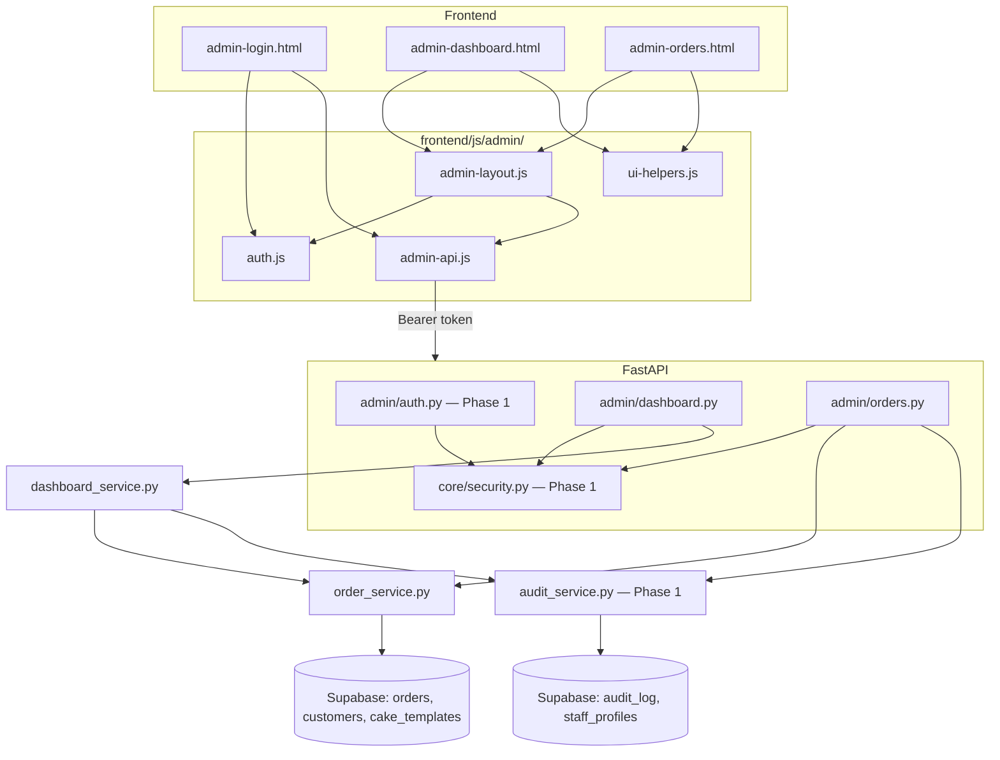
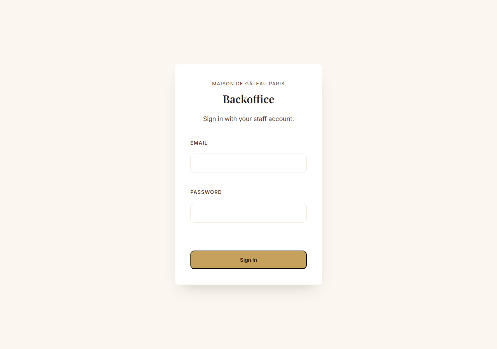
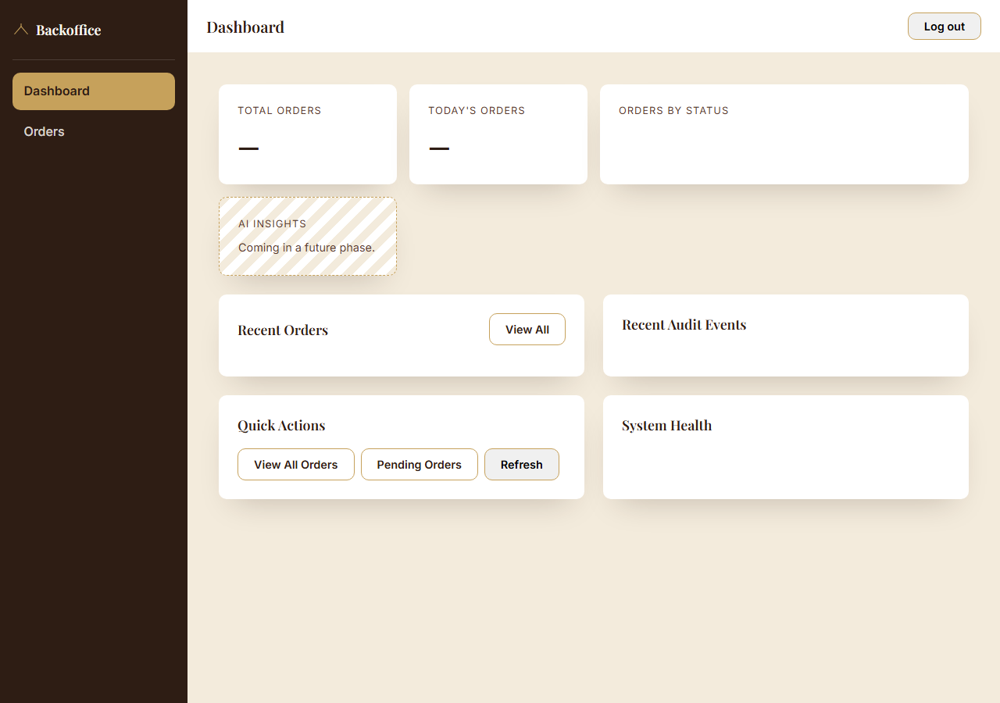
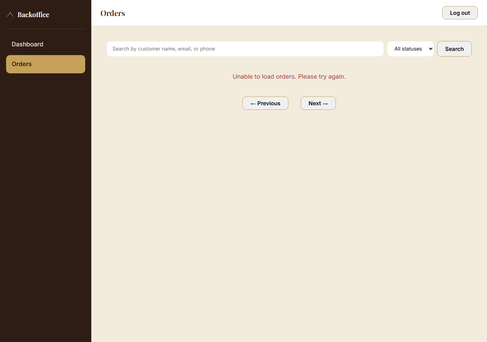

# Epic 1 — Backoffice Dashboard

**Status:** First release implemented, verified locally and via `TestClient` against the live Supabase project. **Full authenticated live-browser testing is blocked** on the same pending item Phase 1 flagged — see [Known limitation](#known-limitation-phase-1s-migration-is-still-not-applied) below.
**Scope:** Dashboard + Order Management, per `docs/Master_Blueprint_v1.md` §17 Phase 3 ("Bakery Operations"), built directly on Phase 1's auth/audit foundation (`docs/PHASE1_IDENTITY_SECURITY.md`).
**Not built in this release, by instruction:** RAG, AI Agent, Gmail, WhatsApp, Machine Learning.

---

## Architecture

Nothing about the layered FastAPI backend or the vanilla-JS, multi-page frontend changed. Epic 1 is entirely additive:

- **Backend:** two new route modules (`app/api/routes/admin/dashboard.py`, `.../orders.py`), one new service (`dashboard_service.py`), `order_service.py` extended with admin-facing functions, `audit_service.py` extended with a read function. Every new route still follows Route → Service → Supabase, with Pydantic schemas at the boundary — identical to every existing route.
- **Frontend:** a new `frontend/js/admin/` subfolder (mirrors the backend's `admin/` subpackage) holding shared modules, plus three new pages (`admin-login.html`, `admin-dashboard.html`, `admin-orders.html`) that reuse the existing page-orchestrator + shared-pure-module convention. `styles.css` gained one new, clearly delimited "Admin Backoffice" section — no new stylesheet, no framework.
- **Zero new database migrations.** Dashboard and order management read/write only `orders`, `customers`, `cake_templates` (existing since Sprint 1) and `staff_profiles` / `audit_log` (Phase 1, already written as a migration file). Status updates are a plain `UPDATE` on the existing `orders.status` column.



---

## New endpoints

All under `/admin`, all protected by Phase 1's `Depends(get_current_admin)` — no route in this epic re-implements auth.

| Method & Path | File | Purpose |
|---|---|---|
| `GET /admin/dashboard` | `admin/dashboard.py` | Aggregate stats, recent orders, recent audit events, system health |
| `GET /admin/orders` | `admin/orders.py` | List orders — `search`, `status`, `page`, `pageSize` query params |
| `GET /admin/orders/{order_id}` | `admin/orders.py` | Single order, customer + template joined in |
| `PATCH /admin/orders/{order_id}/status` | `admin/orders.py` | Update status; writes an `order.status_changed` audit event |

### `GET /admin/dashboard` response shape

```json
{
  "totalOrders": 12,
  "todaysOrders": 2,
  "ordersByStatus": { "pending": 3, "confirmed": 2, "in_progress": 1, "ready": 0, "completed": 5, "cancelled": 1 },
  "recentOrders": [ /* up to 10, newest first, customer + template joined */ ],
  "recentAuditEvents": [ /* up to 10, newest first, actor name + role joined */ ],
  "systemHealth": {
    "backend": { "status": "healthy" },
    "database": { "status": "healthy", "latencyMs": 87.3 },
    "railway": { "status": "running", "environment": "production", "serviceName": "cakecraft-backend" },
    "netlify": { "status": "not_configured", "note": "Frontend is served via Railway, not Netlify." },
    "lastDeployment": { "commitSha": "b5113ea…", "deploymentId": "…" }
  }
}
```

**System Health honesty note:** Railway/Netlify status are read from this process's own environment (Railway injects `RAILWAY_ENVIRONMENT`, `RAILWAY_SERVICE_NAME`, `RAILWAY_GIT_COMMIT_SHA`, etc. into every deployed service) — **no Railway or Netlify API call is made**, and no API token for either is provisioned. Netlify specifically always reports `not_configured`: `docs/Project_Audit_Report_v1.md` §5 confirms the frontend runs on Railway, not Netlify, and this dashboard reports that honestly rather than showing a green check for infrastructure that isn't in use. `apiLatencyMs` is measured live, once per request, timing a cheap `bakery` table read.

---

## New frontend modules

| File | Responsibility |
|---|---|
| `frontend/js/admin/auth.js` | The only file that reads/writes the admin session (`sessionStorage`). `saveAdminSession`, `getAdminSession`, `clearAdminSession`, `isLoggedIn`, `getAuthHeader`, `requireAdminAuth`. |
| `frontend/js/admin/admin-api.js` | The only file that calls `fetch()` for admin endpoints. `adminFetch()` centralizes the Authorization header and 401 handling (clears session + redirects to login) so no page reimplements either. |
| `frontend/js/admin/ui-helpers.js` | Shared render helpers: `renderStatusBadge`, `renderLoadingState`, `renderErrorState`, `renderEmptyState`, `formatCurrency`, `formatDateTime`. |
| `frontend/js/admin/admin-layout.js` | Shell behavior on every protected page: sidebar toggle, active-nav highlighting, `/admin/me` display, logout. Mirrors `app.js`'s role on the customer side. |
| `frontend/js/admin/admin-login.js` | Login page orchestrator. |
| `frontend/js/admin/admin-dashboard.js` | Dashboard page orchestrator. |
| `frontend/js/admin/admin-orders.js` | Orders page orchestrator: search/filter/paginate, detail drawer, status update. |
| `frontend/admin-login.html`, `admin-dashboard.html`, `admin-orders.html` | The three new pages. |

**A security note on rendering, not just plumbing:** every render function above builds DOM nodes via `document.createElement` + `.textContent`, never `innerHTML` + string interpolation, for any value that can contain customer-submitted text (order `notes`, customer `name`/`email`/`phone` — all come from the public, unauthenticated `POST /orders` form). This matters more here than on the customer pages: the admin pages hold the admin's bearer token in `sessionStorage`, so a stored-XSS path through, say, a malicious order `notes` field rendered unsafely would be a real session-theft vector, not just a cosmetic bug. This mirrors the safe-rendering convention `templates.js`/`collections.js` already used on the customer side (`title.textContent = collection.name`) — extended here deliberately, not incidentally.

---

## Database usage

No new migrations. Reads/writes:

- `orders`, `customers`, `cake_templates` — existing tables, unchanged schema. `order_service.py`'s new functions use **PostgREST resource embedding** (`select("*, customers(...), cake_templates(...)")`) to fetch an order with its customer and template in one round trip instead of three — a feature of the same `supabase-py` client already in use, not a new dependency.
- `staff_profiles`, `audit_log` — Phase 1's tables. `audit_service.list_recent_events()` (new) embeds `staff_profiles(name, role)` into each audit row the same way.
- Pagination uses `.range(start, end)` + `count="exact"` (also existing `postgrest-py` features); the dashboard's per-status counts fetch `status, created_at` for every order and count client-side in one query — cheap at this project's order volume, called out in code as the spot to switch to a server-side `GROUP BY` (via an RPC) if that ever stops being true.

---

## Security model

Every `/admin/*` route in this epic:

1. **Requires authentication** — `Depends(get_current_admin)` (Phase 1, unchanged).
2. **Requires authorization** — same dependency; `require_role(...)` (also Phase 1) is available and ready for the first route that needs role differentiation, which none in this release do (dashboard viewing and order status updates are open to any active staff member, not admin-only, by design — see `docs/PHASE1_IDENTITY_SECURITY.md` for the role model itself).
3. **Uses the reusable security dependencies** — no route in this epic parses a header, verifies a token, or checks a role itself.
4. **Records an audit event** for every mutation — the one mutation this epic introduces (`PATCH /admin/orders/{id}/status`) does.

No authentication logic was duplicated anywhere in this epic — every new route's only auth-related code is its `Depends(...)` declaration.

---

## Audit logging

`PATCH /admin/orders/{id}/status` calls `audit_service.record_event` exactly the way Phase 1's login/logout routes do:

```python
record_event(
    actor_id=admin.id,
    action="order.status_changed",
    entity_type="orders",
    entity_id=order_id_str,
    before={"status": existing["status"]},
    after={"status": body.status},
)
```

The route fetches the order once before updating (for the 404 check and the previous status), so `before`/`after` are both real, not inferred. This is the first *real* exercise of Phase 1's "framework only" audit logging goal beyond login/logout — confirming the framework generalizes to a second action without any change to `audit_service.py` itself.

---

## Screenshots

Captured via headless Chrome + CDP against the real static frontend, both with and without a valid session, as part of verification (see below).

**Login page** (`admin-login.html`):


**Dashboard shell** (`admin-dashboard.html`) — cards, panels, sidebar with active-link highlighting, AI Insights placeholder:


**Orders page** (`admin-orders.html`) — search bar, status filter, pagination controls, and (visible here) the error state, since this particular capture used a token the live backend correctly rejected:


---

## Testing

### Existing customer functionality still works
Verified via `fastapi.testclient.TestClient` against the live Supabase project: `GET /health`, `GET /`, `GET /collections` (5 items), `GET /templates` (15 items), `GET /designer/{id}` — all still **200**, unchanged.

### Admin authentication still works
`GET /admin/me` with no token → 401. `POST /admin/login` with wrong credentials → real round-trip to Supabase Auth → 401 `Invalid email or password` (same check as Phase 1's own verification, re-run after this epic's changes to confirm nothing regressed).

### Dashboard loads correctly
Structural + auth-gate checks passed live in a browser: visiting `admin-dashboard.html` with no session correctly redirects to `admin-login.html` (`requireAdminAuth`); with a session present, the shell (sidebar, 4 stat cards, 4 panels, topbar) renders correctly — see screenshot above. Route-level: `GET /admin/dashboard` registered, returns `DashboardResponse`-shaped data, 401s without a token.

### Orders can be updated
`PATCH /admin/orders/{id}/status` route verified: 401 without a token, 404 for a nonexistent order, validated status values (rejects anything outside `ORDER_STATUSES` with a clean error), calls `record_event` on success. Pure logic (`_page_to_range`, `ORDER_STATUSES`, the validation path in `update_order_status`) covered by an offline self-check:
```
cd backend
python -m tests.test_order_service_admin   # 5/5 pass
python -m tests.test_security_dependencies # 7/7 pass (Phase 1, re-run — still green)
```

### Audit log records actions
`update_order_status`'s route calls `record_event` with real before/after status values, using the exact same, already-verified (Phase 1) `audit_service.record_event` function — no new audit-writing code path was introduced, only a new caller of the existing one.

### 401 handling in the browser, isolated
Since the frontend's `API_BASE_URL` is hardcoded to the **live production backend** (a pre-existing condition documented in `docs/Project_Audit_Report_v1.md` §5/§8 — not something this epic changed), and none of this epic's backend code has been deployed there yet, a real invalid-token request against production currently 404s (route doesn't exist there yet) rather than 401s. To verify `adminFetch`'s 401-handling logic itself rather than the deployment gap, `window.fetch` was monkey-patched in the browser to return a real 401 and the actual `adminFetch()` function was called directly: it correctly cleared the stored session, threw, and scheduled a redirect to `admin-login.html`. Once this code is deployed, a genuinely expired/invalid token will 401 for real and this exact path runs unmodified.

---

## Known limitation: Phase 1's migration is still not applied

Re-confirmed at the start of this epic (live read, not assumption): `staff_profiles` and `audit_log` still don't exist in the database (`PGRST205 - could not find the table`). This blocks:
- Any real admin login succeeding end-to-end.
- Any live-browser test of the dashboard actually showing real data, or of a status update actually writing an audit row.

Nothing in Epic 1 depends on a *new* migration — only on Phase 1's already-written, already-approved-in-design one being applied, plus the one-time manual step (documented in `docs/PHASE1_IDENTITY_SECURITY.md`) of creating a Supabase Auth user and a matching `staff_profiles` row. Everything in this epic has been verified as thoroughly as possible without either — full end-to-end verification (real login → real dashboard numbers → real status change → real audit row) is the natural next step once both exist.

---

## Explicitly out of scope for this epic

Backoffice pages beyond Dashboard + Orders (catalog management, staff management), RAG, AI Agent, Gmail, WhatsApp, Machine Learning — all remain later phases per `docs/Master_Blueprint_v1.md` §17. The AI Insights dashboard card is a static placeholder only — no backend call, no feature flag, just a "coming in a future phase" message, exactly as scoped.
