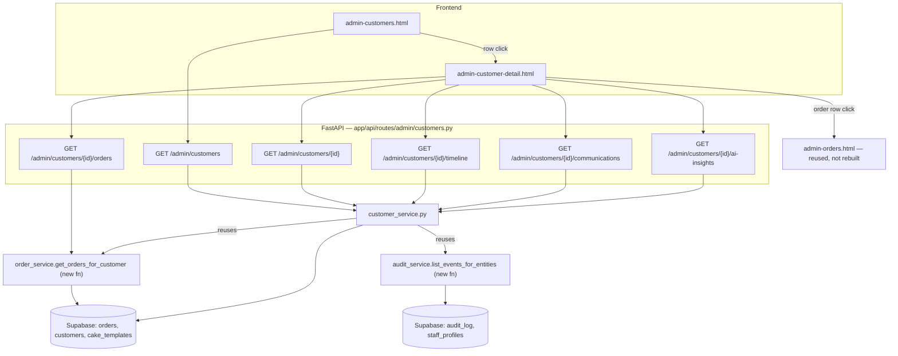
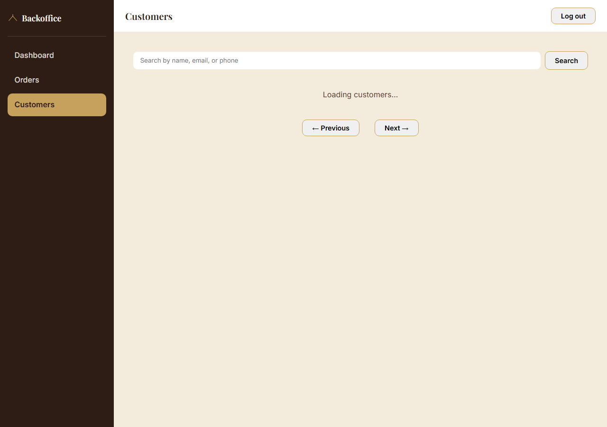
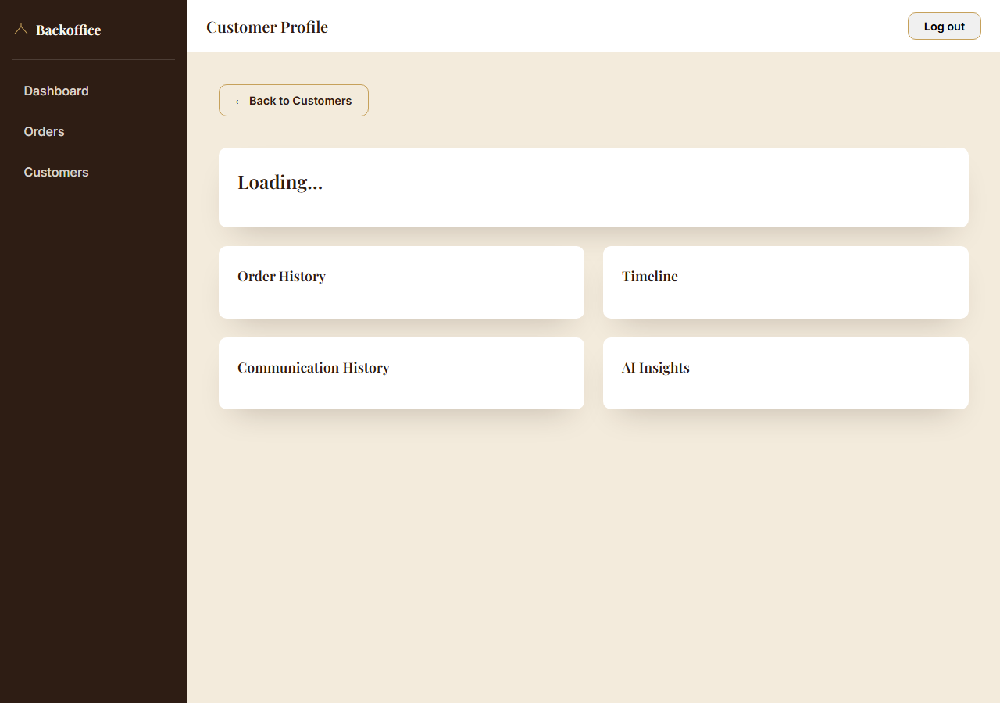

# Epic 1.2 — Customer Management & CRM

**Status:** Implemented, verified via offline unit tests, `TestClient` against the live Supabase project, and a headless-browser structural/visual check. **Full authenticated live-browser testing remains blocked** on the same pending item Phase 1 and Epic 1 both flagged — see [Known limitation](#known-limitation-unchanged-from-epic-1).
**Scope:** The Customers screen, per [`Bakery_Command_Center_UX_Product_Blueprint_v1.md`](Bakery_Command_Center_UX_Product_Blueprint_v1.md) §6, built directly on Phase 1's auth/audit foundation and Epic 1's order management.
**Not built in this release, by instruction:** Gmail, WhatsApp, RAG, ML, or any AI logic — the Communications and AI Insights panels are placeholders whose backend already speaks the shape their real implementation will use (see [Designing for extension](#designing-for-extension-without-refactoring)).

---

## Architecture

Nothing about the layered FastAPI backend or the vanilla-JS, multi-page frontend changed. Epic 1.2 is entirely additive, and reuses more of Epic 1 than it adds:

- **Backend:** one new route module (`app/api/routes/admin/customers.py`), one new service (`customer_service.py`), plus one small new function each on two *existing* services — `order_service.get_orders_for_customer` and `audit_service.list_events_for_entities`. A new two-line shared helper (`search_utils.sanitize_search_term`) removes a small duplication that existed between this screen and `order_service.py`'s customer search — see [Reuse, not duplication](#reuse-not-duplication).
- **Frontend:** two new pages (`admin-customers.html`, `admin-customer-detail.html`) and two new page-orchestrator scripts, following the exact conventions Epic 1 established. `admin-api.js` and `ui-helpers.js` gained new functions, no new files. Every existing admin page's sidebar gained one new nav link.
- **Zero new database migrations.** This screen reads only `customers` and `orders` (both existing since Sprint 1) and `audit_log` (Phase 1, still pending application — see below). No table was added, and — notably — the Customer Timeline needed no new table either, by design (see next section).



---

## Reuse, not duplication

Three concrete examples of extending existing services rather than building parallel ones — the explicit instruction for this epic:

1. **Order history** doesn't query `orders` directly from `customer_service.py`. It calls a new `order_service.get_orders_for_customer(customer_id)`, which reuses `order_service`'s existing, private `_ORDER_DETAIL_SELECT` (the same customer+template embedding Orders and the Production Board already rely on). The response is returned to the frontend using the **same `AdminOrderSummary` schema** the Orders screen already defined — a customer's order history is a list of real orders, in the exact shape the Orders screen already returns them, so no parallel schema was created.
2. **Timeline** reuses Epic 1's audit trail instead of a new `order_status_history` table (which `Master_Blueprint_v1.md` §7 had originally sketched, before Epic 1 discovered `audit_log`'s before/after fields already cover it — see `EPIC1_BACKOFFICE.md`). A new `audit_service.list_events_for_entities(entity_type, entity_ids)` generalizes the existing `list_recent_events` pattern to "every event for a specific set of entities," and `customer_service.get_customer_timeline` merges that with `get_orders_for_customer`'s results — no new table, no duplicated query logic.
3. **Search sanitization**: `order_service.py`'s customer-name/email/phone search (used when searching Orders by customer) and this screen's own customer search needed the exact same small filter-escaping rule. Rather than copy it, it now lives once in `app/services/search_utils.py`, and `order_service._search_customer_ids` was updated to call it — a small, safe refactor of existing code in service of "no duplicated code," not a new capability.

---

## New endpoints

All under `/admin/customers`, all protected by Phase 1's `Depends(get_current_admin)`. This screen is entirely read-only — no route mutates anything, so none of them call `audit_service.record_event` (compare `PATCH /admin/orders/{id}/status`, which does both).

| Method & Path | Purpose | Response shape |
|---|---|---|
| `GET /admin/customers` | Search (`search`) + paginate (`page`, `pageSize`) the customer list | `AdminCustomerListResponse` — `items: AdminCustomerSummary[]`, `total`, `page`, `pageSize` |
| `GET /admin/customers/{id}` | Customer profile: contact info + computed stats | `AdminCustomerDetail` |
| `GET /admin/customers/{id}/orders` | Full order history for this customer | `AdminOrderSummary[]` (reused from `admin_order.py`) |
| `GET /admin/customers/{id}/timeline` | Merged, chronological order-placed + status-change feed | `CustomerTimelineEvent[]` |
| `GET /admin/customers/{id}/communications` | Placeholder | `CustomerCommunicationsResponse` — `{enabled: false, items: []}` today |
| `GET /admin/customers/{id}/ai-insights` | Placeholder | `CustomerAIInsightsResponse` — `{enabled: false, insights: []}` today |

Every `/{id}/...` sub-resource route independently confirms the customer exists (`customer_service.get_customer_by_id`, a cheap raw-row fetch) before doing its own work — the same defensive pattern `admin/orders.py`'s status-update route already uses, rather than trusting a prior call already checked.

### `AdminCustomerSummary` (and `AdminCustomerDetail`, which extends it)

```json
{
  "id": "…", "name": "…", "email": "…", "phone": "…",
  "created_at": "2026-07-29T12:00:00+00:00",
  "orderCount": 3,
  "lifetimeValue": 214.50,
  "lastOrderDate": "2026-08-01T09:30:00+00:00"
}
```
`id`/`name`/`email`/`phone`/`created_at` mirror the `customers` table's own columns 1:1 (existing convention). `orderCount`/`lifetimeValue`/`lastOrderDate` are computed, not raw columns — camelCase, matching the same convention `admin_dashboard.py` already established for computed fields (`totalOrders`, `todaysOrders`).

### `CustomerTimelineEvent`

One flexible shape for every event type (`type` tells the frontend which optional fields are populated):

```json
{ "type": "order_placed", "timestamp": "…", "orderId": "…", "templateName": "Ivory Three-Tier Classic", "status": "pending", "before": null, "after": null, "actorName": null }
{ "type": "order.status_changed", "timestamp": "…", "orderId": "…", "templateName": null, "status": null, "before": {"status": "pending"}, "after": {"status": "confirmed"}, "actorName": "Jane" }
```
A third event kind (a sent communication) is expected to slot into this same shape once Communications ships — that's a concrete instance of "design interfaces so those capabilities can be added without refactoring."

---

## Designing for extension without refactoring

Two panels are explicitly placeholders in this release. Both are built the same way, so extending either later is a backend-only change:

1. The **response schema already has its final field names** (`enabled`, `items`/`insights`) — only their contents change later, not their shape.
2. `customer_service.get_customer_communications`/`get_customer_ai_insights` are one-line functions today (`return {"enabled": False, "items": []}`), with a docstring pointing at exactly what real implementation replaces them (`notifications_log` for Communications, the `ai_*` tables for AI Insights, both already named in `Master_Blueprint_v1.md` §7/§9).
3. The **frontend already branches on `enabled`** (`admin-customer-detail.js`'s `loadCommunications`/`loadAIInsights`): `enabled: false` renders the placeholder state; `enabled: true` with an empty list renders the normal empty state; a populated list is left as a one-line addition (`// Real rendering lands with the Communications phase itself`) at the exact point real items will need real rendering. No existing code needs to be torn out or restructured to make that connection — only added to.

No feature-flag *system* (env vars, a config service) was built for this — that would be scaffolding ahead of need for two functions that return a constant today. When Communications/AI Insights become real epics, that's the point at which a flag might matter (per `Master_Blueprint_v1.md` §5's `AI_FEATURES_ENABLED` sketch); building it now would be guessing at a shape before the feature it configures exists.

---

## New frontend modules

| File | Responsibility |
|---|---|
| `frontend/admin-customers.html` / `js/admin/admin-customers.js` | Customer list: search + paginate, same URL-state convention as `admin-orders.js`. |
| `frontend/admin-customer-detail.html` / `js/admin/admin-customer-detail.js` | Customer profile: five independently-loading panels (profile header, order history, timeline, communications, AI insights) — one slow/failed panel never blocks the others. |
| `js/admin/admin-api.js` *(extended)* | `getAdminCustomers`, `getAdminCustomer`, `getCustomerOrders`, `getCustomerTimeline`, `getCustomerCommunications`, `getCustomerAIInsights`. |
| `js/admin/ui-helpers.js` *(extended)* | `renderPlaceholderState` — visually distinct from `renderEmptyState` on purpose: "empty" means the feature is live with no data, "placeholder" means the feature isn't enabled yet. Reuses the dashed-border/diagonal-stripe language the Dashboard's AI Insights card already established, rather than inventing a new visual idea. |

**Order rows on the profile page link to `admin-orders.html?id=<orderId>`** rather than re-rendering order detail on the Customers page — that page already owns full order detail + status update (Epic 1); this page reuses it instead of duplicating it.

**Safe rendering, unchanged discipline:** every render function in both new scripts builds DOM via `createElement`/`textContent`, never `innerHTML` + interpolation, for the same reason documented in `EPIC1_BACKOFFICE.md` — customer name/email/phone originate from the public, unauthenticated order form, and this page holds the admin's bearer token in `sessionStorage`.

---

## Database usage

No new migrations. Reads only:
- `customers` — existing table, unchanged schema.
- `orders` — existing table, unchanged schema; queried via `order_service.get_orders_for_customer` (new function, existing table).
- `audit_log` / `staff_profiles` — Phase 1's tables, queried via `audit_service.list_events_for_entities` (new function, existing tables) — still not yet applied to the live database (see below).

Order-stats aggregation (`orderCount`/`lifetimeValue`/`lastOrderDate`) fetches `customer_id, total_price, created_at` for the relevant batch of customers and aggregates client-side in Python — the same tradeoff `dashboard_service._get_order_stats()` already makes, for the same reason (cheap at this project's volume; the natural spot to switch to a server-side aggregate later is named in the code).

---

## Security model

Identical posture to Epic 1, extended to six more routes:

1. **Requires authentication** — `Depends(get_current_admin)` on every route.
2. **Requires authorization** — same dependency; this screen has no role-restricted actions (viewing customer data is open to any active staff member, matching the Blueprint's "staff — quick lookup mid-call" target user).
3. **Uses the reusable security dependencies** — no route parses a header or checks a token itself.
4. **Audit logging** — not applicable to this release: the screen is read-only, so there is nothing to log. The moment this screen gains a write action (an internal note/tag, per the Blueprint's "future" list), it calls `audit_service.record_event` exactly the way `admin/orders.py`'s status-update route already does.

---

## API documentation

Extends the endpoint table already maintained in `EPIC1_BACKOFFICE.md` — the six routes in this document's [New endpoints](#new-endpoints) section are the complete, current `/admin/customers/*` surface. Combined with Phase 1 and Epic 1's endpoints, the full `/admin/*` API today is: `POST /admin/login`, `POST /admin/logout`, `GET /admin/me`, `GET /admin/dashboard`, `GET|PATCH /admin/orders...`, and the six `GET /admin/customers...` routes above — every one behind `Depends(get_current_admin)`, no exceptions.

---

## Testing

### Existing customer-facing functionality — regression, unchanged
Verified via `fastapi.testclient.TestClient` against the live Supabase project, re-run after this epic's changes: `GET /health`, `GET /`, `GET /collections` (5 items), `GET /templates` (15 items), `GET /designer/{id}` — all still **200**.

### Existing admin functionality — regression, unchanged
`POST /admin/login` with wrong credentials still round-trips to Supabase Auth and returns 401 `Invalid email or password`; `GET /admin/me`, `GET /admin/dashboard`, `GET /admin/orders` still 401 without a token — identical behavior to Epic 1's own verification, re-run rather than assumed.

### New customer routes
All six registered and auth-gated (401 without a token, including `/admin/customers/not-a-uuid`, which fails cleanly rather than raising an unhandled error). Offline pure-logic checks:
```
cd backend
python -m tests.test_customer_service       # 6/6 pass
python -m tests.test_order_service_admin    # 5/5 pass (unchanged, re-run)
python -m tests.test_security_dependencies  # 7/7 pass (unchanged, re-run)
```
`test_customer_service.py` covers: pagination math, `sanitize_search_term`'s escaping (including that it's still applied correctly after being extracted into `search_utils.py`), the empty-input short-circuit in the stats aggregator (proving no network call happens for an empty customer list), and both placeholder functions' exact response shape.

### Frontend — structural and visual
Headless Chrome + CDP, same technique as Epic 1: `admin-customers.html` renders the search bar, table container, and pagination controls; the sidebar correctly marks "Customers" active; `admin-customer-detail.html` renders all five panel containers (profile grid, order history, timeline, communications, AI insights); `admin-dashboard.html`'s sidebar now lists all three nav items ("Dashboard", "Orders", "Customers"), confirming the new nav link was added consistently everywhere, not just on the new pages. Zero console errors across the whole run. `node --check` passed on every new/modified JS file.

Screenshots (captured mid-load against the not-yet-deployed backend — see below, not touched up):

**Customers list:**


**Customer profile:**


---

## Known limitation (unchanged from Epic 1)

Re-confirmed at the start of this epic: `staff_profiles`/`audit_log` still aren't applied to the live database, and none of Epic 1 or Epic 1.2's backend code has been deployed to the production Railway service `frontend/js/api.js` is hardcoded to call. A direct fetch against that production URL during verification confirmed it responds quickly (404 in ~230ms) rather than hanging — the "Loading…" state visible in both screenshots above is a screenshot-timing artifact of the verification script, not a stuck or broken loading state; `TestClient` verification (which talks to the local, current code directly) confirms every route behaves correctly. Full end-to-end verification (a real login → a real customer list with real stats → a real profile page) is unlocked the same way `EPIC1_BACKOFFICE.md` already describes: apply Phase 1's migration and provision one staff account.

---

## Explicitly out of scope for this epic

Gmail, WhatsApp, RAG, ML, and any AI logic — the Communications and AI Insights panels are placeholders by design (see [Designing for extension](#designing-for-extension-without-refactoring)). Internal notes/tags, direct messaging from the profile page, and the churn-flag/order-pattern-summary AI features named in `Bakery_Command_Center_UX_Product_Blueprint_v1.md` §6 all remain later phases.
