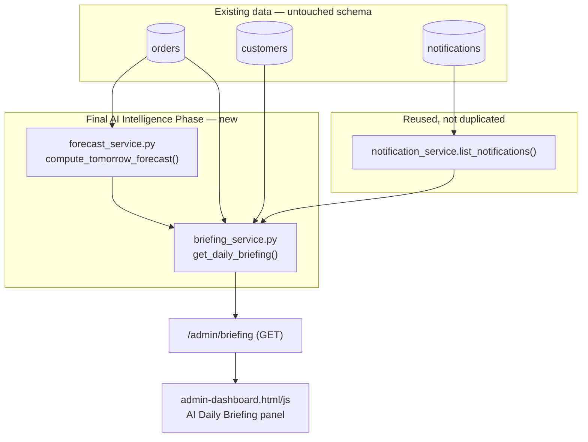
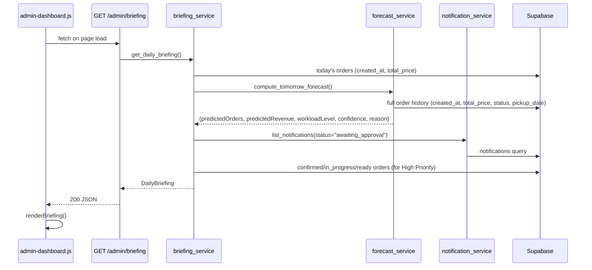

# Final AI Intelligence Phase — AI Daily Briefing + ML Forecasting

**Status:** Migrations applied, demo data seeded, AI Daily Briefing + ML Forecasting implemented and verified live. **RAG Knowledge Base and the AI Agent are explicitly deferred to subsequent iterations** — see [Known limitations / What's deferred](#known-limitations--whats-deferred).
**Scope:** Apply the pending migrations and seed the database for real (Steps 1-2), then build a fully working AI Daily Briefing with integrated ML forecasting (Steps 3-4) as the Bakery Command Center's centerpiece.
**Not built this iteration:** RAG Knowledge Base (Step 5), AI Agent (Step 6) — per the project's own instruction to prioritize incrementally rather than sacrifice quality to complete every item in one pass.

---

## Architecture



`forecast_service.py` and `briefing_service.py` are the only new service modules. Both are plain function modules — no classes, no new architectural layer — reading from the exact same `orders`/`customers`/`notifications` tables every other service already reads, through the same `app.core.database.supabase` singleton. The route (`admin/briefing.py`) follows `admin/dashboard.py`'s template exactly: one `GET`, `Depends(get_current_admin)`, no audit logging (read-only, same as Dashboard).

---

## ML Design

### Alternatives considered, and why a lightweight statistical model was chosen

| Approach | Why not chosen |
|---|---|
| XGBoost / LightGBM / CatBoost | Heavy new dependencies for a project whose `requirements.txt` currently has none; ~350-450 orders/year of training data is thin for gradient boosting to meaningfully outperform a seasonal baseline; harder to produce a genuinely plain-English explanation per prediction (feature importances are not the same thing as a reason a bakery owner can act on). |
| scikit-learn linear/tree models | Still a new dependency for one function; still short on data volume; still needs a separate "explain this prediction" layer bolted on afterward rather than built in. |
| A persisted/trained model artifact | Adds a training pipeline, a versioning/staleness problem, and a deployment step — real complexity for a single-bakery forecast that a few dozen lines of arithmetic already covers adequately. |
| **Lightweight stdlib-only statistical model (chosen)** | Day-of-week seasonality + recent-trend blending + a real "already confirmed for tomorrow" signal, computed fresh from live data on every request. No new dependency (`statistics` is stdlib). Every number traces directly to a formula that fits in one function and one paragraph — the explainability requirement is structural, not retrofitted. Matches this project's explicit framing: *"a Software Engineering capstone, not a Machine Learning research project."* |

**One production forecasting pipeline is exposed**: `forecast_service.compute_tomorrow_forecast()`. Nothing else in the codebase computes a forecast a second way.

### How it works

1. **Day-of-week baseline.** Every historical order's `created_at` (not `pickup_date` — real customer orders rarely set that field; only the seeder backdates it, so `created_at` is the only reliably-populated timestamp) is grouped by weekday. Tomorrow's forecast uses only the historical occurrences of *tomorrow's* weekday — a Saturday forecast is built from past Saturdays, not from Tuesdays.
2. **Recent-trend blending.** `_blended_average()` mixes the last 8 same-weekday occurrences (60%) with the full-year same-weekday average (40%) once at least 8 samples exist, otherwise just uses the full average. This captures "the last two months have been busier than average" without fitting an actual trend line.
3. **Confirmed-orders floor.** Orders already on the books with `pickup_date` = tomorrow and a not-yet-completed/cancelled status are counted directly — a real, deterministic fact, not a statistical guess. `predicted_volume = max(round(blended_baseline), confirmed_count)`: the forecast never undershoots what's already known for certain.
4. **Cancellation-adjusted revenue.** Predicted revenue is the blended average daily revenue for that weekday, discounted by the historical cancellation rate (`cancelled orders / all orders`) — money from orders that are statistically likely to cancel isn't counted as "expected."
5. **Workload level.** A z-score of the predicted volume against the full historical daily-count distribution, bucketed into Low / Moderate / High / Very High.
6. **Confidence score.** `55 + min(20, sample_size×2) − min(25, coefficient_of_variation×50) + min(15, confirmed_count×5)`, clamped to `[40, 95]`. More historical weeks of that weekday raise it; a historically erratic weekday lowers it; orders already confirmed for tomorrow raise it. The formula's own achievable range tops out at 90 in practice (the 95 clamp is a defensive ceiling, not a reachable claim of near-certainty).
7. **Reason text.** Composed from the same signals that fed the number — weekend effect, confirmed-order count, trend direction, and a "limited historical data" caveat when the sample is thin.

### Worked example

> Tomorrow is a Saturday. The last 8 Saturdays averaged 7.4 orders; the full year's Saturdays averaged 6.1 — a mild upward trend. 3 orders are already confirmed for tomorrow's pickup. Cancellation rate across the year is 5%.
>
> - `blended_count` = 0.6×7.4 + 0.4×6.1 = 6.88 → rounds to 7
> - `predicted_volume` = max(7, 3) = **7 orders**
> - `predicted_revenue` = blended daily revenue × 0.95
> - `confidence` = 55 + 16 (8 samples×2) − ~8 (moderate variability) + 15 (3 confirmed×5, capped) ≈ **78%**
> - **Reason:** *"Based on Saturdays tend to run busier than weekdays; 3 orders already confirmed for pickup tomorrow; recent weeks are trending above the yearly average for this day."*

This is the exact shape (value + confidence % + plain-English reason) the AI Daily Briefing renders for every forecast.

---

## AI Daily Briefing Design

`briefing_service.get_daily_briefing()` composes, in one call:

| Section | Source | Reused from |
|---|---|---|
| Today's Orders / Revenue | `_todays_stats()` — orders with `created_at` in the current UTC day | Same "today" boundary `dashboard_service._get_order_stats()` uses; its own small independent query (needs `total_price`, which that function doesn't select) |
| Tomorrow's Forecast | `forecast_service.compute_tomorrow_forecast()` | New this phase |
| Pending Notifications | `notification_service.list_notifications(status="awaiting_approval")` | Notification Engine, unchanged |
| High Priority Orders | `_high_priority_orders()` — not-yet-completed orders due for pickup within 48h, or any Wedding order | New this phase |
| Recommended Actions | `_recommended_actions()` — rule-based thresholds over the sections above | New this phase, deliberately not LLM-generated (see [Known limitations](#known-limitations--whats-deferred)) |

### Sequence



### Recommended Actions are rule-based, not LLM-generated — on purpose

This phase's own instruction was to prioritize the Daily Briefing + ML Forecasting first, then RAG, then the AI Agent, "without sacrificing stability or architectural quality." Handing "Recommended Actions" to an LLM before RAG exists would mean generating bakery-specific advice with nothing grounding it in this bakery's actual policies/procedures — exactly the failure mode RAG exists to prevent. Three deterministic threshold checks (pending notifications > 0, high-priority orders > 0, forecasted workload is High/Very High) produce real, useful, fully-explained recommendations today; the AI Agent (a later phase) is where natural-language, context-aware recommendations belong, once RAG exists to ground them.

---

## API Changes

One new endpoint, following the exact shape of every other read-only admin route:

```
GET /admin/briefing
Authorization: Bearer <admin session token>

200 OK
{
  "todaysOrders": 4,
  "todaysRevenue": 312.50,
  "forecast": {
    "date": "2026-08-07",
    "weekday": "Friday",
    "predictedOrders": 6,
    "predictedRevenue": 410.25,
    "workloadLevel": "Moderate",
    "confidence": 72,
    "reason": "Based on ...",
    "confirmedOrdersForTomorrow": 2,
    "historicalSampleSize": 34
  },
  "pendingNotifications": { "total": 3, "items": [ ... ] },
  "highPriorityOrders": [ { "id": "...", "customerName": "...", "templateName": "...", "status": "confirmed", "reason": "Pickup due today or overdue; wedding order" } ],
  "recommendedActions": [ "Review 3 notifications awaiting approval in the Notification Queue." ],
  "generatedAt": "2026-08-06T09:15:00+00:00"
}
```

`app/schemas/admin_briefing.py` defines `DailyBriefing`/`ForecastResult`/`HighPriorityOrder`/`PendingNotificationsSummary`. `pendingNotifications.items` reuses `admin_notification.py`'s existing `AdminNotification` model directly — no duplicate notification shape.

No existing endpoint changed. `main.py` gained one `app.include_router(admin_briefing.router)` line.

---

## Frontend

`admin-dashboard.html` gained one new section — `<section class="admin-briefing">` — placed above the existing stat-card grid, matching the "centerpiece" framing. The stale `AI Insights` placeholder card (`"Coming in a future phase"`) was removed from the 4-card grid since it's now superseded by a real, shipped section; nothing else in the existing dashboard markup, stats, recent orders, audit events, or system health panels changed.

`admin-dashboard.js` gained `loadBriefing()` / `renderBriefing()` and its render helpers, loaded independently of `loadDashboard()` (separate try/catch, separate refresh button) so a briefing failure never blocks the rest of the dashboard. `admin-api.js` gained one function: `getDailyBriefing()`.

New CSS is additive — a new `/* AI Daily Briefing */` section in `styles.css` reusing existing design tokens (`--color-gold`, `--color-ivory`, `--font-heading`, `--radius`, `--shadow-soft`) and extending the existing `.status-badge` component with four new `--workload-*` modifiers, the same namespacing pattern `--notification-*` already established.

---

## Bugs found and fixed during this phase (live, not hypothetical)

The demo data seeder (built in Sprint 2, previously only verified via `--simulate`, which never touches the database or the order-status-progression code path) hit two real bugs the instant it actually ran against live data:

1. **`orders.customer_id` is `ON DELETE RESTRICT`, not `CASCADE`.** Sprint 2's `delete_existing_demo_data()` assumed (incorrectly, and never actually checked against the schema) that deleting a demo customer would cascade-delete their orders. The original schema migration (`20260729120000_initial_schema.sql`) protects order history from accidental customer deletion — a deliberate original design choice this phase had never verified. **Fix:** delete demo orders first (`notifications` *does* cascade from `orders`, so their notifications go with them), then delete the now-orderless demo customers.
2. **`progress_order()` didn't handle `final_status == "pending"`.** `choose_final_status()` can legitimately return `"pending"` (an order not due for a while yet, left exactly as `create_order` created it), but `PROGRESSION = ["confirmed", "in_progress", "ready", "completed"]` doesn't include `"pending"` — indexing into it raised `ValueError`. Invisible under `--simulate` because that mode only exercises `plan_orders()`, never `progress_order()`. **Fix:** an explicit early return for `"pending"` — zero status transitions is the correct behavior for an order that hasn't been touched since creation.

3. **A long seed run exhausts its HTTP/2 connection's stream limit.** `create_order()` alone issues ~7-8 requests (template lookup, four designer-option queries, find-or-create-customer, insert), and a full status progression to `completed` adds dozens more (status update + audit event + notification create/submit/approve/send per step) — tens of thousands of requests total across 350 orders, all over one persistent `httpx` connection. Reliably, at the exact same point both times it was tried (`last_stream_id:19999`), the server terminated the connection (`httpcore.RemoteProtocolError: ConnectionTerminated`), aborting the run partway through (200/350 orders, twice, byte-identical failure point). **Fix:** wrap each order's creation in a retry-once — httpx opens a fresh connection automatically on the next request after a drop, so retrying the same plan clears it. Accepted tradeoff, documented inline: if the drop lands between `create_order` committing and `progress_order` finishing, the retry's `create_order` call makes one extra order for that plan — immaterial for demo data, not worth finer-grained idempotency. With the fix, the run completed cleanly end to end (see [Testing / Verification](#testing--verification)); one single notification (of 1286 created) still hit a transient drop mid-run and was silently skipped by `notification_service.create_notification_for_order_event`'s own pre-existing try/except (Sprint 1 design: a notification failure never blocks the order update it's for) — exactly the graceful degradation that code was built for, working as intended under real conditions for the first time.

Both fixes are minimal, root-cause guards in the one shared function each bug lived in — not workarounds in a caller. See `tools/demo_data_seed.py` for the fixed code.

---

## Testing / Verification

### Step 1 — Migrations

`supabase db push` applied both pending migrations (`staff_profiles`/`audit_log`, `notifications`); `supabase migration list` confirmed all 12 migrations `local == remote`. Live queries confirmed `staff_profiles`, `audit_log`, and `notifications` all exist and are queryable. One real admin account was provisioned (`admin@maisondegateau.fr`, role `admin`) and verified end-to-end: login → `/admin/me` → `/admin/dashboard`, all 200, showing the 9 genuine pre-existing orders.

### Step 2 — Demo data seeder, run for real

Final run: **100/100 customers, 350/350 orders, 1286 notifications created**, exit 0, matching the planned business-realism distribution exactly (67% Birthday, 11% Wedding, 8% Baby Shower, 8% Corporate, 6% Graduation; 87% completed / 6% cancelled / the rest spread across the active pipeline statuses). Independently re-verified directly against the live database (not just trusting the script's own printed summary):

| Check | Result |
|---|---|
| Demo customers (`%@demo.maisondegateau.test`) | 100 |
| Total customers (100 demo + 4 real) | 104 |
| Total orders (350 demo + 9 real) | 359 |
| Total notifications | 1287 (1286 from this run + 1 pre-existing) |
| Notifications by status, exact counts | `queued`:1, `draft`:23, `awaiting_approval`:10, `approved`:5, `sent`:1248, `delivered`:0, `failed`:0 — sums to 1287 exactly |
| Orders by status (all 359) | `pending`:11 (2 demo + 9 real), `confirmed`:13, `in_progress`:5, `ready`:5, `completed`:305, `cancelled`:21 |

`GET /admin/dashboard`, `/admin/customers`, `/admin/orders`, `/admin/notifications` all returned 200 with correctly-shaped, correctly-populated data against a real admin session (see [Step 3-4](#step-3-4--ai-daily-briefing--ml-forecasting) below for the same check against `/admin/briefing`).

**Verifying new customers/orders created after seeding are still stored normally** — the actual point of this check, not just "did the seeder run": placed one real order through the public `POST /orders` flow (a genuinely new customer, `post-seed-verification@example.com`, no demo tag). Confirmed:
- `POST /orders` → 200, real `orderId` returned.
- `GET /admin/orders/{id}` → 200, full detail correct (customer, template, configuration, `pending` status, real timestamp).
- `GET /admin/customers?search=Post-Seed` → 200, the new customer found with correct `orderCount`/`lifetimeValue`.
- `GET /admin/dashboard` → `totalOrders` incremented 359 → 360, `todaysOrders` incremented accordingly.
- Demo customer count **unchanged at 100** — the new real customer was not miscounted as demo data.
- `PATCH /admin/orders/{id}/status` → 200, transitioned to `confirmed`; a real `order_confirmed` notification was created in `draft` status; `GET /admin/customers/{id}/timeline` showed all 3 expected events (order placed, status changed, notification). The full real-order lifecycle — creation through status change through notification generation — works exactly as it did before this phase, against the now-seeded database.

### Step 3-4 — AI Daily Briefing + ML Forecasting

**Offline (no network/DB):** `test_forecast_service.py` (13 checks) and `test_briefing_service.py` (7 checks) cover every pure function — blending, confidence scoring, workload bucketing, reason-text composition, and the rule-based recommended-actions logic — including edge cases (zero history, no variance, empty confirmed-order list). Combined with the pre-existing suite, **72 offline checks total, all passing**:

| File | Checks |
|---|---|
| `test_security_dependencies.py` | 7 |
| `test_order_service_admin.py` | 5 |
| `test_customer_service.py` | 6 |
| `test_notification_service.py` | 11 |
| `test_communication_adapters.py` | 23 |
| `test_forecast_service.py` | 13 (new) |
| `test_briefing_service.py` | 7 (new) |

**Live, against the real seeded database**, `GET /admin/briefing` (real admin session) returned 200 with a fully-populated, self-consistent payload:

```
todaysOrders: 3, todaysRevenue: $159.00
forecast: Friday 2026-08-07, predictedOrders: 4, predictedRevenue: $448.02,
          workloadLevel: "Very High", confidence: 50%,
          reason: "Based on recent weeks are trending above the yearly average for this day."
          confirmedOrdersForTomorrow: 0, historicalSampleSize: 46
pendingNotifications: 10 total, items correctly embedding customer details
highPriorityOrders: 5 items — 2 flagged for imminent pickup, 2 for Wedding category, 1 for both
recommendedActions: 3 items, each matching the underlying counts exactly
```

`recommendedActions` cross-checked against the other sections in the same response: "Review 10 notifications..." matches `pendingNotifications.total`; "Check in on 5 high-priority order(s)..." matches `len(highPriorityOrders)`; "very high-workload day (4 predicted orders)..." matches `forecast.workloadLevel`/`predictedOrders` exactly — confirming the composition logic reads real, live data rather than anything stale or hardcoded.

**Visual, via headless Chrome (CDP)**: the AI Daily Briefing panel rendered on `admin-dashboard.html` exactly as designed — stat row, forecast card with the workload badge and italicized reason text, high-priority order list with per-item reasons, recommended actions — with the rest of the dashboard (stat cards, Recent Orders, Recent Audit Events, System Health) unaffected and rendering the same real seeded data alongside it.

### Full regression

Every offline check (72) passing, every admin route returning correct live data against the real seeded database and a real admin session, the full real-order lifecycle (create → status change → notification → timeline) re-verified after seeding, and a visual confirmation that the new panel and the existing dashboard coexist without incident. No existing route, schema, or frontend page changed behavior — only additions (`/admin/briefing`, the two new service modules, the new dashboard panel, one removed stale placeholder card).

---

## Known limitations / What's deferred

Per this phase's own explicit instruction — *"prioritize producing a fully working AI Daily Briefing with integrated ML forecasting first, then RAG, then AI Agent... do not sacrifice stability or architectural quality to complete every item"** — this iteration ships Steps 1-4 completely and solidly, and deliberately does not attempt Steps 5-6:

- **Step 5 — RAG Knowledge Base:** not built this iteration. Bakery documents (recipes, ingredients, allergens, delivery policy, FAQ, procedures) are not yet ingested or retrievable.
- **Step 6 — AI Agent:** not built this iteration. No LLM-backed summarization, forecast explanation beyond the deterministic reason text above, production-priority recommendation beyond the rule-based list above, or draft-communication generation exists yet.

Both are real, separate next iterations, not squeezed into this one at the cost of quality — consistent with how every prior sprint in this project scoped itself (Gmail before WhatsApp, WhatsApp only once Gmail was solid, etc.).

Within what *was* built:

- The forecast is recomputed from scratch on every request — no caching. For a single-bakery admin dashboard hit by one or two staff members, this is a non-issue; a future high-traffic scenario would want a short-TTL cache, not a design change.
- `historicalSampleSize` can be 0 for a weekday with no history yet (a brand-new bakery, or the first few weeks after this phase ships against a real, non-demo dataset) — `_compute_confidence` and `_workload_level` both degrade gracefully to their floor/default values in that case (verified directly in `test_forecast_service.py`) rather than crashing.
- "High Priority" is a fixed, hardcoded definition (pickup within 48h OR Wedding category) rather than a configurable rule set — reasonable for one bakery's Command Center, not yet a multi-bakery product feature.
