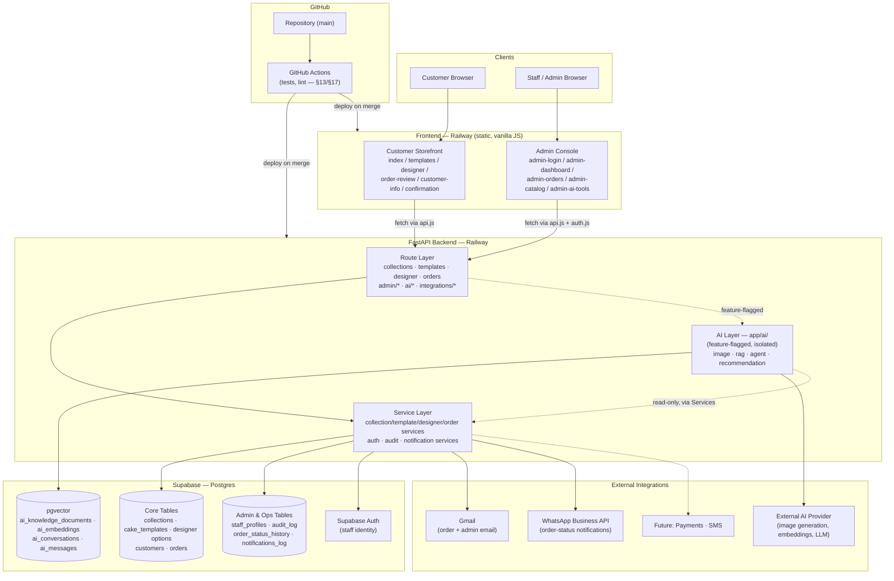
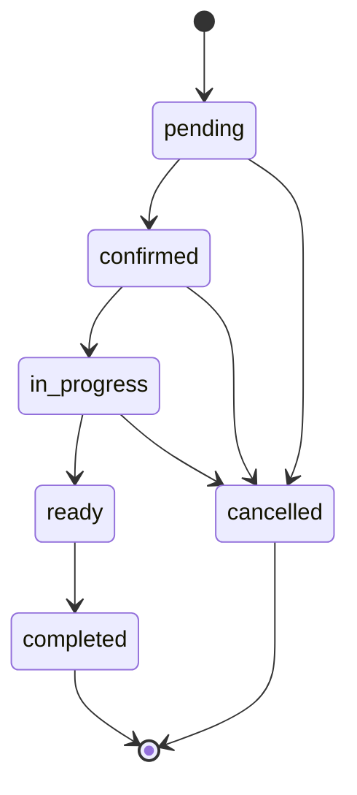
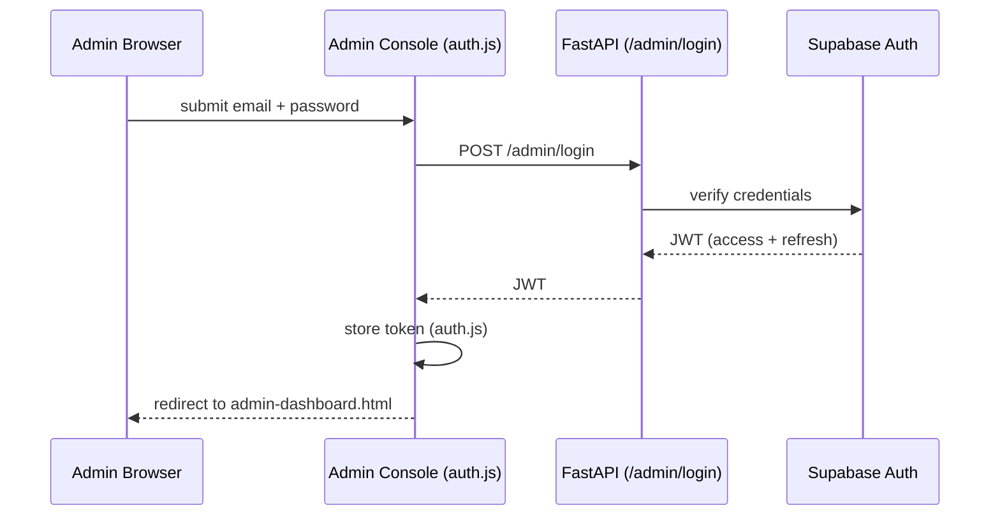
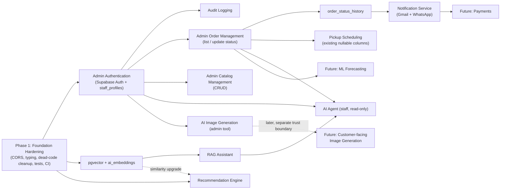

# CakeCraft Studio — Master Blueprint v1

**Status:** 🔒 ARCHITECTURE FREEZE — Official target-architecture document for Version 2
**Date:** 2026-08-05
**Source of truth:** [`docs/Project_Audit_Report_v1.md`](Project_Audit_Report_v1.md) (current-state audit)
**Nature of this document:** Planning and architecture only. **No production code is included.** Any SQL, function signatures, or folder trees below are design-level sketches to communicate intent, not implementation-ready artifacts.

## How to read this document

Every section describes the **target (V2)** state, explicitly building on top of the **current (V1)** state as documented in the Audit Report. Where a decision extends something that already exists, that is called out. Where a decision introduces something new, its dependencies on existing pieces are called out. Nothing here proposes replacing the current backend framework, frontend approach, or database technology — see the constraint below.

> **Hard constraint carried through this entire document:** Do not redesign the existing architecture. CakeCraft Studio V2 **extends** the current layered FastAPI backend (routes → services → Supabase client) and the current vanilla-JS, multi-page frontend (page orchestrators + shared pure-function utility modules + a single `api.js` fetch boundary). No framework migration, no ORM introduction, no SPA rewrite is in scope.

---

## 1. Executive Summary

CakeCraft Studio V1 is a working, deployed, unauthenticated customer-ordering funnel: browse collections → pick a template → customize → review → submit contact details → confirmation. The Audit Report confirmed the engineering foundation is sound (strict separation of concerns, zero business-logic duplication, consistent conventions) but identified clear gaps against a production bakery-management platform: no authentication of any kind, no admin/back-office tooling, no AI capability despite the README's "AI-Native" claim, no automated tests, several dead schema/files, and a handful of hardening items (CORS, schema typing, stale docs).

This Blueprint defines how CakeCraft Studio grows from a **single customer-facing ordering funnel** into a **cloud-native, AI-assisted bakery management platform** — adding an authenticated admin/staff side, an optional and clearly-isolated AI layer, external communication integrations (email, WhatsApp), and the testing/documentation/security practices a production system needs — **without discarding or restructuring anything that already works.** Every new capability is additive: a new route module, a new service, a new table, a new page — following the exact conventions the audit found already in place.

The document is organized so it can double as a phased delivery plan (§17) and a reference architecture (§3–§13) at the same time, consistent with the project's own stated principle of incremental, milestone-based delivery (`docs/ARCHITECTURE.md`, Principle 5).

---

## 2. System Vision

**CakeCraft Studio as a cloud-native, AI-powered bakery management platform.**

V1 answers one question: *"How does a customer design and submit a custom cake order?"* V2 additionally answers: *"How does the bakery run its business around those orders, and how does AI make both sides of that easier — without ever becoming a dependency the platform can't function without?"*

Three pillars define the vision:

1. **Cloud-native by default.** Stateless FastAPI services, a managed Postgres database (Supabase), infrastructure-as-config (`railway.json`), and secrets sourced from the deployment platform rather than the codebase — all already true today and preserved unchanged as the platform grows.
2. **Two audiences, one codebase.** The customer-facing funnel (unauthenticated, public, unchanged in spirit) and a new authenticated admin/staff side (order management, catalog management, AI tooling) coexist in the same repository, same backend, same frontend conventions — not a second application.
3. **AI as an enhancement, never a foundation.** This restates `docs/ARCHITECTURE.md` Principle 9 verbatim because it is the single most important constraint on the AI Architecture (§9): every AI capability is feature-flagged, isolated behind its own service boundary, and the platform must remain fully order-capable with zero AI provider keys configured.

---

## 3. High-Level Architecture

### Frontend
Two vanilla-JS, multi-page surfaces sharing one `frontend/` project and one design system: the existing **customer storefront** (6 pages, unchanged) and a new **admin console** (new pages, same conventions — static HTML + a page-orchestrator script + shared pure-function/API modules). No SPA framework, no bundler, no build step — matching the audit's finding that this discipline is already the codebase's strongest trait.

### Backend
One FastAPI application, same layered flow (**Route → Service → Data access**) extended with new route groups (`/admin/*`, `/ai/*`, `/integrations/*`) and new services, all following the existing per-domain-file convention. A new `app/ai/` package holds every AI-related service, kept structurally separate so the AI layer can be disabled entirely without touching core order/catalog logic.

### Database
The existing Supabase Postgres database, same migration-driven workflow (`supabase/migrations/*.sql`), extended with new tables for admin identity, audit logging, order-status history, notification logs, and — when the AI layer lands — a `pgvector`-backed embeddings store. No existing table is dropped or restructured; dead schema (`customization_options`) is retired per the Audit's recommendation (§9 of the Audit Report), not repurposed.

### AI Layer
A set of optional, independently-toggleable services: image generation, retrieval-augmented generation (RAG) over a bakery knowledge base, a scoped AI agent for staff/customer assistance, a recommendation engine, and a deferred machine-learning track. Every capability reads through the existing service layer for order/catalog data — it never bypasses it, and never gets direct write access to the database without going through an existing, already-validated service function.

### External Integrations
Gmail (transactional email), WhatsApp Business Cloud API (order-status notifications), and a documented set of future integrations (payments, SMS) — all called from a new `notification_service.py`, never directly from route handlers.

### Deployment
GitHub remains the source of truth; Railway remains the host for both the backend and frontend services (as already live today); Supabase remains the managed database. Netlify is documented as an evaluated-but-not-committed alternative for static hosting (see §11) — it is not part of the current deployment and this Blueprint does not require adopting it.

---

## 4. Component Diagram

---

## 5. Backend Architecture

The existing `backend/app/{api/routes, services, schemas, core}` layout is preserved exactly. Everything below is additive.

### Route layer
- **Unchanged:** `health.py`, `collections.py`, `templates.py`, `designer.py`, `orders.py`.
- **New — `app/api/routes/admin/`:**
  - `auth.py` — `POST /admin/login`, `POST /admin/logout`, `GET /admin/me`.
  - `orders.py` — `GET /admin/orders` (list/filter), `PATCH /admin/orders/{id}/status` (transition through the existing `status` check-constraint values).
  - `catalog.py` — CRUD over collections/templates/designer options, replacing the audit's "only editable via raw SQL" gap.
- **New — `app/api/routes/ai/`** (each endpoint individually feature-flagged, see §9): `image.py`, `assistant.py`, `recommendations.py`.
- **New — `app/api/routes/integrations/`:** `webhooks.py` — inbound WhatsApp delivery/status webhooks.

All new routes keep the existing convention: thin handlers, `try/except` mapping to the same `ValueError → 400`, `None → 404`, generic `→ 500` pattern already used in `orders.py`. New `/admin/*` and `/ai/*` routes additionally depend on the auth dependency defined in §8.

### Service layer
- **Unchanged:** `collection_service.py`, `template_service.py`, `designer_service.py`, `order_service.py` — plus the two audit-flagged fixes applied in place (email uniqueness handling, id typing — see §17 Phase 1), no structural change.
- **New:** `auth_service.py` (verifies Supabase Auth JWTs, resolves `staff_profiles.role`), `audit_service.py` (single `record(actor_id, action, entity_type, entity_id, before, after)` helper called from every admin write path), `notification_service.py` (Gmail + WhatsApp senders behind one interface, logs every send to `notifications_log`).
- **New — `app/ai/`** (see "Future AI services" below).

### Data access
No ORM is introduced. New tables are queried with the exact same `supabase.table(...).select/insert/update().execute()` pattern already used throughout `order_service.py`. This is a deliberate continuation, not an oversight — the audit found this pattern consistently applied with zero exceptions, and introducing an ORM for only the new tables would fragment the codebase's one data-access idiom into two.

### Utilities
New, narrowly-scoped helper modules (not a generic "utils" dumping ground, consistent with the audit's finding of clean single-responsibility files): password/session helpers used only by `auth_service.py`; an email/WhatsApp templating helper used only by `notification_service.py`; a prompt-template and text-chunking helper used only inside `app/ai/`.

### Future AI services
`app/ai/` is a peer of `app/services/`, not a subfolder of it — signaling structurally that it is optional. Each file wraps exactly one capability: `image_generation_service.py`, `rag_service.py`, `agent_service.py`, `recommendation_service.py`. Every function in this package checks a feature flag (`AI_FEATURES_ENABLED` plus per-capability flags, e.g. `AI_IMAGE_GENERATION_ENABLED`) and raises a clean "feature disabled" condition the route layer turns into a 501/404 — never a partial failure. No route outside `/ai/*` ever imports from `app/ai/`, so the core ordering funnel provably cannot regress because of an AI dependency going down.

---

## 6. Frontend Architecture

The existing `frontend/{*.html, js/, css/}` layout and its conventions are preserved exactly. Everything below is additive.

### Pages
- **Unchanged:** `index.html`, `templates.html`, `designer.html`, `order-review.html`, `customer-information.html`, `confirmation.html`.
- **New (admin console, auth-gated):** `admin-login.html`, `admin-dashboard.html` (order/queue overview), `admin-orders.html` (list + status transitions), `admin-catalog.html` (collections/templates/options CRUD), `admin-ai-tools.html` (image generation + assistant, only rendered if the backend reports the relevant AI feature flag as enabled). Each page follows the existing one-orchestrator-file rule: `admin-orders.js`, `admin-catalog.js`, etc.

### Shared modules
- **Unchanged, reused as-is by admin pages too:** `summary.js`, `validation.js` (extended with new pure validation functions for admin forms — never modified logic for existing ones), `pricing.js`.
- **New:**
  - `auth.js` — the only file that reads/writes the admin session token; exposes `getAuthHeader()`, `isLoggedIn()`, `logout()`. No other file touches the token directly, mirroring how `api.js` is today the *only* file allowed to call `fetch()`.
  - `admin-api.js` (or additive functions inside `api.js`, decided at implementation time) — the equivalent fetch boundary for `/admin/*` and `/ai/*` endpoints, attaching `auth.js`'s header to every call.

### State management
Unchanged for the customer funnel: all state travels through URL query parameters, no client-side storage, no framework state. For the admin console, the **only** new client-side state is the auth token from `auth.js` (held in memory + `sessionStorage` so a refresh doesn't force re-login mid-session, cleared on logout/tab-close-driven expiry) — this is a deliberately minimal, additive exception, not a general state-management layer.

### API communication
`api.js` remains the sole customer-facing fetch boundary. Admin/AI calls go through the equivalent boundary described above. Both ultimately call the same backend; there is one `API_BASE_URL`, one hardening pass on it (§17 Phase 1 addresses the audit's stale-comment/hardcoded-URL finding), not two separate frontend deployments pointed at two backends.

---

## 7. Database Architecture

### Current entities
(Full detail in Audit Report §4; summarized here for reference.) `bakery`, `collections`, `cake_templates`, `customization_options` (dead — retired per §17 Phase 1), `cake_sizes` / `flavors` / `fillings` / `frostings`, `customers`, `orders`.

### New entities to be added

> Design-level sketches for planning purposes — not migration-ready DDL.

| Table | Purpose | Key columns |
|---|---|---|
| `staff_profiles` | Role assignment for Supabase Auth-authenticated staff (see §8 — identity itself lives in Supabase's managed `auth.users`, not a custom password table) | `user_id (FK → auth.users)`, `name`, `role` (`admin` \| `staff`), `active`, `created_at` |
| `audit_log` | Append-only record of every admin write action | `id`, `actor_id (FK → staff_profiles)`, `action`, `entity_type`, `entity_id`, `before (jsonb)`, `after (jsonb)`, `created_at` |
| `order_status_history` | Tracks every `orders.status` transition (currently untracked — status just gets overwritten in place) | `id`, `order_id (FK → orders)`, `old_status`, `new_status`, `changed_by (FK → staff_profiles)`, `changed_at` |
| `notifications_log` | Record of every outbound email/WhatsApp send | `id`, `order_id (FK → orders, nullable)`, `channel` (`email` \| `whatsapp`), `recipient`, `status`, `provider_message_id`, `sent_at` |
| `ai_knowledge_documents` | Source content for RAG (policies, FAQs, ingredient info) | `id`, `title`, `content`, `source`, `created_at` |
| `ai_embeddings` | Chunked + embedded knowledge, `pgvector`-indexed | `id`, `document_id (FK → ai_knowledge_documents)`, `chunk_index`, `content`, `embedding (vector)`, `created_at` |
| `ai_generated_images` | Log of AI image-generation requests/outputs | `id`, `prompt`, `provider`, `image_url`, `created_by (FK → staff_profiles)`, `related_template_id (FK → cake_templates, nullable)`, `created_at` |
| `ai_conversations` / `ai_messages` | Agent/assistant chat history (auditable, per §8) | conversation: `id`, `actor_type` (`customer` \| `staff`), `started_at`; message: `id`, `conversation_id (FK)`, `role`, `content`, `created_at` |

### Relationships
All new tables attach to existing entities via foreign key, never by duplicating or renaming existing columns: `order_status_history.order_id → orders.id`, `notifications_log.order_id → orders.id`, `ai_generated_images.related_template_id → cake_templates.id`, `audit_log.actor_id` / `order_status_history.changed_by` / `ai_generated_images.created_by → staff_profiles.user_id`. `customers` and `orders` are otherwise untouched — pickup scheduling (`orders.pickup_date`/`pickup_time`, already nullable per the audit) is populated by new application logic, not a new column.

### Future vector storage
Supabase Postgres supports the `pgvector` extension directly — no new database service is introduced. `ai_embeddings.embedding` is a `vector(N)` column (dimension fixed by whichever embedding model is selected at implementation time) with an approximate-nearest-neighbor index (`ivfflat` or `hnsw`), queried via `pgvector`'s `<->` distance operator through the same `supabase-py` client already in use. This same table/index also backs the Recommendation Engine's similarity lookups (§9), so RAG and recommendations share one vector store rather than each standing up its own.

---

## 8. Authentication Architecture

The audit's single most consequential finding is that **no authentication exists anywhere** and that every table's Row Level Security is enabled but functionally inert (the backend's service-role key bypasses it). This section closes that gap for the admin/staff side only — **customers remain unauthenticated by design**, unchanged from V1; adding customer accounts is out of scope for this Blueprint (see §9's non-goals and §17's phasing).

### Admin authentication
**Recommendation: Supabase Auth**, not a hand-rolled password table. Justification: the project's own `supabase/config.toml` already fully configures a local `[auth]` block (JWT expiry, password requirements, rate limits) that has simply never been wired into the application — adopting it uses infrastructure the stack already provisions rather than introducing a new one, and keeps password storage, reset flows, and JWT signing out of this codebase entirely. Staff sign in with email/password (or, later, magic link) against Supabase Auth; the FastAPI backend never sees or stores a password, only verifies the resulting JWT.

### Session management
Sessions are **stateless JWTs** issued by Supabase Auth: a short-lived access token (drives `jwt_expiry`, already set to 3600s locally) plus Supabase's own refresh-token rotation. The backend verifies each request's `Authorization: Bearer <token>` against Supabase's JWKS — no custom session table is required for authentication itself (the earlier idea of a bespoke `sessions` table is dropped in favor of this managed approach; `staff_profiles` handles *role*, not session state). `auth.js` (§6) is the only frontend module that stores or attaches this token.

### Authorization
Role-based, sourced from `staff_profiles.role` (`admin` \| `staff`) and enforced by a single FastAPI dependency (e.g. `require_role("admin")`) applied to every `/admin/*` and `/ai/*` route — the same pattern already used for the existing routes' shared error-handling, just applied to a new concern. Customers continue to have zero authorization concept: every existing public route stays exactly as open as it is today.

### Audit logging
Every state-changing admin action (order status change, catalog edit, staff account change) writes one row to `audit_log` via the shared `audit_service.record(...)` helper described in §5 — called from the service layer, not duplicated per route, so no admin write path can accidentally skip it.

**RLS note (closing the audit's specific finding):** once staff identity exists via Supabase Auth, real RLS policies become possible for the first time — e.g., `staff_profiles`/`audit_log` readable only by `admin` role directly through Postgres policy, not just backend-enforced. This is listed explicitly in §17 rather than assumed automatic, since it requires deciding, table by table, whether backend-enforced authorization is sufficient or DB-enforced RLS is also warranted.

---

## 9. AI Architecture

Every subsystem below is optional and independently feature-flagged (§5). None is a prerequisite for the ordering funnel or the admin console's core operations (order management, catalog management) to function.

### Image Generation
`image_generation_service.py` wraps one external image-generation provider (selected at implementation time) behind a single function, `generate_image(prompt, context) -> image_url`. Primary use case: **admin tooling** — staff generate new template preview art instead of sourcing/editing photography manually. A customer-facing "visualize my custom cake" variant is a plausible V2.x extension but is explicitly a *later*, separate decision (§17 Phase 7), since it changes the request's trust boundary (customer-supplied prompts vs. staff-supplied ones — see Prompt Injection Mitigation, §12).

### RAG
A retrieval-augmented FAQ/knowledge assistant. Bakery content (policies, ingredient info, pickup logistics) is chunked into `ai_knowledge_documents`, embedded into `ai_embeddings` (§7), and retrieved by similarity at query time to ground `rag_service.py`'s responses — reducing hallucination risk versus an ungrounded chat model. Serves both a customer-facing FAQ widget and a staff-facing knowledge search.

### AI Agent
`agent_service.py` — a scoped, tool-using assistant, **not** a general-purpose chat interface. Its available "tools" are existing, already-validated service functions (e.g., `get_active_templates`, a read-only order-lookup), never raw SQL and never a direct table write. V2 scope is explicitly **read-only/advisory**: it can answer "how many pending orders this week?" or "which flavors are trending?" but cannot itself change an order's status or the catalog — any action it recommends still requires a human clicking a button in the admin console. This boundary is a direct mitigation for the risks discussed in §12.

### Recommendation Engine
Starts as simple, explainable heuristics — most-popular-in-collection, same-category-as-last-order — requiring no AI provider at all. An embedding-similarity variant (reusing `ai_embeddings`, §7) is a natural upgrade once the vector store exists for RAG, but the heuristic version ships first and independently, so recommendations work even with the AI layer fully disabled.

### Machine Learning
Explicitly the lowest-priority, most speculative track (e.g., demand forecasting for seasonal template popularity). Not committed scope for V2 — listed here only so it has a named place in the architecture rather than being invented ad hoc later. See §17 Phase 7.

---

## 10. External Integrations

### Gmail
Transactional email — order-confirmation receipts to customers, new-order alerts to staff, and (once §8 lands) admin password-related emails handled entirely by Supabase Auth rather than this codebase. **Recommendation: start with SMTP via a Gmail account/app password**, consistent with the project's "Keep it Simple" philosophy (`docs/PROJECT_RULES.md`); the full Gmail API (OAuth2) is a documented upgrade path if richer needs arise (templating, read receipts, threading), not a Day 1 requirement. All sends go through `notification_service.py` and are logged to `notifications_log` (§7).

### WhatsApp
WhatsApp Business Cloud API (Meta) for order-status updates ("your cake is ready for pickup") — the channel real bakery customers are most likely to actually read promptly. V2 scope is **outbound notifications only**; an inbound-message webhook (`app/api/routes/integrations/webhooks.py`, already sketched in §5) is present in the architecture for completeness but treated as a later, separate milestone (§17), since two-way WhatsApp implies its own conversation-state and support-routing concerns beyond this Blueprint's scope.

### Future APIs
Documented as known-likely, not committed: a payment gateway (e.g., Stripe) once pricing/payment becomes a requirement; SMS (e.g., Twilio) as a fallback notification channel; a calendar/scheduling API if pickup-slot capacity management grows beyond a simple date/time field.

---

## 11. Deployment Architecture

### GitHub
Remains the single source of truth. V2 adds: **feature-branch + PR workflow** (the audit's commit history shows direct-to-`main` commits, workable at V1's solo-developer scale but a growing risk as an admin/auth/AI surface area is added), and **GitHub Actions** running the test suite (§13) on every PR as a merge gate — the audit's "no CI" finding is closed here specifically, not left implicit.

### Railway
Continues exactly as today: two independent services (backend, frontend), each with its own `railway.json`, each configured via Railway-managed environment variables (never committed secrets). New environment variables introduced by this Blueprint — Supabase Auth keys (already part of the Supabase project, just newly *used*), AI provider API key(s), Gmail/WhatsApp credentials — follow the exact same "Railway env var, gitignored `.env` locally" pattern the audit confirmed is already followed correctly for `SUPABASE_URL`/`SUPABASE_KEY`.

### Netlify
**Not currently used** — the audit confirms both frontend and backend are live on Railway today, and this Blueprint does not require moving off that. Netlify is documented here only as an **evaluated future option** for the customer-facing static storefront specifically (CDN edge delivery, per-PR preview deploys) — the admin console, being auth-gated and more tightly coupled to backend feature flags, would stay alongside the backend on Railway regardless. Adopting Netlify is an explicit, separate decision point (§17 Phase 7), not a default.

### Supabase
Continues as the managed Postgres database. V2 additionally uses: the `pgvector` extension (§7), Supabase Auth (§8, already configured locally and simply switched on), and optionally Supabase Storage as a bucket for AI-generated images and any future staff-uploaded media — decoupling that content from the frontend's static asset bundle, which today ships all images as files inside the frontend deploy itself.

---

## 12. Security Architecture

### Authentication
Admin/staff only, via Supabase Auth (§8). Customers remain unauthenticated by design — the surface area that needs protecting is the new admin/AI capability, not the existing public storefront.

### Authorization
Role-based route guards (§8) on every `/admin/*` and `/ai/*` endpoint. Every existing public endpoint's authorization posture is explicitly **unchanged** — this Blueprint does not lock down anything a customer can do today.

### Input validation
Continue Pydantic schemas at every route boundary (the audit found this consistently applied already). V2 closes two specific gaps the audit flagged: request-body ID fields typed `UUID` (not bare `str`) and `customer_email`/any new email field typed `EmailStr`. New admin/AI request schemas apply explicit length limits to free-text fields, particularly important for anything that can reach an AI prompt (see below).

### SQL injection prevention
Continue exclusive use of the `supabase-py` query builder (`.eq()`, `.insert()`, `.ilike()`, etc.) for all data access, existing and new. Raw SQL string concatenation is explicitly prohibited project-wide, including in any future admin "run a report" tooling — reports are built from parameterized query-builder calls, never hand-assembled SQL strings.

### Prompt injection mitigation
Applies specifically to the AI Agent and RAG (§9), since both consume user-supplied free text (order notes, chat input, admin catalog descriptions once summarized by AI). Mitigations designed in from the start: system instructions and user content are passed as separate structured message roles to the LLM provider, never concatenated into one string; the Agent's available tools are an explicit allow-list of read-only service functions (§9) — there is no "execute arbitrary action" tool for it to be tricked into calling; any AI-proposed write (e.g., "mark this order ready") still requires a human confirmation click in the admin console, so a successful injection can at most produce a bad *suggestion*, never a silent state change; every AI input and output is logged (`ai_messages`, §7) for post-hoc review.

### Secrets management
Continue the exact pattern the audit confirmed is already correct: `.env` files gitignored locally, real values set as Railway environment variables in production, nothing hardcoded in source. This extends unchanged to every new secret this Blueprint introduces (Supabase Auth service keys, AI provider keys, Gmail/WhatsApp credentials).

---

## 13. Testing Strategy

The audit found **zero automated tests and no CI** anywhere in the repository. This is treated as foundational debt to close early (§17 Phase 1), not deferred alongside the new features.

### Unit tests
Backend: `pytest`, targeting pure/isolable logic first — `order_service`'s option-validation and price-calculation functions (with the Supabase client mocked), and every new service in §5 (`auth_service`'s JWT verification logic, `audit_service.record`, `notification_service`'s templating). Frontend: the existing pure-function modules (`pricing.js`, `summary.js`, `validation.js`) need no framework to test — they're already side-effect-free — run via Node's built-in `node --test`/`assert`; every new pure-function admin module follows the same pattern.

### Integration tests
FastAPI's `TestClient` driving full route → service → database round trips against a local Supabase-CLI test database (already available via `supabase/config.toml`, just not currently used for testing). Priority order: `POST /orders` (the one endpoint with real business logic today), then every new `/admin/*` and `/ai/*` endpoint as it's built, verifying both the success path and the authorization boundary (an unauthenticated or wrong-role request must be rejected).

### E2E tests
Browser-driven, covering full user journeys rather than individual endpoints: the existing customer funnel end-to-end (landing → confirmation), and the new admin login → order-management flow. **Recommendation:** formalize the CDP-driven verification scripts already used manually during earlier development/audit passes into a repeatable Playwright suite, rather than adopting a second, unrelated tool — this reuses proven technique instead of introducing new tooling for its own sake.

All three layers run in GitHub Actions (§11) as a PR merge gate, closing the audit's CI gap directly rather than leaving it implicit.

---

## 14. Documentation Roadmap

Closing the audit's documentation-currency findings and adding what V2 needs:

| Document | Action |
|---|---|
| `docs/ARCHITECTURE.md` | Fill in the 8 currently-empty sections (Frontend/Backend/Database/API Architecture, Designer Engine, Development Workflow, Coding Standards, Release Strategy, Future Vision) — much of this Blueprint's content graduates into that document as V2 ships. |
| `docs/RELEASE_0.2.md`, `MILESTONE_09_SPEC.md`, `MILESTONE_10_SPEC.md` | Update status fields to reflect actual shipped state (audit found all three still marked "Planning" despite being live). |
| `docs/IMAGE_LIBRARY.md` | Update checklist to reflect sourced/optimized imagery already in production. |
| `README.md` | Revisit the "AI-Native" claim — scope it to roadmap language until §9's capabilities actually ship (audit finding). |
| **New:** `docs/RELEASE_0.3.md` (or `Release_V2.md`) | Milestone-by-milestone plan mirroring §17 below, in the same format as the existing release docs. |
| **New:** `docs/ADMIN_GUIDE.md` | Staff-facing operating guide once §8/§11's admin console ships. |
| **New:** `docs/AI_ARCHITECTURE.md` | Deep-dive expansion of §9 once AI capabilities move from planned to implemented. |
| **New:** `docs/SECURITY.md` | Expansion of §12 into an operational security runbook (secret rotation, incident process). |
| **New:** `docs/TESTING.md` | Expansion of §13 — how to run each test layer locally and in CI. |
| `docs/Project_Audit_Report_v1.md`, this document | Kept as the permanent historical baseline; future audits/blueprints version as `v2`, `v3`, etc. rather than overwriting. |

---

## 15. UML Diagram Roadmap

This Blueprint ships two illustrative diagrams now; the rest are named and scoped for delivery alongside the feature they document (§17), so none are produced speculatively ahead of the design they'd depict.

**Delivered now — order status lifecycle (state diagram):**

*(Values match the existing `orders.status` check constraint — §7 of the Audit Report. No new states are introduced; V2 makes these transitions reachable via the admin console instead of only via direct DB access.)*

**Delivered now — admin login sequence:**

**Roadmapped — produced alongside the corresponding §17 phase:**
- **ER / class diagram** of the full V2 schema (current + new entities from §7) — produced once Phase 2–5 tables are finalized at migration-writing time.
- **Sequence diagrams:** order-status update with notification fan-out (Gmail + WhatsApp); RAG query (embed → similarity search → grounded response); AI image-generation request.
- **Use-case diagram:** Customer / Staff / AI-Agent actors and their permitted actions, once §8's role model is implemented.
- **Deployment diagram:** GitHub → Railway (+ optional Netlify) → Supabase, including secret/env-var flow, once §11's CI pipeline exists to depict.

---

## 16. Feature Dependency Graph

**Reading the graph:** Foundation Hardening (§17 Phase 1) gates everything — no new feature is built on top of the audit's still-open gaps. Admin Authentication is the single most-depended-on node, consistent with §8's framing as the prerequisite for essentially every V2 capability. Pickup Scheduling is notably cheap — it depends only on Order Management, since the schema already supports it (nullable `pickup_date`/`pickup_time`, per the audit) — making it a strong early-win candidate. The AI Agent deliberately depends on RAG *and* Order Management *and* Auth simultaneously, reflecting its design as a bounded, read-only tool-user rather than a standalone feature.

---

## 17. Version 2 Implementation Roadmap

Phased, incremental, each phase independently deployable and testable — consistent with `docs/ARCHITECTURE.md` Principle 5 ("Incremental Development... every milestone should leave the project in a stable and deployable state") and Principle 10 ("Test Before Commit"). Each phase's Definition of Done follows `docs/PROJECT_RULES.md` unchanged: *it works, it is tested, it is committed, documentation is updated.*

| Phase | Focus | Key deliverables | Depends on |
|---|---|---|---|
| **1. Foundation Hardening** | Close audit gaps before building on top of them | Explicit CORS allow-list; `UUID`/`EmailStr` schema typing; unique constraint on `customers.email`; retire `customization_options` and other dead files identified in the audit; stale-doc updates (§14); first `pytest`/`node --test` suite + GitHub Actions CI (§13) | Audit Report |
| **2. Admin Foundation** | Staff can log in | Supabase Auth wired in; `staff_profiles` table; `/admin/login`; `admin-login.html` + `auth.js`; role-guard dependency | Phase 1 |
| **3. Bakery Operations** | Staff can run the order pipeline | `/admin/orders` (list/update status); `admin-orders.html`; `order_status_history`; `audit_log` + `audit_service`; Pickup Scheduling (UI + service logic over already-nullable columns) | Phase 2 |
| **4. Customer Communication** | Status changes reach the customer | `notification_service.py`; Gmail send on order confirmation; WhatsApp send on status change; `notifications_log` | Phase 3 |
| **5. Catalog Management** | Staff can manage the storefront without SQL | `/admin/catalog` CRUD; `admin-catalog.html` | Phase 2 |
| **6. AI Foundation** | Vector store + grounded assistant, fully optional | `pgvector` extension; `ai_knowledge_documents`/`ai_embeddings`; `rag_service.py`; customer-facing FAQ widget (feature-flagged) | Phase 1 (independent of Phases 2–5) |
| **7. AI Expansion** | Staff-facing intelligence | `agent_service.py` (read-only, tool-scoped); heuristic Recommendation Engine (embedding upgrade once Phase 6 exists); `image_generation_service.py` as an admin catalog tool | Phases 3, 5, 6 |
| **8. Future Exploration** *(not committed — named for continuity only)* | Longer-horizon bets | ML demand forecasting; customer-facing "visualize my cake" image generation; payment gateway integration; Netlify evaluation for the storefront | Phases 4, 7 |

Phases 1–5 form the operational core of V2 (a bakery can actually run its business through the admin console). Phases 6–7 deliver the AI layer promised by the System Vision (§2), scoped so they can slip or be reprioritized without blocking Phases 1–5. Phase 8 is explicitly aspirational and out of committed scope — listed so future planning has a named place to land rather than reopening this document's structure.

---

*This Blueprint supersedes no prior document — it extends `docs/ARCHITECTURE.md`'s vision and principles with a concrete V2 target, grounded in `docs/Project_Audit_Report_v1.md`'s findings. No source code was written or modified in producing it.*
