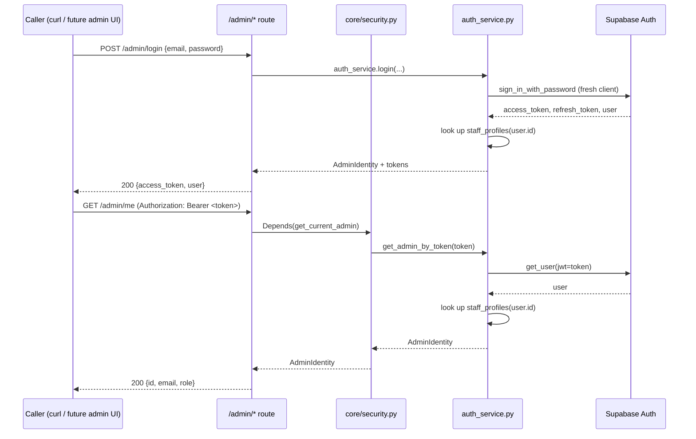

# Phase 1 — Identity & Security Foundation

**Status:** Implemented, verified locally. **Database migration created but not yet applied** — see [Migration status](#migration-status) below.
**Scope:** Backend only. No Backoffice pages, RAG, AI Agent, Gmail, WhatsApp, or ML — those remain later phases per [`Master_Blueprint_v1.md`](Master_Blueprint_v1.md).

This document explains every module Phase 1 adds, why it's shaped the way it is, and how to verify and use it. It extends the existing layered FastAPI architecture (routes → services → data access) exactly as-is — no existing file's structure changed, only additive routers/services/schemas plus two small, targeted edits to `main.py` and `core/config.py`.

---

## What this phase adds

| # | Goal | Where |
|---|---|---|
| 1 | Admin authentication via Supabase Auth | `app/services/auth_service.py` |
| 2 | Login / logout / session management | `app/api/routes/admin/auth.py`, `app/services/auth_service.py` |
| 3 | Role-based authorization | `app/core/security.py` (`require_role`) |
| 4 | Reusable protection for future `/admin` endpoints | `app/core/security.py` (`get_current_admin`, `require_role`) |
| 5 | `audit_log` table + service | `supabase/migrations/20260805090000_create_staff_and_audit_log.sql`, `app/services/audit_service.py` |
| 6 | Log admin login/logout; framework for future actions | `audit_service.record_event`, called from `admin/auth.py` |
| 7 | Centralized auth/security config | `app/core/config.py` (new "Auth & security" block) |
| 8 | Preserve layered architecture | see [Architecture fit](#architecture-fit) |
| 9 | No regression to customer-facing functionality | see [Verification](#verification) |
| 10 | Documentation per module | every new file has a module docstring; this document ties them together |
| 11 | Migrations via existing approach, not applied without approval | see [Migration status](#migration-status) |

---

## New modules

| File | Responsibility |
|---|---|
| `app/core/config.py` *(extended)* | New "Auth & security" settings block: `admin_signout_scope`. No new required env vars — admin auth reuses `SUPABASE_URL`/`SUPABASE_KEY`. |
| `app/core/security.py` | Reusable FastAPI dependencies: `get_bearer_token`, `get_current_admin`, `require_role(*roles)`. Every protected route depends on these instead of writing its own auth logic. |
| `app/services/auth_service.py` | The only module that talks to Supabase Auth. `login`, `get_admin_by_token`, `logout`, plus the `AdminIdentity` dataclass and `InvalidCredentialsError`. |
| `app/services/audit_service.py` | `record_event(...)` — the single insert point for `audit_log`. Generic by design; only called for login/logout today. |
| `app/schemas/admin_auth.py` | `AdminLoginRequest`, `AdminUser`, `AdminLoginResponse`, `AdminLogoutResponse`. |
| `app/api/routes/admin/auth.py` | `POST /admin/login`, `POST /admin/logout`, `GET /admin/me`. |
| `app/api/routes/admin/__init__.py` | Package marker — home for every future `/admin/*` route module (catalog, orders, etc. per the Blueprint). |
| `supabase/migrations/20260805090000_create_staff_and_audit_log.sql` | `staff_profiles`, `audit_log` tables. **Not applied yet.** |
| `backend/tests/test_security_dependencies.py` | Offline self-check for the pure logic in `core/security.py` (no network/DB needed). |
| `backend/.env.example` *(extended)* | Documents the new, optional `ADMIN_SIGNOUT_SCOPE` variable. |

---

## Architecture fit

Nothing about the existing route → service → data-access flow changed. The new pieces slot into the same three layers:

- **Route layer:** `app/api/routes/admin/auth.py` — same thin-handler, `try/except → HTTPException` convention as `orders.py`/`templates.py`.
- **Service layer:** `auth_service.py`, `audit_service.py` — same "plain function + `supabase.table(...)` calls" idiom as `order_service.py`/`template_service.py`. No ORM introduced.
- **Cross-cutting dependency layer:** `core/security.py` is new *only* as a home — `core/` already existed for `config.py`/`database.py`, this is the same kind of shared, framework-level concern, not a new architectural layer.

`app/api/routes/admin/` is a new subpackage (the existing `routes/` folder was flat). This was a deliberate, minimal structural addition — every future admin route (catalog management, order management, etc., per the Blueprint's later phases) has an obvious home instead of crowding the flat top-level folder or inventing a different convention per feature.

## Why Supabase Auth (not a custom password table)

The project's own `supabase/config.toml` already fully configures a local `[auth]` block (JWT expiry, password rules, rate limits) that was never wired into the app. Using it here means no password hashing, reset flows, or JWT signing logic lives in this codebase — Supabase Auth owns all of that. `staff_profiles` only maps an already-authenticated Supabase user to an app role; it never stores a credential.

## Why a fresh Supabase client for login, but the shared singleton for everything else

`supabase-py`'s `sign_in_with_password` stores the resulting session as *state on the client instance it's called on*. `app/core/database.py`'s `supabase` client is a module-level singleton shared by every concurrent request — reusing it for login would let concurrent logins race on that shared state. `auth_service.login` sidesteps this by creating a short-lived `Client` just for that one call (see the docstring in `auth_service.py`). `get_admin_by_token` and `logout`, by contrast, pass the token explicitly (`get_user(jwt=...)`, `admin.sign_out(jwt, scope)`) — both are stateless with respect to the client instance, so reusing the shared singleton for them is safe.

## How authentication works end-to-end



A valid Supabase Auth session is **necessary but not sufficient**: `get_admin_by_token` also requires a matching, active `staff_profiles` row. A real Supabase user who isn't provisioned as staff gets the same 401 as an invalid token.

## How to protect a future `/admin` route

This is the reusable pattern goal 4 asks for — every future admin/AI route follows it:

```python
from fastapi import APIRouter, Depends
from app.core.security import get_current_admin, require_role

router = APIRouter(prefix="/admin", tags=["admin-catalog"])

@router.get("/catalog")
def list_catalog(admin=Depends(get_current_admin)):
    ...  # any active staff member

@router.delete("/catalog/{id}")
def delete_catalog_item(admin=Depends(require_role("admin"))):
    ...  # admin role only
```

## How to log a future admin action

`audit_service.record_event` is already generic — Phase 1 only calls it for login/logout, but any future write action should call it the same way, right after the action succeeds:

```python
from app.services.audit_service import record_event

record_event(
    actor_id=admin.id,
    action="order.status_changed",
    entity_type="orders",
    entity_id=order_id,
    before={"status": old_status},
    after={"status": new_status},
)
```

---

## Migration status

`supabase/migrations/20260805090000_create_staff_and_audit_log.sql` creates `public.staff_profiles` and `public.audit_log`. **It has not been applied to the database** — per this project's standing workflow, migrations are written as files and only applied on explicit approval. Until it's applied:

- `POST /admin/login` will fail for *any* credentials (Supabase Auth may authenticate a real user, but the `staff_profiles` lookup that follows will find no table and the request fails) — verified below with intentionally-wrong credentials, which correctly fails earlier at the Supabase Auth step itself.
- No `/admin/*` route can succeed end-to-end yet.

**Once approved and applied**, provisioning the first admin is a manual, one-time operational step (no code in this repo does this, by design — Phase 1 is the framework, not a seed script for a production credential):
1. Create a user in Supabase Auth (Dashboard → Authentication → Add user, or `supabase.auth.admin.create_user(...)` from a one-off script/shell).
2. Insert a matching row: `insert into public.staff_profiles (user_id, name, role) values ('<the user's auth.users id>', 'Your Name', 'admin');`

## Verification

Run the offline self-check (no network/DB, covers `core/security.py`'s pure logic):
```
cd backend
python -m tests.test_security_dependencies
```
Result: 7/7 checks pass (bearer-header parsing, role gating).

Manual verification performed against the live app + live Supabase project during implementation (via `fastapi.testclient.TestClient`, no server process needed):

| Request | Result | Confirms |
|---|---|---|
| `GET /health` | 200 | existing route unaffected |
| `GET /` | 200 | existing route unaffected |
| `GET /collections` | 200, 5 items | existing DB-backed route unaffected |
| `GET /templates` | 200, 15 items | existing DB-backed route unaffected |
| `GET /admin/me` (no header) | 401 | new route registered, rejects unauthenticated calls |
| `GET /admin/me` (malformed header) | 401 | header parsing rejects non-bearer schemes |
| `POST /admin/logout` (no header) | 401 | protected the same way as `/admin/me` |
| `POST /admin/login` (missing password) | 422 | request schema validation |
| `POST /admin/login` (wrong credentials, real Supabase Auth call) | 401 `Invalid email or password` | end-to-end wiring to Supabase Auth works; failure is caught and mapped correctly |

No regressions found in existing customer-facing routes.

## Explicitly out of scope for this phase

Backoffice pages/UI, RAG, AI Agent, Gmail integration, WhatsApp integration, Machine Learning — all remain later phases in [`Master_Blueprint_v1.md`](Master_Blueprint_v1.md) §17. `staff_profiles.role` currently supports `admin`/`staff` but no route yet differentiates between them (no admin-only action exists until catalog/order management is built) — `require_role` is implemented and unit-tested, ready for the first route that needs it.
