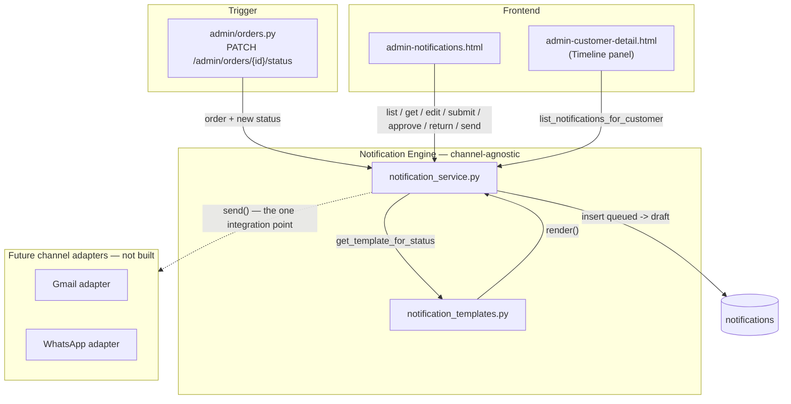
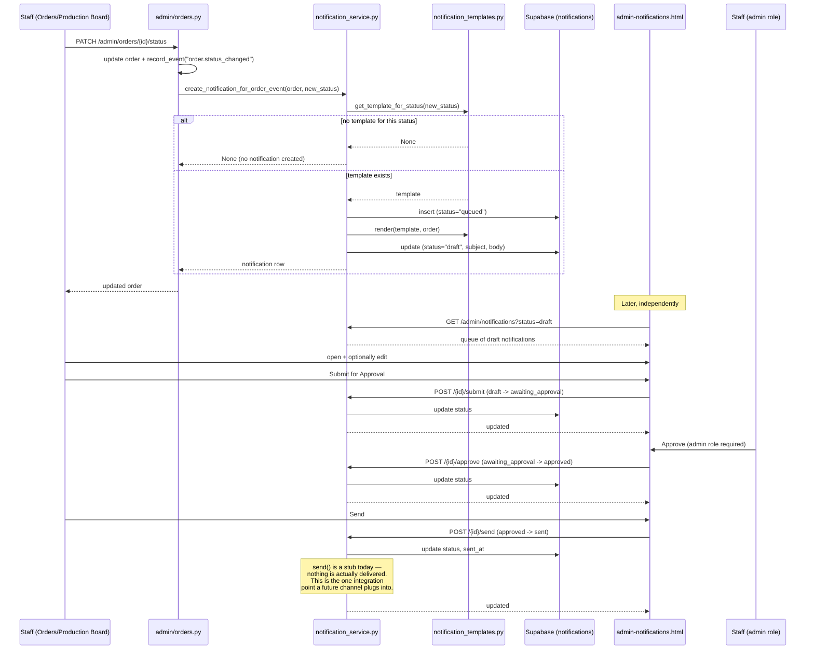
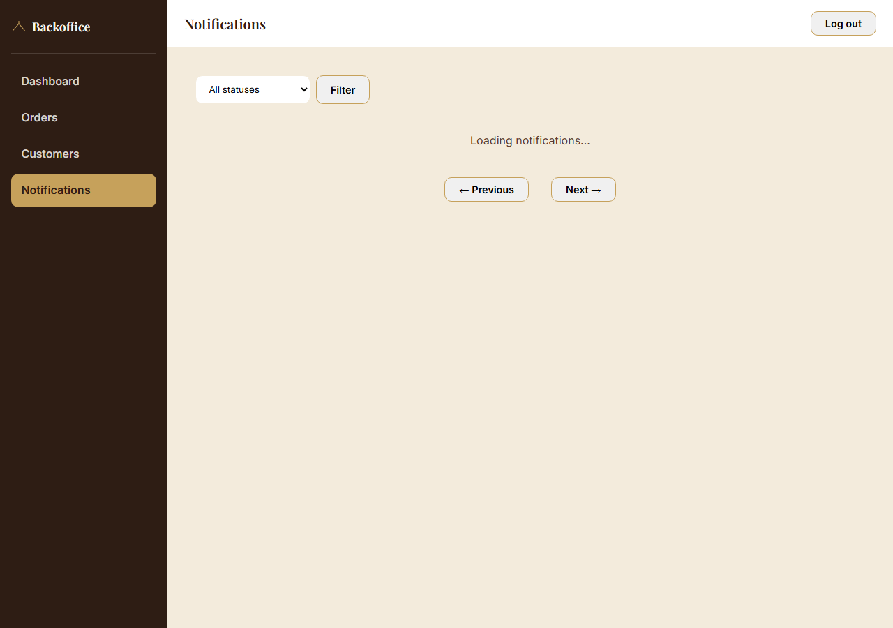
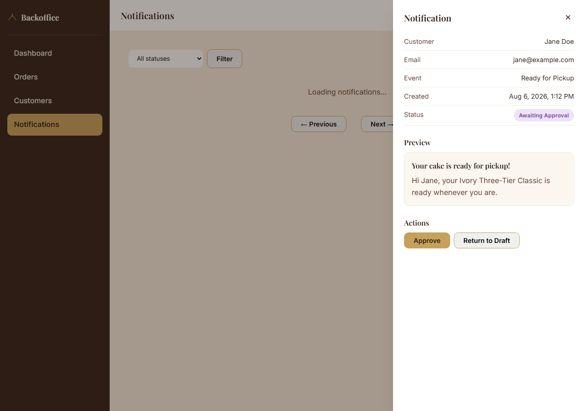

# Sprint 1 — Event-Driven Customer Communication Platform

**Status:** Implemented, verified via offline unit tests, `TestClient` against the live Supabase project, and a headless-browser structural/visual/role-gating check. **Full authenticated live-browser testing remains blocked** on the same pending item every prior phase has flagged — see [Known limitation](#known-limitation-unchanged-from-prior-phases).
**Scope:** The communication *foundation* — a channel-agnostic notification queue with a human-approval workflow, fed by order-status events. **Not** Gmail. **Not** WhatsApp. **Not** AI. Those are named, scoped future extension points, not built here.
**Builds on:** Phase 1 (auth/audit), Epic 1 (Dashboard/Orders), Epic 1.2 (Customers/Timeline) — all reused unchanged, per [`Bakery_Command_Center_UX_Product_Blueprint_v1.md`](Bakery_Command_Center_UX_Product_Blueprint_v1.md) §8's Communications screen and §11's Recommendation Catalog entry for the future "Message draft assistant."

---

## Architecture

Nothing about the layered FastAPI backend or the vanilla-JS, multi-page frontend changed. This sprint adds one new domain (notifications) following the exact same shape every prior domain already uses, plus a handful of small, well-justified extensions to existing files.

**New:**
- `app/services/notification_templates.py` — static, deterministic message templates.
- `app/services/notification_service.py` — the channel-agnostic queue + lifecycle.
- `app/schemas/admin_notification.py` — request/response shapes.
- `app/api/routes/admin/notifications.py` — the queue + approval-workflow endpoints.
- `frontend/admin-notifications.html` / `js/admin/admin-notifications.js` — the Notification Queue page.
- `supabase/migrations/20260806090000_create_notifications.sql` — one new table (**not yet applied** — see below).

**Extended, not replaced:**
- `app/api/routes/admin/orders.py`'s status-update route — one new line, after the existing audit-log write, that asks the new service to create a notification for the transition. Everything that route already did (update the order, check existence, log the audit event) is unchanged.
- `app/services/customer_service.py`'s `get_customer_timeline` — now folds notifications into the same unified feed order-placed/status-changed events already populate, via one new query.
- `app/schemas/admin_customer.py`'s `CustomerTimelineEvent` — two new optional fields (`label`, `notificationId`); every existing consumer of this schema is unaffected, since both default to `None`.
- `frontend/js/admin/admin-customer-detail.js`'s timeline rendering — one new branch in `describeTimelineEvent`, one new click-through for notification entries.
- Every existing admin page's sidebar — one new nav link.



---

## Sequence diagram

The full lifecycle, from an order status change to a human clicking Send:



---

## Event flow

### 1. What triggers a notification

`admin/orders.py`'s existing status-update route (unchanged in every other respect) calls `notification_service.create_notification_for_order_event(updated_order, new_status)` immediately after its existing audit-log write. This is the *only* place a notification is ever created — the notification routes themselves only ever move an existing one through its lifecycle, never create one (see [API endpoints](#api-endpoints)).

### 2. Which transitions actually produce one

Not every status change is customer-relevant. `notification_templates.ORDER_STATUS_EVENT_TEMPLATES` maps five of the six real `orders.status` values to a template:

| Order status | Notification event | Label |
|---|---|---|
| `confirmed` | `order_confirmed` | Order Confirmed |
| `in_progress` | `baking_started` | Baking Started |
| `ready` | `ready_for_pickup` | Ready for Pickup |
| `completed` | `order_completed` | Completed |
| `cancelled` | `order_cancelled` | Order Cancelled |
| `pending` | *(none)* | — no template; nothing notifies on a transition back to pending, and order creation itself doesn't go through this route at all (the confirmation page already covers "we got your order" at that moment) |

A note on the sprint brief's example events ("Design Approved," "Decorating Started," "Quality Check"): these describe production **sub-stages** finer than the six values `orders.status` actually supports today. Rather than widen that column (a schema change to the *order* domain, outside this sprint's scope and not requested), the event vocabulary was deliberately decoupled from the order-status vocabulary — a notification's `event` column (`order_confirmed`, `baking_started`, ...) is its own semantic name, not a copy of the order status string. When the Production Board eventually grows finer-grained stages, they plug into `ORDER_STATUS_EVENT_TEMPLATES` (or a successor keyed the same way) without any change to the engine itself — the exact same "add a template, not a new subsystem" motion as today.

### 3. Rendering

Template rendering happens synchronously, in two explicit steps, both inside `create_notification_for_order_event`:
1. Insert a row with `status="queued"`.
2. Immediately render and update it to `status="draft"` with real `subject`/`body`.

Doing this as two real writes (rather than one insert already containing rendered content) is deliberate: it makes `queued` a genuine, observable state rather than a status value that's technically valid but never actually reachable — and it's the exact seam a future async or AI-assisted drafting step needs (see [Future extension points](#future-extension-points)). In this sprint, the gap between the two is milliseconds; nothing currently depends on it being longer.

### 4. The approval workflow

```
queued → draft → awaiting_approval → approved → sent
           ↑___________|_________________|
            (return_to_draft, from either)
```

| Transition | Route | Who |
|---|---|---|
| *(created automatically)* | — | System, on a tracked order-status change |
| `draft` → `awaiting_approval` | `POST /admin/notifications/{id}/submit` | Any active staff member |
| `awaiting_approval` → `approved` | `POST /admin/notifications/{id}/approve` | **`admin` role only** |
| `awaiting_approval`/`approved` → `draft` | `POST /admin/notifications/{id}/return-to-draft` | Any active staff member |
| `approved` → `sent` | `POST /admin/notifications/{id}/send` | Any active staff member |

Every transition is guarded server-side (`notification_service._transition`, shared by all four actions) — attempting an out-of-order move (e.g. approving a `draft`) returns 400, not a silent no-op. `return_to_draft` was not in the sprint brief's suggested status list; it was added because a one-way approval pipeline with no way to correct a mistake would be a real operational dead end, and it introduces no new status value — just one more guarded edge in the same graph.

**Every notification requires human approval before sending** — there is no code path, anywhere, that moves a notification to `sent` without first passing through `approved`, which itself requires an explicit `admin`-role action. `approve` is the first route in this project to actually exercise `require_role("admin")` for something real — Phase 1 built the dependency and unit-tested it, but noted no route needed it yet (`docs/PHASE1_IDENTITY_SECURITY.md`).

---

## API endpoints

All under `/admin/notifications`, all behind `Depends(get_current_admin)`; `approve` additionally requires `Depends(require_role("admin"))`.

| Method & Path | Purpose | Audit event logged |
|---|---|---|
| `GET /admin/notifications` | List/filter (`status`) + paginate the queue | — (read-only) |
| `GET /admin/notifications/{id}` | Full detail (used by the drawer) | — (read-only) |
| `PATCH /admin/notifications/{id}` | Edit `subject`/`body` — only while `draft` | `notification.edited` |
| `POST /admin/notifications/{id}/submit` | `draft` → `awaiting_approval` | `notification.submitted` |
| `POST /admin/notifications/{id}/approve` | `awaiting_approval` → `approved` (**admin only**) | `notification.approved` |
| `POST /admin/notifications/{id}/return-to-draft` | `awaiting_approval`/`approved` → `draft` | `notification.returned_to_draft` |
| `POST /admin/notifications/{id}/send` | `approved` → `sent` (stub dispatch) | `notification.sent` |

Every mutating route logs to `audit_log` via the existing `audit_service.record_event` — the exact same call shape Epic 1's order-status route already established, giving the Dashboard's Recent Audit Events widget organic new content with zero changes to that widget.

### `AdminNotification` (list item and detail — one shape for both)

```json
{
  "id": "…", "order_id": "…", "customer_id": "…",
  "event": "ready_for_pickup", "channel": null, "status": "draft",
  "subject": "Your cake is ready for pickup!",
  "body": "Hi Jane, your Ivory Three-Tier Classic is ready whenever you are. See you soon!",
  "sent_at": null, "created_at": "2026-08-06T09:00:00+00:00",
  "customers": { "id": "…", "name": "Jane Doe", "email": "jane@example.com", "phone": null }
}
```
`channel` is always `null` today — see [Future extension points](#future-extension-points). `customers` reuses `admin_order.py`'s existing `AdminOrderCustomer` shape directly (not `admin_customer.py`'s richer `AdminCustomerSummary`, which requires stats fields this embed doesn't select) — see the schema file's docstring for why that specific reuse, not a new type, was correct here.

### Extended: `CustomerTimelineEvent`

Two new optional fields, both `None` on the existing `order_placed`/`order.status_changed` entry kinds:
```json
{ "type": "notification", "timestamp": "…", "orderId": "…", "status": "awaiting_approval", "label": "Ready for Pickup", "notificationId": "…" }
```

---

## New frontend modules

| File | Responsibility |
|---|---|
| `frontend/admin-notifications.html` / `js/admin/admin-notifications.js` | The Notification Queue: status filter, paginated table (Customer / Event / Status / Preview / Created — exactly the five columns requested), and a detail drawer reusing the same open/close/backdrop pattern `admin-orders.js`'s order drawer already established. |
| `js/admin/admin-api.js` *(extended)* | `getAdminNotifications`, `getAdminNotification`, `updateNotificationContent`, `submitNotification`, `approveNotification`, `returnNotificationToDraft`, `sendNotification`. |
| `js/admin/ui-helpers.js` *(extended)* | `NOTIFICATION_STATUS_LABELS` / `renderNotificationStatusBadge` (own color set, namespaced `status-badge--notification-*` so it can never collide with order-status badge colors); `NOTIFICATION_EVENT_LABELS`. |
| `js/admin/admin-customer-detail.js` *(extended)* | Timeline entries of `type: "notification"` now render with their event label and status, and are clickable through to the Notification Queue's own detail drawer — reused, not re-rendered, the same reuse discipline `EPIC1_CUSTOMERS.md` established for order rows linking to `admin-orders.html`. |

**The drawer is the "Notification Preview" and "Approval workflow" UI in one place** — a dedicated preview-only screen wasn't built separately; the preview *is* the drawer's primary content block (a styled subject/body card), and the action buttons beneath it change based on the notification's current status:
- `draft` → editable subject/body + **Submit for Approval**.
- `awaiting_approval` → read-only preview + **Approve** (hidden entirely for non-admin staff — a UX nicety; the real 403 enforcement is server-side regardless) + **Return to Draft**.
- `approved` → read-only preview + **Send** + **Return to Draft**.
- `sent` → read-only preview + the sent timestamp, no actions.

**Safe rendering, unchanged discipline:** every render function builds DOM via `createElement`/`textContent`, never `innerHTML` + interpolation. This matters slightly differently here than on prior screens: a notification's body starts as a static template, but is *editable by staff* — by the time it's displayed, it's staff-authored free text sitting on a page that holds the admin's bearer token, the same trust boundary already documented for customer-submitted fields elsewhere.

---

## Database usage

**One new migration**, created but **not applied** (see below): `supabase/migrations/20260806090000_create_notifications.sql` creates `public.notifications` (`id, order_id, customer_id, event, channel, status, subject, body, sent_at, created_at`).

This table intentionally supersedes what `Master_Blueprint_v1.md` §7 had originally sketched as a separate `notifications_log` table — the same kind of "the earlier plan gets superseded by a simpler real design" call `EPIC1_BACKOFFICE.md` already made for `order_status_history` vs. reusing `audit_log`. Once a notification reaches `sent`, this same row already carries everything a delivery log would need (`channel`, `sent_at`); a second table would only duplicate it. No `approved_by`/`created_by` columns either — who approved/sent/edited a notification lives in `audit_log`, exactly like order status changes, not duplicated onto this table.

---

## Security model

Identical posture to every prior phase, with one first: role differentiation is now real, not just unit-tested.

1. **Requires authentication** — `Depends(get_current_admin)` on every route.
2. **Requires authorization** — `approve` specifically requires `Depends(require_role("admin"))`; every other action is open to any active staff member.
3. **Uses the reusable security dependencies** — no route parses a header, checks a token, or checks a role itself.
4. **Audit logging** — every mutating action logs a `notification.*` event with before/after status (or before/after content, for edits), via the unmodified, existing `audit_service.record_event`.

---

## Testing

### Existing customer-facing functionality — regression, unchanged
`TestClient` against the live Supabase project, re-run after this sprint's changes: `GET /health`, `GET /`, `GET /collections` (5 items), `GET /templates` (15 items), `GET /designer/{id}` — all still **200**.

### Existing admin functionality — regression, unchanged
`POST /admin/login` with wrong credentials still 401s via a real Supabase Auth round-trip; `GET /admin/me`, `GET /admin/dashboard`, `GET /admin/orders`, `GET /admin/customers` still 401 without a token — identical to Epic 1/1.2's own verification, re-run rather than assumed.

### Notification events generated correctly
Verified by design and by offline test, not yet by a live order-status change (blocked on the same migration gap every phase has hit — see below): `notification_templates.get_template_for_status`/`render` produce the exact right event key, subject, and body for every mapped status, and correctly return `None`/fall back gracefully for `pending` and missing customer/template data. The wiring itself — `admin/orders.py` calling `notification_service.create_notification_for_order_event` right after its existing audit-log write — was confirmed via full-app import + route registration checks (`TestClient`) with zero regressions to the surrounding route.

### Timeline updates correctly
`customer_service.get_customer_timeline` now includes a third event source (`notification_service.list_notifications_for_customer`) merged and sorted alongside the existing two — confirmed by code review against the existing, already-tested merge/sort logic (unchanged) plus the new frontend rendering check below.

### Approval workflow functions correctly
Every transition function's *guard* is offline-tested (`test_notification_service.py`, 11/11 pass — see below); every route is confirmed registered and auth-gated via `TestClient`; and the **role-gating was verified live in a browser**, not just asserted: `renderNotificationDetail` was called directly with a fake `awaiting_approval` notification once as an `admin` session (Approve button present) and once as a `staff` session (Approve button absent, Return to Draft still present) — see screenshots below.

Offline pure-logic checks (all four test files, full project regression):
```
cd backend
python -m tests.test_security_dependencies    # 7/7 pass (unchanged, re-run)
python -m tests.test_order_service_admin      # 5/5 pass (unchanged, re-run)
python -m tests.test_customer_service         # 6/6 pass (unchanged, re-run)
python -m tests.test_notification_service     # 11/11 pass (new)
```
`test_notification_service.py` covers: template lookup (known + unmapped status), rendering (with and without customer/template context), event-label coverage (every template has a label, unknown events fall back to their key), and every transition function's guard against an invalid starting status — each test deliberately uses a fake notification dict whose status makes the guard fail before any Supabase call would happen, keeping the whole suite network-free (the success paths — a real DB write — are exercised live via `TestClient` instead, following the same split every prior phase's test suite already uses).

### Frontend — structural, visual, and role-gated
Headless Chrome + CDP: the Notification Queue page renders its status filter, table container, and pagination controls; the sidebar correctly lists all four nav items with "Notifications" active; `node --check` passed on every new/modified JS file; zero console errors across the whole run.

**Screenshots:**

Notification Queue page:


Detail drawer — preview + approval actions, rendered as an `admin` (Approve visible):


---

## Known limitation (unchanged from prior phases)

Re-confirmed at the start of this sprint: `staff_profiles`/`audit_log` still aren't applied to the live database, and now neither is this sprint's own `notifications` migration. None of this backend code has been deployed to the production Railway service `frontend/js/api.js` is hardcoded to call, either. This blocks any *real* order-status change from producing a *real* notification row end-to-end — verification above is as thorough as possible without it (offline logic tests + `TestClient` wiring/auth checks + direct-call browser rendering tests with fabricated data). Applying both pending migrations and provisioning one staff account (documented in `docs/PHASE1_IDENTITY_SECURITY.md`) unlocks full end-to-end verification: change a real order's status, watch a real notification appear in the queue, submit → approve (as an admin) → send it, and see it appear in that customer's timeline.

---

## Future extension points

This section is the sprint's actual deliverable — a communication *foundation*, not a feature. Concretely, here is where each named future capability plugs in, and why nothing about the engine needs to change to accommodate it:

- **Gmail / WhatsApp** (`Master_Blueprint_v1.md` §10): plug into `notification_service.send()`. Its signature (`notification -> notification`) and guard (`approved -> sent`) don't change; only its body does, replacing "just flip the status" with a real API call. `notifications.channel` already exists on the table, nullable, ready to record which channel a real send used.
- **Delivery status** (`delivered`/`failed`): already reserved in the `notifications.status` check constraint and `NOTIFICATION_STATUSES`. A real channel adapter's webhook/callback would call a new `mark_delivered(notification_id)` / `mark_failed(notification_id, reason)` — small, additive functions next to `send()`, not a redesign of the lifecycle.
- **AI-assisted drafting** (`Bakery_Command_Center_UX_Product_Blueprint_v1.md` §11, "Message draft assistant"): plugs into the seam between `_insert_queued` and `_render_draft` — today `_render_draft` calls `notification_templates.render()` (deterministic string substitution); a future version could call an LLM instead, grounded in the same order/customer context, still producing a `draft` a human reviews and submits exactly as today. The two-step queued→draft write (rather than one combined insert) exists specifically so this seam is real, not theoretical.
- **Finer-grained production events** ("Design Approved," "Decorating Started," "Quality Check," per this sprint's own brief): add entries to `ORDER_STATUS_EVENT_TEMPLATES` (or a successor keyed by a future, more granular production stage rather than the top-level order status) — the engine, queue, and approval workflow are already event-key-agnostic, not order-status-specific by contract, only by today's one caller.
- **Customer-initiated replies / two-way channels**: out of scope for this sprint entirely (`Master_Blueprint_v1.md` §10 explicitly scopes Communications to outbound-only first), but the `notifications` table's shape (one row per message, a `channel` column, a real customer/order link) doesn't preclude a future `direction` column distinguishing inbound from outbound without restructuring what exists today.

Nothing above requires touching `admin/orders.py`'s trigger point, the approval-workflow routes, the audit logging, or the frontend queue/drawer — every extension point is a bounded, additive change to one function or one table, which is the whole point of building the foundation first.
