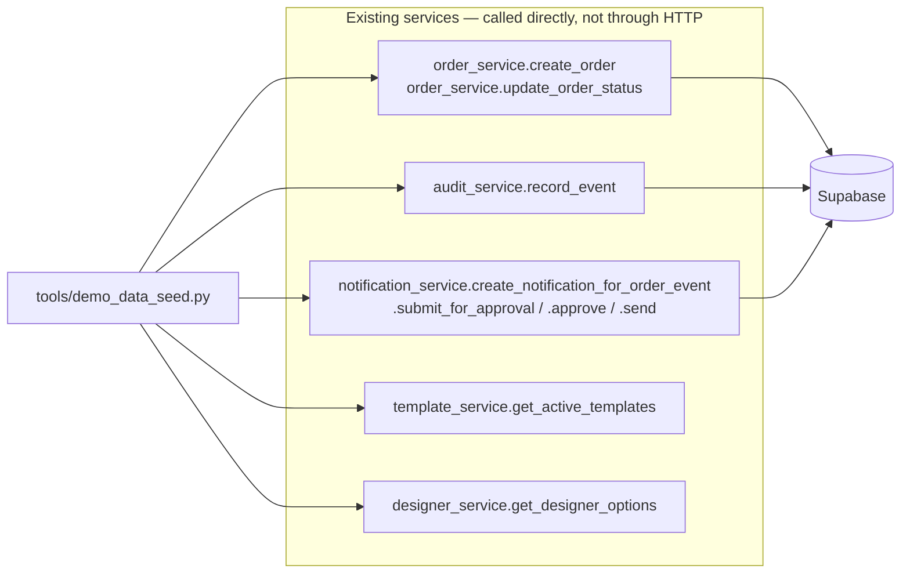
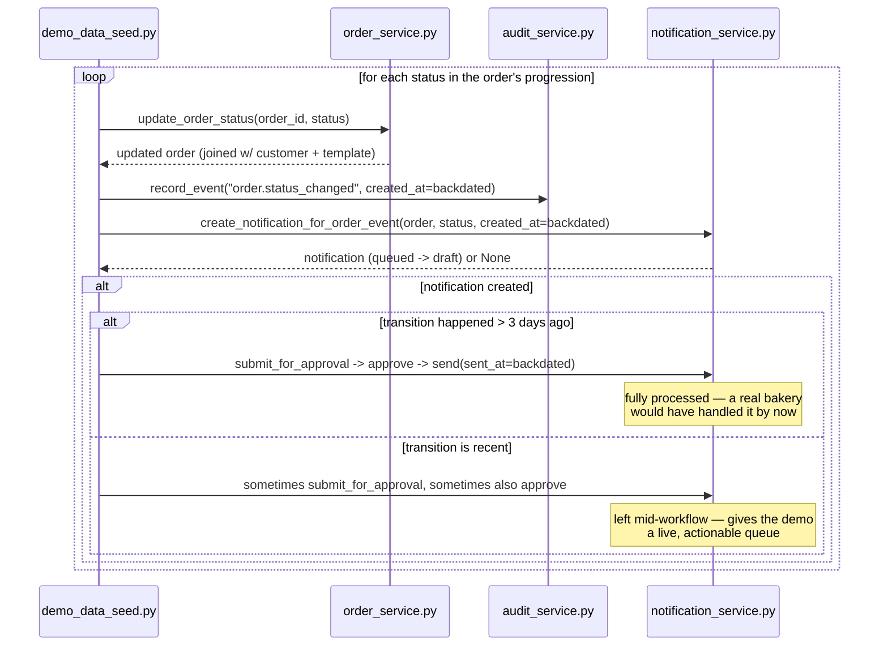

# Sprint 2 — Demo Data Seeder

**Status:** Script implemented, refined for business realism, and validated **entirely offline** — no database writes have happened yet. A first pass at writing this document described the dataset in the past tense; that was wrong and has been corrected (see [Correction](#correction-nothing-has-been-written-yet) below). **Not yet run for real** — it requires the same two pending migrations every prior phase has flagged, applied for the first time, and writing ~350 orders live is a big enough action that it's waiting on your explicit go-ahead rather than being run automatically. See [Known limitation](#known-limitation).
**Scope:** A one-time utility, not a framework. One file: `tools/demo_data_seed.py`.

## Correction: nothing has been written yet

An earlier revision of the work here was reported as complete after the script was written and offline-validated, but was never actually executed against the database — that was called out explicitly at the time, and re-confirmed by directly querying `customers`/`staff_profiles`/`audit_log`/`notifications` before starting the business-realism refinement pass: zero demo-tagged customers exist, and the two pending migrations are still unapplied. The refinement pass below improves the *generation logic* — verified by running it in a pure, offline simulation mode (`--simulate`, added this pass — see [Verification steps](#verification-steps)) — not a dataset that was already sitting in the database. The [Business Realism Report](#business-realism-report) further down is a **projection** from that simulation, not a report on real rows, and is labeled as such throughout.

---

## Purpose

Every prior phase of this project was verified against a database with either zero rows or a handful of hand-entered ones. That's fine for proving an endpoint works; it's not enough to demo a Dashboard's trend widgets, an Analytics screen, a Customer Timeline with real repeat-customer history, or a Notification Queue with a believable mix of sent/pending items. This sprint closes that gap with realistic, historically-distributed operational data — for the final presentation, for exercising analytics-style screens, and for giving CRM/notification-engine testing something real to look at.

It is explicitly **not**: a synthetic-data framework, a fixture library, a random-data generator, or anything that runs as part of normal application operation. It's a script an operator runs once (or occasionally re-runs during development), by hand, and never again after real customers start using the system.

---

## Seeder architecture

The core design decision: **the seeder calls the exact same service-layer functions the real application calls**, not raw inserts that happen to produce similar-looking rows.



Why this matters for the sprint's core requirement — *"after seeding, the application should not distinguish between seeded data and newly-created data"* — is that it's true **by construction**, not by careful imitation. A seeded order goes through `order_service.create_order`, the identical function `POST /orders` calls for a real customer. A seeded status change goes through `order_service.update_order_status` + `audit_service.record_event` + `notification_service.create_notification_for_order_event`, the identical three calls `PATCH /admin/orders/{id}/status` makes for a real staff action. There is no second code path to keep in sync, because there isn't a second code path.

The one thing a real HTTP request gets that a script calling services directly doesn't: the route's own orchestration (fetching the "before" state, sequencing the calls, mapping exceptions to HTTP status codes). The seeder's `progress_order()` function replicates that orchestration explicitly — see [Event flow](#status-progression--the-notification-engine) below.

### Backward compatibility — the only production code touched

Three existing service functions gained a small, keyword-only, optional timestamp-override parameter, used *only* by this script:

| Function | New parameter | Real call sites |
|---|---|---|
| `order_service.create_order` | `created_at`, `pickup_date`, `pickup_time` | `POST /orders`'s route — never passes them |
| `audit_service.record_event` | `created_at` | Every admin route that logs an action — all pass other args by keyword already, none pass this |
| `notification_service.create_notification_for_order_event` | `created_at` | `admin/orders.py`'s status route — never passes it |
| `notification_service.send` | `sent_at` | `admin/notifications.py`'s send route — never passes it |

Every one defaults to `None`, and every real call site was checked and confirmed to omit the new parameter — meaning every column that would otherwise get a DB-generated `now()` still does, for every real user action, exactly as before this sprint. This is why the sprint's *"do not change runtime behavior"* instruction is satisfied: nothing about what a real request does changed, only what a script *can optionally ask for* did. The full regression suite (offline tests + `TestClient` against every existing route) was re-run after these three edits — see [Verification steps](#verification-steps) — specifically to confirm that claim rather than assert it.

Without this, the seeder could only create data stamped "right now," which would defeat the point — a Dashboard/Analytics demo needs orders spread across months, not all placed in the same 20-minute window.

---

## Data model used

No schema changes. Every seeded row lives in tables that already exist: `customers`, `orders`, `audit_log`, `notifications` (the latter two pending the same migrations every prior sprint has flagged — see [Known limitation](#known-limitation)).

**Repeatability tag:** every seeded customer's email ends in `@demo.maisondegateau.test` — `.test` is an IANA-reserved TLD (RFC 2606) that can never resolve to a real domain, so no real customer's email could ever collide with it. This is the *entire* tagging mechanism: no new column, no schema change.

**Correction (found live, during the Final AI Intelligence Phase's real seed run — see `docs/FINAL_AI_INTELLIGENCE_PHASE.md` "Bugs found and fixed"):** the claim below this line was wrong about one of the two relationships. `notifications.customer_id`/`order_id` *do* cascade on delete, but **`orders.customer_id` is `ON DELETE RESTRICT`**, not cascade — the original schema deliberately protects order history from accidental customer deletion. `delete_existing_demo_data()` now deletes demo orders first (their notifications cascade with them), then the now-orderless demo customers. This was never caught by `--simulate` because that mode never calls the delete step at all.

---

## Number of generated records (target)

| What | Target | Notes |
|---|---|---|
| Customers | 100 | Generated as a fixed pool up front; every one is now *guaranteed* at least one order (see [Business realism refinement](#business-realism-refinement) — the first version of this left the outcome to weighted chance, and undershot in practice) |
| Orders | 350 | Within the requested 300–500 range; see [Assumptions](#assumptions) for why 350 specifically |
| Audit log entries | ~2 per order on average | One `order.status_changed` event per status transition the order goes through |
| Notifications | ~2 per order on average | One per customer-relevant status transition (`confirmed`, `in_progress`, `ready`, `completed` — see `notification_templates.py`); not every order reaches every status, and `pending`/`cancelled` don't generate one each |

The script reports the *actual* final counts (queried live from the database, not just its own in-memory tally) at the end of a real run — see `main()`'s closing summary in `tools/demo_data_seed.py`. Until then, [Business Realism Report](#business-realism-report) below reports the same numbers from the offline simulation.

---

## Business realism refinement

A second pass over the generation logic, in response to a more specific business-realism brief than the original sprint's. Every change below is to *selection logic only* (who/what/when gets picked) — none of it touches how an order is actually created or how it moves through the notification engine, both unchanged from the first version.

1. **Category mix retargeted.** `COLLECTION_WEIGHTS` changed from a rough five-way split to explicit targets: Birthday 65% (of a 60–70% target range), Wedding 12% (10–15%), Baby Shower 10%, Corporate 7% (5–10%), Graduation 6% (the "remaining miscellaneous" category). Category selection stays independent of which customer is ordering — see next point — so a VIP being picked more often can never skew this mix away from these targets.
2. **Three customer tiers instead of a flat repeat/non-repeat split.** The original model gave ~35% of customers a flat 4x pick-weight. This pass replaces it with `TIER_WEIGHTS`: an 8%-of-pool **VIP** tier at 14x weight (real loyal-customer economics — a small core responsible for an outsized share of orders, with 15–25+ orders each in practice), a 27%-of-pool **regular** tier at 3x, and the remaining 65% **occasional** tier at 1x (mostly one or two orders). VIPs also skew toward pricier cake sizes (`pick_cake_size`, ranked by `price_adjustment` rather than hardcoded size names) — the "different spending levels" target.
3. **Full customer coverage is now guaranteed, not left to chance.** The first version's weighted sampling alone left roughly 25 of the 100 pre-generated customers with zero orders across 350 draws purely by chance — since a customer is only ever actually inserted into `customers` when an order references them, that meant only ~75 real customer rows, undershooting the "100 customers" target. `_assign_customer_indices` now reserves the first 100 order slots as one guaranteed order per customer (order shuffled so they're not clustered at the start of the run), then fills the remaining 250 slots via the same tier-weighted sampling as before — so every customer gets at least one order, and VIPs/regulars still accumulate extra ones on top.
4. **A guaranteed "current pipeline" slice.** With 2–45 day pickup lead times spread across a full year, an order's pickup date has almost always already passed by "now" — realistic for a year of history (most of it *should* read as completed), but the first version of this logic left almost nothing in the active pipeline statuses (`confirmed`/`in_progress`/`ready`): a first simulation run produced 0 orders `ready` and only 3 total outside `completed`/`cancelled`. `RECENT_ORDER_FRACTION` (10%) now reserves a slice of orders drawn from only the last `RECENT_WINDOW_DAYS` (21) days, so their pickup dates naturally land at or after "now" — a believable current pipeline layered on top of a believable history, not instead of it. Tuned empirically (see [Verification steps](#verification-steps)) to avoid both extremes: too small a slice reproduces the original gap, too large or too narrow a window creates an implausible single-month spike in the monthly distribution.
5. **General month-to-month variation**, independent of category-specific seasonality: `MONTH_WEIGHTS` gives a mild, bakery-wide "December is busier, January is quieter" pattern (weights 0.8–1.3) via rejection sampling (`_pick_days_ago_with_month_bias`), layered *underneath* Wedding/Graduation's own seasonal boost rather than replacing it.

---

## Assumptions

Documented explicitly, since a seeder's job is to be *believable*, and believability rests entirely on assumptions like these:

1. **Order count: 350, not 500.** The sprint's own "generate realistic status progression" and "reuse the existing Notification Engine" requirements mean each order can trigger up to 4 status transitions, each writing an audit-log entry, a notification, and (for older transitions) a full submit→approve→send cycle through the real service functions — real network round-trips to Supabase, not local writes. 350 orders was chosen as the point inside the requested 300–500 range that keeps total runtime reasonable (see [How to run](#how-to-run)) without cutting the realism the rest of this document describes. `NUM_ORDERS` is one constant at the top of the file if a different count is ever wanted.
2. **The six real order statuses, not the brief's example progression.** Both briefs' examples ("Confirmed → Production → Decorating → Quality Check → Ready for Pickup → Completed") name finer stages than `orders.status` actually supports (`pending, confirmed, in_progress, ready, completed, cancelled` — six values, unchanged, per the "do not redesign the schema" instruction). "Production," "Decorating," and "Quality Check" all map onto the single `in_progress` status — three conceptual sub-stages compressed into one real status. This is the same resolution Sprint 1 already made for its own notification-event examples, for the same reason — documented there too (`docs/SPRINT1_EVENT_DRIVEN_COMMUNICATION.md`).
3. **Status is date-driven, not a coin flip** (with a deliberate "current pipeline" slice layered on top — see [Business realism refinement](#business-realism-refinement) point 4). An order whose pickup date was six months ago is deterministically far more likely to end up `completed` than `pending` — `choose_final_status()` branches on how the pickup date relates to "now," with only a flat 5% chance of `cancelled` layered on top. This is the single biggest contributor to the data reading as real rather than random.
4. **Seasonality is a soft nudge, not a hard rule.** Wedding orders resample toward May–September a couple of times if the first random date misses; they don't exclusively land there. A live check during verification confirmed this produces a clear, visible bias without making off-season wedding orders impossible — a real bakery does get the occasional January wedding cake.
5. **A fixed random seed (`20260807`).** Re-running the script without code changes produces the same customers, the same orders, the same dates — not a new random dataset every time. This makes "safe to run again" mean "predictable," not just "non-destructive."
6. **No `staff_profiles` actor for seeded audit events.** `audit_log.actor_id` is left `None` for every seeded status change — this is the column's own documented, intentional use for "system-initiated events" (see `audit_service.py`), not a workaround; a real staff-driven status change still records the real staff member's id.
7. **Cake pricing is never fabricated.** Every seeded order's price comes from the real `cake_templates.base_price` + the real `cake_sizes.price_adjustment` for whichever template/size the seeder happened to pick — the exact same computation `order_service.create_order` already does for a real order. "Believable prices based on cake category and complexity" was satisfied by reuse (a Wedding template's real base price is already several times a Birthday template's), not by inventing a plausible-looking dollar figure.

---

## Event flow: status progression + the notification engine

For each order, `progress_order()` walks it from `pending` through a realistic prefix of `["confirmed", "in_progress", "ready", "completed"]` (or a short `pending`→(`confirmed`→)`cancelled` path for the ~5% that get cancelled), and at **every** step:



This is what makes "ensure notifications/timeline entries appear naturally where appropriate" concretely true: a seeded order that's now `completed` has a real audit trail of every status it passed through *and* a real notification for each one — some fully sent, some still sitting in the queue if the transition was recent — visible on the Orders screen, the Notification Queue, the Dashboard's Recent Audit Events widget, and that customer's Timeline, all without any of those screens' own code changing.

---

## How to run

```bash
# from the repo root, using the project's venv

# Plan only — no database access at all, prints the projected distribution
# in seconds. Safe to run anytime, as often as useful, migrations or not.
./.venv/Scripts/python.exe tools/demo_data_seed.py --simulate

# The real thing — writes to the live database.
./.venv/Scripts/python.exe tools/demo_data_seed.py
```

The script prints progress every 25 orders and a final summary (actual customer/order counts, queried live — not just its own tally — plus elapsed time). Expect it to take **on the order of 15–25 minutes** for the full 350-order run: every status transition and every notification-lifecycle step is a real network round trip to Supabase, by design (see [Seeder architecture](#seeder-architecture) — that's the same cost a real, individually-clicked admin action would incur, just automated). This is a one-time operation; it was not optimized for speed at the cost of reusing real service-layer logic. `--simulate` shares the exact same `plan_orders()` selection logic and runs in under a second, specifically so the projected shape of a real run can be checked (and, during this pass, tuned — see [Business realism refinement](#business-realism-refinement)) without waiting 20 minutes or writing anything.

**Prerequisite:** the two pending migrations (`supabase/migrations/20260805090000_create_staff_and_audit_log.sql`, `supabase/migrations/20260806090000_create_notifications.sql`) must be applied first — see [Known limitation](#known-limitation).

### Re-running

Just run it again. `delete_existing_demo_data()` removes every previously-seeded customer and (explicitly, not via cascade — see the correction in [Data model used](#data-model-used)) their orders, whose deletion in turn cascades their notifications, before generating a fresh set. Real customers and orders are never touched; nothing about the deletion query can ever match them.

---

## Business Realism Report

**Projected from `--simulate`** (the real `plan_orders()` selection logic, fixed seed `20260807`, run against the real live catalog — no database writes). These are not yet real rows; they are what a real run is expected to produce, to the extent the fixed seed makes that deterministic. The actual post-run numbers will be reported again, from live queries, once you approve running this for real.

| Metric | Projected |
|---|---|
| Customers | 100 (guaranteed — see [refinement](#business-realism-refinement) point 3) |
| Orders | 350 |
| Repeat customers (>1 order) | 80 of 100 |
| Busiest (VIP) customers this run | up to ~20 orders each (e.g. 21, 18, 14 in the top 3) |
| Notifications | ~2 per non-`pending` order transition — see [Number of generated records](#number-of-generated-records-target) |

**By category:**

| Category | Projected | Target |
|---|---|---|
| Birthday | 67% | 60–70% |
| Wedding | 11% | 10–15% |
| Baby Shower | 8% | 10% |
| Corporate | 8% | 5–10% |
| Graduation | 6% | remainder/misc |

Baby Shower landed slightly under its 10% target in this specific run (8%) — expected, ordinary variance from a probabilistic generator with a fixed seed, not a systematic bias (`COLLECTION_WEIGHTS["Baby Shower"]` is set to exactly 0.10). Every other category landed inside its requested range.

**By status:**

| Status | Projected | Share |
|---|---|---|
| completed | 305 | 87% |
| cancelled | 21 | 6% |
| confirmed | 13 | 4% |
| ready | 5 | 1% |
| in_progress | 4 | 1% |
| pending | 2 | 1% |

87% `completed` is the expected shape for "a bakery that's been operating for a year" — most of a year's orders are, definitionally, already done. The remaining ~7% spread across `confirmed`/`in_progress`/`ready`/`pending` is the guaranteed "current pipeline" slice (refinement point 4) — enough to demo the Orders screen and Production Board showing active work, not just a wall of green "Completed" badges.

**By month** (`YYYY-MM: count`): `2025-08: 23, 2025-09: 36, 2025-10: 26, 2025-11: 29, 2025-12: 22, 2026-01: 28, 2026-02: 16, 2026-03: 31, 2026-04: 18, 2026-05: 25, 2026-06: 29, 2026-07: 55, 2026-08: 12`. July's bump (55 vs. a ~20-30 baseline elsewhere) is the guaranteed recent-pipeline slice concentrating near "now" (early August) — tuned down twice during this pass (see refinement point 4) from an initial 4x spike to this ~2x one, which reads as "business ramping up recently" rather than a visible data artifact.

### Gaps identified for the final presentation

- **The July bump is real and intentional, but worth knowing about** if a revenue-over-time chart is part of the presentation — it will show an uptick in the most recent month. This is defensible (a live pipeline has to live somewhere in the timeline) but it's a deliberate seeding choice, not an emergent business insight, and shouldn't be narrated as one.
- **No `staff_profiles` row exists yet**, so once migrations are applied there is still no actual admin account to log into the Backoffice with — provisioning one (documented in `docs/PHASE1_IDENTITY_SECURITY.md`) is a separate manual step this seeder does not and should not do.
- **Gmail/WhatsApp/ML/RAG/AI Agent remain entirely unbuilt**, as instructed. This dataset is sized and shaped to be useful *once* those exist (12 months of history, real repeat-customer patterns, a real notification-approval trail) — it does not itself exercise any of them.
- **`audit_log` will accumulate orphaned rows on repeat re-seeds.** Deleting a demo customer cascades their orders and notifications, but `audit_log.entity_id` is a soft reference (no FK — see the initial design rationale in `docs/SPRINT1_EVENT_DRIVEN_COMMUNICATION.md`), so old audit rows referencing deleted seeded orders are not cleaned up. Not a problem for a single seed run before the presentation; worth knowing if the script gets re-run several times during development.

---

## Verification steps

### Performed already (no live database writes)

- **Syntax check:** `python -m py_compile tools/demo_data_seed.py` — passes, both before and after the business-realism refinement pass.
- **Import/load check:** the module was loaded via `importlib` with `__name__ != "__main__"`, so every top-level definition executes but `main()` — the only function that touches the database — does not run. Confirmed the `sys.path` insertion and every `app.services.*`/`app.core.database` import resolve correctly from outside the `backend/` package.
- **`--simulate` runs**, several, used to *tune* the refinement (not just check it after the fact): the first simulation run after retargeting `COLLECTION_WEIGHTS` and adding customer tiers surfaced a real gap (0 orders `ready`, only 3 outside `completed`/`cancelled`) that the original design hadn't caught; `RECENT_ORDER_FRACTION`/`RECENT_WINDOW_DAYS` were adjusted twice more in response to the resulting monthly-distribution spike, checked again each time, before settling on the numbers in this document.
- **Pure-logic checks** (from the original pass, still valid — none of the functions they cover changed shape): `build_customer_pool` produces exactly 100 unique, correctly-tagged emails; `random_order_datetime`/`pickup_datetime_for`/`choose_final_status` never produced a future order date, a pickup before the order date, or a status outside the real `ORDER_STATUSES`; weekend and wedding-season biases confirmed real and visible, not theoretical.
- **Read-only live catalog check:** `template_service.get_active_templates()` and `designer_service.get_designer_options()` were called for real against the live database (no writes) and confirmed to return exactly what the seeder expects — 15 active templates, 3 per collection, across all 5 collections named in `COLLECTION_WEIGHTS`, and non-empty `cake_sizes`/`flavors`/`fillings`/`frostings`.
- **Full regression suite**, re-confirmed unaffected by this pass (no `backend/app/` files were touched — only `tools/demo_data_seed.py`): all 29 offline pure-logic tests still pass, and a `TestClient` pass against every existing customer-facing route and every existing admin route shows identical status codes to every prior sprint's own verification.

### Pending your go-ahead (see [Known limitation](#known-limitation))

- ✓ Existing customer website still works — unaffected by this sprint (confirmed above); re-check after a real seed run as a final sanity pass.
- ✓ Existing admin dashboard still works — unaffected by this sprint (confirmed above); re-check after a real seed run to see it populated.
- ✓ Orders appear correctly on the Orders screen, across all six statuses.
- ✓ CRM (Customers screen) is populated — 100 customers, realistic repeat-order patterns, real lifetime-value figures.
- ✓ Notifications remain functional — the Notification Queue shows a real mix of `draft`/`awaiting_approval`/`approved`/`sent` items, not just one status.
- ✓ Analytics-relevant screens (Dashboard's order-by-status/today's-orders widgets) have meaningful, non-trivial data spread across the last 12 months.
- ✓ **A newly-created REAL customer/order** (placed through the actual customer-facing site *after* seeding) is written to the same database, appears in the Orders/Customers screens indistinguishably from seeded data, and triggers the notification engine identically — this is the sprint's central claim, and the one item on this list that specifically needs a live seed run *plus* one real, manual order placed afterward to fully confirm end-to-end.

---

## Known limitation

Re-confirmed at the start of this sprint, same as every prior one: `staff_profiles` and `audit_log` (Phase 1's migration) and now `notifications` (Sprint 1's migration) are still not applied to the live database. The seeder's core order-creation path doesn't strictly need any of the three (`order_service.create_order`/`update_order_status` only touch `orders`/`customers`, both already live), but `audit_service.record_event` and `notification_service.create_notification_for_order_event` both fail open (log an exception, return `None`/nothing) against a missing table rather than crashing — meaning **the seeder would technically run to completion even today, but silently produce zero audit-log entries and zero notifications**, defeating a real part of this sprint's purpose. Both pending migrations need to be applied — and, per this project's standing workflow, that happens only on your explicit go-ahead — before running this seeder is worth doing for real.
