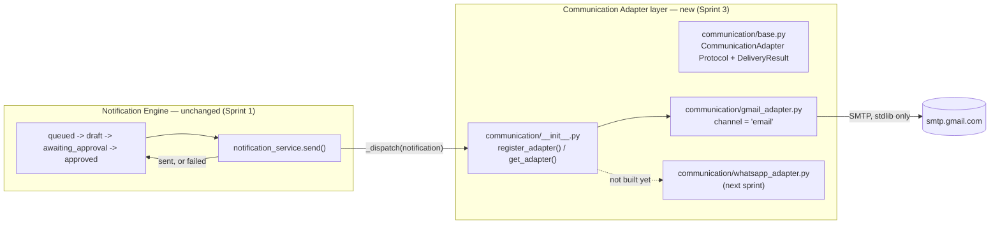

# Sprint 3 — Communication Adapter + Gmail Adapter

**Status:** Implemented and verified entirely offline. **No database changes applied, no data seeded** — explicitly out of scope for this sprint (see [Deployment sequencing](#deployment-sequencing)).
**Scope:** A reusable Communication Adapter abstraction, and Gmail as its first concrete implementation, plugged into the exact seam Sprint 1 designed for this purpose.
**Not built:** WhatsApp adapter (next), any database migration or seeding action (deferred to the final deployment).

---

## Architecture

Sprint 1's `notification_service.send()` was written with a single sentence doing a lot of work: *"the entire channel-agnostic dispatch surface: a future real channel adapter replaces the body of this function... nothing upstream needs to change."* This sprint is that sentence becoming true.



**Nothing about the queue, drafting, or approval steps changed.** `create_notification_for_order_event`, `submit_for_approval`, `approve`, `update_draft_content` — all byte-for-byte the same as Sprint 1/2 left them. The only function that changed is `send()`, and the only thing it gained is a call into the new adapter layer at the exact point its own docstring always said a real channel would plug in.

### The abstraction: `typing.Protocol`, not a class hierarchy

`CommunicationAdapter` (`communication/base.py`) is a `typing.Protocol` — structural typing, not inheritance. An adapter doesn't extend a base class; it just needs a `channel` attribute and `is_configured()`/`send()` functions with the right shape. This matches every other service module in this project (none of which use class inheritance — `order_service.py`, `notification_service.py`, etc. are all plain functions), so `gmail_adapter.py` is a plain module, not a class, and satisfies the Protocol the same way any object with the right attributes would:

```python
>>> isinstance(gmail_adapter, CommunicationAdapter)
True
```

A future `whatsapp_adapter.py` needs exactly three things to plug in: a `channel = "whatsapp"` module-level variable, `is_configured() -> bool`, and `send(notification: dict) -> DeliveryResult`, then one line — `register_adapter(whatsapp_adapter)` — in `communication/__init__.py`. `register_adapter` validates the shape at registration time (via the same `isinstance` check, since the Protocol is `@runtime_checkable`), so a malformed adapter fails loudly at import time, not silently the first time a notification tries to use it.

### `DeliveryResult` — one shape for every channel's outcome

```python
@dataclass(frozen=True)
class DeliveryResult:
    success: bool
    provider_message_id: str | None = None
    error: str | None = None
```

`notification_service` never sees Gmail's or WhatsApp's own error/result types — every adapter translates its own outcome into this one shape. `send()` never raises on a delivery failure either; a bad recipient, an SMTP timeout, missing credentials — all of it comes back as `DeliveryResult(success=False, error=...)`, so `notification_service.send()` can transition cleanly to `failed` instead of the request blowing up.

---

## The critical design decision: "not registered" vs. "registered but unconfigured"

This is the one subtlety in this sprint worth calling out on its own, because getting it wrong would have quietly broken `tools/demo_data_seed.py` (Sprint 2, not yet run) the moment it eventually does run.

`_dispatch()` resolves a notification's channel to an adapter and treats two different situations identically — both fall back to Sprint 1's original stub (report success, nothing actually delivered):

1. **No adapter is registered for this channel at all** (e.g. `"whatsapp"`, before next sprint).
2. **An adapter *is* registered (Gmail, right now, in every environment) but reports itself unconfigured** — `gmail_adapter.is_configured()` is `False` because no `GMAIL_ADDRESS`/`GMAIL_APP_PASSWORD` are set anywhere yet, including wherever this eventually deploys.

The alternative — treating "registered but unconfigured" as a real delivery failure — would mean every notification `tools/demo_data_seed.py` creates and walks to `sent` would instead land on `failed`, the moment Sprint 3's code merged, even with zero Gmail setup. That would have silently undermined Sprint 2's entire Business Realism Report (87% of orders projected as `completed` with believable `sent` notification histories) without anyone asking for that. `_dispatch()`'s explicit `adapter is None or not adapter.is_configured()` check is what prevents it — verified directly in `test_dispatch_falls_back_to_stub_when_registered_but_unconfigured` (see [Testing](#testing)), and empirically by re-running the seeder's `--simulate` mode after this sprint's changes and confirming byte-identical output to before (same fixed seed, so this is a real equality check, not just "looks similar" — see [Verification](#verification)).

Once real Gmail credentials *are* eventually set (the final deployment phase, per your plan), this same code path starts attempting real delivery, and a genuine failure (bad recipient email, Gmail rejecting the send) will correctly land on `failed` — which is the whole point of building this now rather than only stubbing it. The behavior is correct in both states without a feature flag beyond credential presence itself, the same "gracefully degrades to off" pattern every AI/integration feature in this project already follows.

---

## Gmail Adapter

Gmail SMTP with an app password — not the full Gmail API, per `Master_Blueprint_v1.md` §10's own "start simple" recommendation for this exact integration. Uses only Python's standard library (`smtplib`, `email`) — **zero new dependencies**, no change to `requirements.txt`.

- **Configuration:** `GMAIL_ADDRESS` / `GMAIL_APP_PASSWORD`, added to `core/config.py`'s centralized `Settings` (matching `admin_signout_scope`'s established optional-config pattern) and documented in `.env.example`. Both unset today, everywhere.
- **`is_configured()`:** `True` only if both are set. Currently `False` in this environment — confirmed live, not assumed (see Testing).
- **`send()`:** composes the email (`_build_message`, a pure function, separated out specifically so it's testable without a network connection), connects via STARTTLS on port 587, logs in, sends, and returns a `DeliveryResult` with a real `Message-Id` (`email.utils.make_msgid()`) as `provider_message_id` on success. Never raises.

### Schema: one new nullable column, on a migration that still hasn't been applied

`notifications.provider_message_id` (`text`, nullable) was added directly to `supabase/migrations/20260806090000_create_notifications.sql` — editing that file in place rather than writing a second migration, since it has never been applied (confirmed live at the start of this sprint, again at the end — see [Verification](#verification)) and there is no live data or schema to migrate away from. This closes a real, small gap Sprint 1's own design notes had flagged: the consolidated `notifications` table was said to "already carry everything a delivery log would need," but the original design was missing the one field (`provider_message_id`) `Master_Blueprint_v1.md` §7's original sketch actually called for. No other column changed; no other migration touched.

`AdminNotification` (the API schema) and the Notification Queue's detail drawer both surface this field — visible only once a real send has happened (`null` for anything still queued/draft/awaiting_approval/approved, and for every notification created while no adapter is configured, exactly as before this sprint).

---

## Two small, honest follow-on changes

Both scoped tightly to what Gmail's real success/failure outcome now requires — nothing else in the engine moved.

1. **`return_to_draft` now also accepts `failed` as a starting state**, alongside `awaiting_approval`/`approved`. Sprint 1 added this action specifically so an approval workflow with no way back from a mistake wouldn't be a dead end; a real delivery failure is exactly that same kind of mistake, needing exactly that same recovery path (fix the content or the recipient, then resubmit). Named as its own constant (`_RETURN_TO_DRAFT_ALLOWED_FROM`) rather than an inline tuple, both for clarity and so it can be asserted on directly in a test without reaching a live database call (see Testing).
2. **The `/send` route's audit action name now reflects the real outcome** (`notification.sent` vs. `notification.send_failed`), rather than always logging `notification.sent` regardless of what actually happened — the one route in this file whose outcome is genuinely bimodal as of this sprint, so it's the one route that no longer reuses the shared `_apply_transition` helper (the other three — submit, approve, return-to-draft — still only ever have one outcome each, and are untouched).

The Notification Queue's detail drawer already had CSS and status-label support for `failed` sitting unused since Sprint 1 (it reserved the status in the check constraint and the frontend's label/color maps from the start) — this sprint adds the one missing piece: an actual "Return to Draft" action shown when a notification's status is `failed`, instead of the generic "still being prepared" fallback message that Sprint 1's code would otherwise have shown for a status it never expected to actually see.

---

## Testing

### Offline (no network, no database, no real credentials — all of it, deliberately)

`backend/tests/test_communication_adapters.py`, 11 checks:
- `gmail_adapter` satisfies `CommunicationAdapter` structurally (`isinstance` check).
- The registry resolves `"email"` to `gmail_adapter` and returns `None` for an unregistered channel.
- `gmail_adapter.is_configured()` is confirmed `False` in this environment right now — a live assertion, not an assumption, and what makes every other test in this file safe to run without real credentials.
- `gmail_adapter.send()` with no configuration returns a clean `DeliveryResult(success=False, ...)` — confirmed to happen *before* any network attempt (no SMTP connection is ever opened).
- `_build_message()` (the pure message-composition function) correctly fills Subject/To/body from a notification, and raises `ValueError` for one with no customer email.
- **The critical regression test:** `notification_service._dispatch()` falls back to the stub (`success=True`, nothing delivered) both for an unregistered channel and for `"email"` (registered, unconfigured) — proving the distinction described above holds in code, not just in this document.
- `send()` still rejects a non-`"approved"` notification before attempting any dispatch (the original Sprint 1 guard, unchanged, now verified to run *before* the new adapter-resolution step rather than after).
- `"failed"` is present in `return_to_draft`'s allowed-starting-states constant.

Full project regression, re-run after every change in this sprint: all 40 offline checks across all five test files pass (`test_security_dependencies`, `test_order_service_admin`, `test_customer_service`, `test_notification_service`, and the new `test_communication_adapters`), and a `TestClient` pass against every existing customer-facing and admin route — including every notification lifecycle route — shows identical status codes to every prior sprint's own verification.

### The seeder, specifically re-checked (not just assumed safe)

`tools/demo_data_seed.py` was not modified this sprint (confirmed — no diff), but it calls `notification_service.send()`, which was. Re-ran `--simulate` (the pure planning logic, zero database access) after all of this sprint's changes and confirmed byte-identical output to Sprint 2's final numbers — same fixed seed, so this is a real equality check: 100 customers, 350 orders, the same category/status/monthly distribution, the same busiest customers. The seeder remains exactly "ready for the final deployment phase," unmodified and unaffected.

### What was *not* tested, deliberately

No real SMTP connection was attempted anywhere in this sprint — no `GMAIL_ADDRESS`/`GMAIL_APP_PASSWORD` are configured in this environment, and even if they were, sending real email as part of an automated verification pass isn't appropriate. `is_configured()` being `False` right now is itself the reason every other test in this sprint could safely run at all.

---

## Deployment sequencing

Per your explicit instruction, this sprint touches **zero** live state:

- No migration was applied (`staff_profiles`/`audit_log` from Phase 1, `notifications` from Sprint 1 — both still pending, re-confirmed live at the end of this sprint).
- No demo data was seeded (re-confirmed live: 0 demo-tagged customers).
- `tools/demo_data_seed.py` is untouched and still produces the exact same projected dataset.

The stated plan — WhatsApp adapter next, then one final production deployment covering all pending migrations, the seeder, and full end-to-end verification — has this sprint's adapter layer already positioned for it: `communication/__init__.py`'s registry is the one place a `whatsapp_adapter.py` needs to plug into, and nothing about the Notification Engine, the Orders/Customers/Dashboard screens, or the seeder needs to change to accommodate it.
