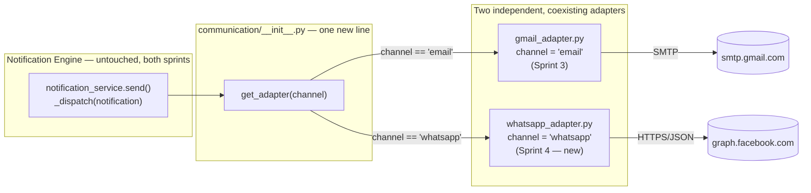

# Sprint 4 — WhatsApp Adapter

**Status:** Implemented and verified entirely offline. **No database changes applied, no data seeded** — same deferral as Sprint 3, still waiting on the final deployment phase.
**Scope:** A second concrete `CommunicationAdapter` — WhatsApp Business Cloud API — registered alongside Gmail through the exact same, unmodified registry Sprint 3 built.
**Not built:** any migration, any seeding action, any AI/ML/RAG capability, any change to the Notification Engine, the approval workflow, the notification queue, or the frontend.

---

## Architecture

This sprint's honest headline: **zero lines of `notification_service.py`, `admin/notifications.py`, or any frontend file changed.** Sprint 3 built `_dispatch()` to resolve a notification's channel through the registry generically — `communication.get_adapter(channel)` — not with any Gmail-specific logic. Adding a second, fully independent adapter was a proof of that design, not a reason to touch it.



`whatsapp_adapter.py` mirrors `gmail_adapter.py`'s shape exactly: a module-level `channel` string, `is_configured() -> bool`, `send(notification: dict) -> DeliveryResult`, never raises, degrades cleanly to a reported failure (not an exception) when unconfigured. Same `CommunicationAdapter` Protocol, same `DeliveryResult` dataclass, same registration call (`register_adapter(whatsapp_adapter)`) — the pattern Sprint 3 documented as what a future channel needs turned out to be complete and accurate on the first try.

---

## Integration points

The only files touched this sprint, and exactly why each one needed to be:

| File | Change | Why |
|---|---|---|
| `communication/whatsapp_adapter.py` | **New.** The adapter itself. | The actual deliverable. |
| `communication/__init__.py` | One import, one `register_adapter()` call. | The registry is the *only* place a new channel needs to announce itself — see Sprint 3's own design intent, now exercised for real. |
| `core/config.py` | Two new optional settings (`whatsapp_access_token`, `whatsapp_phone_number_id`). | Matches `gmail_address`/`gmail_app_password`'s existing centralized-config pattern exactly — no new pattern introduced. |
| `.env.example` | Documents the two new optional vars. | Same reason every prior optional integration setting is documented there. |
| `backend/tests/test_communication_adapters.py` | Extended, not replaced. | Same file already tested the registry and Gmail; WhatsApp and the coexistence proof belong in the same place, not a new one. |

**Not touched:** `notification_service.py`, `admin/notifications.py`, any schema/migration, any frontend file. `notifications.channel` (added in Sprint 1) and `notifications.provider_message_id` (added in Sprint 3) already accept any string — `"whatsapp"` needs nothing new from either. The Notification Queue's detail drawer already renders whatever `channel` value a notification has generically (`if (notification.channel) { appendDetailRow(body, "Channel", notification.channel); }`, written in Sprint 3 with no channel names hardcoded) — it already displays "whatsapp" correctly with the exact code that already existed.

---

## Configuration

Two new optional environment variables, both unset everywhere today — same "gracefully degrades to off" contract as Gmail's:

| Variable | Meaning |
|---|---|
| `WHATSAPP_ACCESS_TOKEN` | A Meta system-user or temporary access token for the WhatsApp Business app. |
| `WHATSAPP_PHONE_NUMBER_ID` | The Cloud API phone number ID (not the phone number itself) the business sends from. |

`is_configured()` is `True` only if both are set — confirmed `False` in this environment right now, live (see [Verification](#verification)).

### Dependency: `httpx`, already there

The adapter uses `httpx` for the HTTPS/JSON call to Meta's Graph API. `httpx==0.28.1` is already pinned in `requirements.txt` — it's supabase-py's own HTTP client, installed and present in every environment this project already runs in. This adapter is simply the first place *application* code imports it directly rather than only depending on it transitively. **No dependency was added; `requirements.txt` did not change.**

---

## Error handling

Same contract as `gmail_adapter.py`, deliberately — one predictable failure shape across every channel, so `notification_service.send()` never needs channel-specific error handling:

- **Not configured:** `send()` short-circuits before touching the network, returns `DeliveryResult(success=False, error="WhatsApp adapter is not configured...")`.
- **No customer phone number on the notification:** same clean failure, no network attempt.
- **Phone number has no extractable digits** (`_to_whatsapp_number` strips everything else): same clean failure.
- **Meta's API returns an HTTP error** (bad token, invalid recipient, rate limit, etc.): the response body's `error.message` is extracted and returned as `DeliveryResult.error`; logged via `logger.error` with the notification id for traceability.
- **Network/timeout/anything unexpected:** caught, logged via `logger.exception`, returned as a clean `DeliveryResult(success=False, error=str(exc))`. **`send()` never raises**, under any of these conditions — verified directly (see Testing).

### A real production limitation, documented rather than worked around

Meta requires a pre-approved message **template** for business-initiated WhatsApp messages sent outside a 24-hour customer-service window — a free-form "text" message (what this adapter sends) isn't guaranteed to be deliverable in every real scenario. This adapter implements the simplest message shape on purpose, matching `gmail_adapter.py`'s own "start simple" scope from Sprint 3, and because template registration is an external, manual step with Meta that can't be done or tested as part of a code change. This is a known, real gap for a production rollout — see [Future extension points](#future-extension-points), not something silently glossed over.

---

## Testing / Verification

### Offline (no network, no database, no real credentials)

`backend/tests/test_communication_adapters.py` grew from 11 checks (Sprint 3) to **23**. The new ones:

- `whatsapp_adapter` satisfies `CommunicationAdapter` structurally (`isinstance` check) — same proof Gmail got.
- The registry resolves `"whatsapp"` to `whatsapp_adapter`.
- `whatsapp_adapter.is_configured()` confirmed `False` live, right now — what keeps every other WhatsApp test safe to run with no real credentials or network access.
- `send()` with no configuration, no customer phone, or unextractable digits all return a clean failure with zero network attempts.
- `_to_whatsapp_number` and `_build_message_text` (the two pure helper functions) verified directly.

**The tests that actually answer this sprint's stated goal — "verify that Gmail and WhatsApp coexist cleanly":**

```python
def test_both_adapters_are_registered_simultaneously():
    assert communication.get_adapter("email") is gmail_adapter
    assert communication.get_adapter("whatsapp") is whatsapp_adapter
    assert gmail_adapter is not whatsapp_adapter

def test_dispatch_routes_email_channel_to_gmail_not_whatsapp(): ...
def test_dispatch_routes_whatsapp_channel_to_whatsapp_not_gmail(): ...

def test_default_channel_still_resolves_to_email_unaffected_by_whatsapp():
    # The literal "do not modify runtime behavior" check: a notification
    # with no channel set still resolves to email, exactly as before
    # WhatsApp existed.
    channel, _ = notification_service._dispatch({"channel": None})
    assert channel == communication.DEFAULT_CHANNEL == "email"
```

These directly prove, in code, that registering a second adapter didn't change which channel a channel-less notification resolves to, and that each explicitly-tagged channel routes to the correct (and only the correct) adapter.

### Full project regression, re-run after every change

All **52** offline checks across all five test files pass (`test_security_dependencies` 7, `test_order_service_admin` 5, `test_customer_service` 6, `test_notification_service` 11, `test_communication_adapters` 23). A `TestClient` pass against every existing customer-facing and admin route — including every notification lifecycle route — shows identical status codes to every prior sprint's own verification.

### The seeder, re-checked again

`tools/demo_data_seed.py` was not touched this sprint either. Re-ran `--simulate` after all of this sprint's changes: byte-identical output to Sprint 2/3's numbers (same fixed seed) — 100 customers, 350 orders, identical category/status/monthly distribution. Still exactly "ready for the final deployment phase."

### What was *not* touched, verified rather than assumed

`notification_service.py`, `admin/notifications.py`, and every frontend file received zero edits this sprint — not asserted from memory, but reflected in exactly which files this document's [Integration points](#integration-points) table lists as changed (five files, all either new or centralized-config/test files) versus the much larger set of files every prior sprint touched in the engine or UI layers.

### What was *not* tested, deliberately

No real HTTPS call to `graph.facebook.com` was attempted anywhere in this sprint — no `WHATSAPP_ACCESS_TOKEN`/`WHATSAPP_PHONE_NUMBER_ID` are configured in this environment, and sending a real WhatsApp message as part of automated verification wouldn't be appropriate even if they were. `is_configured()` being `False` right now is what makes every other test in this sprint safe to run at all — same posture as Gmail in Sprint 3.

---

## Deployment sequencing (unchanged from Sprint 3)

Re-confirmed live at the end of this sprint: zero migrations applied (`staff_profiles`/`audit_log`/`notifications` all still pending), zero demo data seeded. Per your plan, the next step is the single final production deployment: apply all pending migrations, run `tools/demo_data_seed.py` for real, and verify the complete end-to-end workflow — at which point both adapters exist, ready to be configured with real credentials whenever that's decided, independently of each other.

---

## Future extension points

- **Message templates.** The real production requirement noted above — registering approved WhatsApp message templates with Meta and sending `type: "template"` payloads instead of free-form `text` for business-initiated messages outside the 24-hour window. An external/manual step with Meta first, then a small, additive change to `_build_message_text`'s call site in `send()` — the adapter's shape and the registry don't need to change.
- **Channel selection.** Nothing today ever sets a notification's `channel` to `"whatsapp"` before send — both adapters are fully available and independently verified, but `_dispatch()`'s fallback (`DEFAULT_CHANNEL = "email"`) is what actually gets used for every notification today, unchanged from Sprint 3. A future customer-channel-preference feature, or simply changing `DEFAULT_CHANNEL`, is what would start routing real notifications through WhatsApp — a deliberate decision left for later, not an oversight (see "do not modify runtime behavior").
- **Delivery status callbacks.** Meta's Cloud API supports webhooks reporting delivery/read receipts — `notifications.status`'s reserved `"delivered"` value (still unused by any code path, same as Sprint 3 left it) is exactly what a future webhook handler would transition a WhatsApp-sent notification into, via a small additive function next to `send()`, mirroring the extension point Sprint 1 originally reserved this for.
- **A third adapter.** SMS (Twilio) or any other channel named in `Master_Blueprint_v1.md` §10 follows the exact same three-step pattern this sprint just proved twice: a module matching `CommunicationAdapter`'s shape, one `register_adapter()` call, and nothing else in the engine changes.
